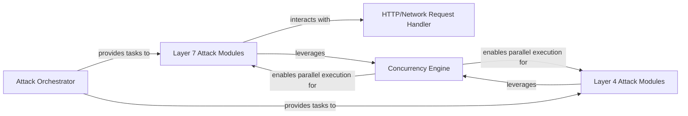

## Details

Abstract Components Overview of a project, with identified components and their relationships, but without concrete source code references due to tool call limitations.

### Layer 7 Attack Modules
Implements specific application-layer (HTTP/HTTPS) DDoS attack methods (e.g., GET flood, POST flood). It constructs HTTP requests and relies on the HTTP/Network Request Handler for their dispatch and anti-DDoS bypass.

**Related Classes/Methods**: _None_

### Layer 4 Attack Modules
Implements specific transport-layer (TCP/UDP/ICMP) DDoS attack methods (e.g., SYN flood, UDP flood, ICMP flood). It constructs raw network packets and sends them directly.

**Related Classes/Methods**: _None_

### HTTP/Network Request Handler [[Expand]](./HTTP_Network_Request_Handler.md)
Provides the core functionality for sending HTTP/HTTPS requests and managing anti-DDoS bypass mechanisms (e.g., Cloudflare bypass). It abstracts the complexities of network communication for Layer 7 attacks.

**Related Classes/Methods**: _None_

### Attack Orchestrator
Responsible for providing attack tasks, parameters, and target lists to the specific attack modules. It acts as the control plane, feeding instructions based on configuration.

**Related Classes/Methods**: _None_

### Concurrency Engine
Manages the parallel and asynchronous execution of attack operations. It ensures high performance by handling a large number of simultaneous connections and requests, likely utilizing Python's asyncio or multi-threading/processing.

**Related Classes/Methods**: _None_

### [FAQ](https://github.com/CodeBoarding/GeneratedOnBoardings/tree/main?tab=readme-ov-file#faq)