```mermaid
graph LR
    Command_Line_Interface_CLI_["Command-Line Interface (CLI)"]
    Target_Management_Module["Target Management Module"]
    Configuration_Management_Module["Configuration Management Module"]
    Attack_Execution_Engine["Attack Execution Engine"]
    Layer_7_Attack_Modules["Layer 7 Attack Modules"]
    Layer_4_Attack_Modules["Layer 4 Attack Modules"]
    Proxy_Management_System["Proxy Management System"]
    Network_Request_Handler["Network Request Handler"]
    Command_Line_Interface_CLI_ -- "provides raw target inputs to" --> Target_Management_Module
    Command_Line_Interface_CLI_ -- "provides attack parameters and settings to" --> Configuration_Management_Module
    Target_Management_Module -- "provides processed target lists to" --> Attack_Execution_Engine
    Configuration_Management_Module -- "provides validated attack configurations to" --> Attack_Execution_Engine
    Attack_Execution_Engine -- "invokes" --> Layer_7_Attack_Modules
    Attack_Execution_Engine -- "invokes" --> Layer_4_Attack_Modules
    Attack_Execution_Engine -- "utilizes" --> Proxy_Management_System
    Layer_7_Attack_Modules -- "utilizes" --> Network_Request_Handler
    Layer_4_Attack_Modules -- "utilizes" --> Network_Request_Handler
    Proxy_Management_System -- "provides validated proxies to" --> Attack_Execution_Engine
    click Command_Line_Interface_CLI_ href "https://github.com/CodeBoarding/GeneratedOnBoardings/blob/main/MHDDoS/Command_Line_Interface_CLI_.md" "Details"
    click Attack_Execution_Engine href "https://github.com/CodeBoarding/GeneratedOnBoardings/blob/main/MHDDoS/Attack_Execution_Engine.md" "Details"
    click Proxy_Management_System href "https://github.com/CodeBoarding/GeneratedOnBoardings/blob/main/MHDDoS/Proxy_Management_System.md" "Details"
    click Network_Request_Handler href "https://github.com/CodeBoarding/GeneratedOnBoardings/blob/main/MHDDoS/Network_Request_Handler.md" "Details"
```

## Details

One paragraph explaining the functionality which is represented by this graph. What the main flow is and what is its purpose.

### Command-Line Interface (CLI) [[Expand]](./Command_Line_Interface_CLI_.md)
Provides the primary user interface for interacting with the tool, enabling users to select attack types, specify targets, and configure various attack parameters through command-line arguments. It translates raw user input into structured data.

**Related Classes/Methods**: _None_

### Target Management Module
Responsible for parsing, validating, and managing target information (e.g., IP addresses, URLs, ports) received from the CLI. It prepares and formats target lists for use by the attack execution engine.

**Related Classes/Methods**: _None_

### Configuration Management Module
Manages and validates all attack-related parameters, such as attack type, duration, intensity, and specific protocol settings. It externalizes configurations into files (e.g., JSON, plain text) for flexible operation without code modifications.

**Related Classes/Methods**: _None_

### Attack Execution Engine [[Expand]](./Attack_Execution_Engine.md)
The core orchestrator responsible for initiating, managing, and coordinating concurrent attack operations. It leverages Python's `asyncio` or multi-threading/multi-processing to achieve high performance and manage a large number of simultaneous connections and requests efficiently.

**Related Classes/Methods**: _None_

### Layer 7 Attack Modules
Encapsulates specific application-layer (e.g., HTTP GET/POST flood, Slowloris) attack logic. Each module is designed as an independent, interchangeable component, allowing for easy extension and maintenance of attack vectors.

**Related Classes/Methods**: _None_

### Layer 4 Attack Modules
Encapsulates specific transport-layer (e.g., SYN flood, UDP flood, ICMP flood) attack logic. Similar to Layer 7 modules, these are independent and interchangeable components for various low-level attack methods.

**Related Classes/Methods**: _None_

### Proxy Management System [[Expand]](./Proxy_Management_System.md)
Manages the integration, rotation, and validation of various proxy types (HTTP, SOCKS) using libraries like PyRoxy. This system is crucial for maintaining anonymity and bypassing anti-DDoS measures.

**Related Classes/Methods**: _None_

### Network Request Handler [[Expand]](./Network_Request_Handler.md)
Provides a standardized, abstracted interface for performing various network operations, including HTTP requests, raw socket operations, and DNS lookups. It handles the low-level details of network communication for the attack modules.

**Related Classes/Methods**: _None_

### [FAQ](https://github.com/CodeBoarding/GeneratedOnBoardings/tree/main?tab=readme-ov-file#faq)