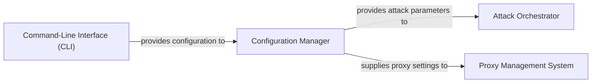

## Details

One paragraph explaining the functionality which is represented by this graph. What the main flow is and what is its purpose.

### Configuration Manager [[Expand]](./Configuration_Manager.md)
The Configuration Manager serves as the central hub for managing all operational parameters within the DDoS Attack Framework. Its core responsibility is to load, parse, and validate critical attack parameters such as attack methods, target specifications, proxy configurations, and concurrency levels. It sources this information from various external inputs, including JSON files, plain text files, and command-line interface (CLI) arguments. By acting as the single source of truth for all attack-related settings, this component ensures the framework's configuration-driven nature, enabling flexible and dynamic operation without requiring code modifications for different attack scenarios.

**Related Classes/Methods**: _None_

### Command-Line Interface (CLI) [[Expand]](./Command_Line_Interface_CLI_.md)
The Command-Line Interface (CLI) component provides the primary user interaction point for the DDoS Attack Framework. It is responsible for parsing command-line arguments, validating user input, and initiating the attack process based on the provided parameters. The CLI acts as the bridge between the user's commands and the internal configuration and orchestration logic, ensuring that the framework can be easily controlled and configured from the terminal.

**Related Classes/Methods**: _None_

### Attack Orchestrator
The Attack Orchestrator is the core control component responsible for coordinating and executing DDoS attacks. It receives validated attack parameters from the Configuration Manager and manages the lifecycle of the attack. This includes initiating attack threads or processes, distributing tasks to attack agents (if applicable), monitoring attack progress, and handling attack termination. Its primary role is to ensure that the attack is executed efficiently and according to the specified parameters.

**Related Classes/Methods**: _None_

### Proxy Management System [[Expand]](./Proxy_Management_System.md)
The Proxy Management System is responsible for handling and utilizing proxy servers during a DDoS attack. It receives proxy configurations from the Configuration Manager, loads proxy lists, validates proxy functionality, and provides a pool of usable proxies to the Attack Orchestrator or individual attack threads. This component ensures anonymity and distributed attack origins by effectively managing and rotating proxies, enhancing the attack's effectiveness and resilience.

**Related Classes/Methods**: _None_

### [FAQ](https://github.com/CodeBoarding/GeneratedOnBoardings/tree/main?tab=readme-ov-file#faq)