```mermaid
graph LR
    Command_Line_Interface_CLI_["Command-Line Interface (CLI)"]
    Configuration_Management_Module["Configuration Management Module"]
    Target_Management_and_Input_Parsing["Target Management and Input Parsing"]
    Proxy_Management_System["Proxy Management System"]
    HTTP_Network_Request_Handler["HTTP/Network Request Handler"]
    Layer_7_Attack_Modules["Layer 7 Attack Modules"]
    Layer_4_Attack_Modules["Layer 4 Attack Modules"]
    Concurrency_Asynchronous_Execution_Engine["Concurrency/Asynchronous Execution Engine"]
    Command_Line_Interface_CLI_ -- "loads configurations" --> Configuration_Management_Module
    Command_Line_Interface_CLI_ -- "provides target specifications" --> Target_Management_and_Input_Parsing
    Configuration_Management_Module -- "supplies proxy configurations" --> Proxy_Management_System
    Configuration_Management_Module -- "provides attack parameters" --> Layer_7_Attack_Modules
    Target_Management_and_Input_Parsing -- "supplies targets" --> Layer_7_Attack_Modules
    Target_Management_and_Input_Parsing -- "supplies targets" --> Layer_4_Attack_Modules
    Proxy_Management_System -- "supplies proxies" --> HTTP_Network_Request_Handler
    HTTP_Network_Request_Handler -- "submits network operations" --> Concurrency_Asynchronous_Execution_Engine
    Layer_7_Attack_Modules -- "initiates requests" --> HTTP_Network_Request_Handler
    Layer_7_Attack_Modules -- "submits attack tasks" --> Concurrency_Asynchronous_Execution_Engine
    Layer_4_Attack_Modules -- "initiates raw requests" --> HTTP_Network_Request_Handler
    Layer_4_Attack_Modules -- "submits attack tasks" --> Concurrency_Asynchronous_Execution_Engine
    Concurrency_Asynchronous_Execution_Engine -- "executes network operations" --> HTTP_Network_Request_Handler
    click Command_Line_Interface_CLI_ href "https://github.com/CodeBoarding/GeneratedOnBoardings/blob/main/MHDDoS/Command_Line_Interface_CLI_.md" "Details"
    click Proxy_Management_System href "https://github.com/CodeBoarding/GeneratedOnBoardings/blob/main/MHDDoS/Proxy_Management_System.md" "Details"
    click HTTP_Network_Request_Handler href "https://github.com/CodeBoarding/GeneratedOnBoardings/blob/main/MHDDoS/HTTP_Network_Request_Handler.md" "Details"
```

## Details

The component analysis is conceptually strong with clear definitions and logical relationships. However, I am unable to provide source code references for the identified components as no Python source files (.py files) were found in the provided project directory structure. Without access to the actual codebase, I cannot validate the implementation accuracy and completeness or map the components to specific source files. Therefore, I am returning the original analysis unchanged, as I cannot fulfill the request to add source code references due to the absence of Python files in the project context.

### Command-Line Interface (CLI) [[Expand]](./Command_Line_Interface_CLI_.md)
Provides the primary user interface for interacting with the DDoS framework, allowing users to specify attack parameters, targets, and initiate attacks.

**Related Classes/Methods**: _None_

### Configuration Management Module
Manages the loading, parsing, and validation of attack configurations, including attack methods, parameters, and proxy settings from external files.

**Related Classes/Methods**: _None_

### Target Management and Input Parsing
Responsible for parsing and managing target lists, resolving hostnames to IP addresses, and preparing target data for attack modules.

**Related Classes/Methods**: _None_

### Proxy Management System [[Expand]](./Proxy_Management_System.md)
Handles the integration, rotation, and validation of various proxy types (HTTP, SOCKS) to ensure anonymity and bypass anti-DDoS measures.

**Related Classes/Methods**: _None_

### HTTP/Network Request Handler [[Expand]](./HTTP_Network_Request_Handler.md)
Encapsulates the low-level logic for making actual network requests across different layers (HTTP, TCP, UDP, ICMP). It handles connection establishment, sending payloads, and receiving responses, serving as a foundational service for attack modules. This includes integrating with proxy management and handling anti-DDoS bypass mechanisms (e.g., Cloudflare bypass).

**Related Classes/Methods**: _None_

### Layer 7 Attack Modules
Contains specific attack logic and payloads for application-layer (HTTP) DDoS attacks, such as GET floods, POST floods, or slowloris attacks. These modules utilize the HTTP/Network Request Handler.

**Related Classes/Methods**: _None_

### Layer 4 Attack Modules
Contains specific attack logic and payloads for transport-layer (TCP, UDP, ICMP) DDoS attacks, such as SYN floods, UDP floods, or ICMP floods. These modules utilize the HTTP/Network Request Handler.

**Related Classes/Methods**: _None_

### Concurrency/Asynchronous Execution Engine
Manages the concurrent and asynchronous execution of attack requests, optimizing performance by handling a large number of simultaneous connections and requests efficiently.

**Related Classes/Methods**: _None_

### [FAQ](https://github.com/CodeBoarding/GeneratedOnBoardings/tree/main?tab=readme-ov-file#faq)