```mermaid
graph LR
    Command_Line_Interface_CLI_["Command-Line Interface (CLI)"]
    Configuration_Management_Module["Configuration Management Module"]
    Proxy_Management_System["Proxy Management System"]
    HTTP_Network_Request_Handler["HTTP/Network Request Handler"]
    Layer_7_Attack_Modules["Layer 7 Attack Modules"]
    Concurrency_Asynchronous_Execution_Engine["Concurrency/Asynchronous Execution Engine"]
    Error_Handling_and_Resilience_Mechanisms["Error Handling and Resilience Mechanisms"]
    Logging_and_Reporting_System["Logging and Reporting System"]
    Command_Line_Interface_CLI_ -- "configures" --> Configuration_Management_Module
    Command_Line_Interface_CLI_ -- "triggers" --> Layer_7_Attack_Modules
    Configuration_Management_Module -- "provides settings to" --> Proxy_Management_System
    Configuration_Management_Module -- "provides parameters to" --> Layer_7_Attack_Modules
    Proxy_Management_System -- "supplies proxies to" --> HTTP_Network_Request_Handler
    Layer_7_Attack_Modules -- "instructs" --> HTTP_Network_Request_Handler
    Concurrency_Asynchronous_Execution_Engine -- "manages" --> Layer_7_Attack_Modules
    Concurrency_Asynchronous_Execution_Engine -- "orchestrates" --> HTTP_Network_Request_Handler
    HTTP_Network_Request_Handler -- "notifies" --> Error_Handling_and_Resilience_Mechanisms
    Error_Handling_and_Resilience_Mechanisms -- "sends errors to" --> Logging_and_Reporting_System
    Logging_and_Reporting_System -- "displays to" --> Command_Line_Interface_CLI_
    Command_Line_Interface_CLI_ -- "sends logs to" --> Logging_and_Reporting_System
    Configuration_Management_Module -- "sends logs to" --> Logging_and_Reporting_System
    Proxy_Management_System -- "sends logs to" --> Logging_and_Reporting_System
    HTTP_Network_Request_Handler -- "sends logs to" --> Logging_and_Reporting_System
    Layer_7_Attack_Modules -- "sends logs to" --> Logging_and_Reporting_System
    Concurrency_Asynchronous_Execution_Engine -- "sends logs to" --> Logging_and_Reporting_System
    click Command_Line_Interface_CLI_ href "https://github.com/CodeBoarding/GeneratedOnBoardings/blob/main/MHDDoS/Command_Line_Interface_CLI_.md" "Details"
    click Proxy_Management_System href "https://github.com/CodeBoarding/GeneratedOnBoardings/blob/main/MHDDoS/Proxy_Management_System.md" "Details"
    click HTTP_Network_Request_Handler href "https://github.com/CodeBoarding/GeneratedOnBoardings/blob/main/MHDDoS/HTTP_Network_Request_Handler.md" "Details"
```

## Details

This architecture emphasizes modularity, concurrency, and configurability, crucial for a high-performance DDoS attack framework. Each component is chosen for its fundamental role in achieving the project's objectives.

### Command-Line Interface (CLI) [[Expand]](./Command_Line_Interface_CLI_.md)
The primary user interface for interacting with the framework. It parses user commands, validates input, and orchestrates the execution of attack modules and utilities.

**Related Classes/Methods**:

- `cli.py` (1:1)
- `main.py` (1:1)

### Configuration Management Module
Manages the loading, parsing, and distribution of all operational parameters and settings, including attack targets, proxy configurations, and general framework settings, typically from external files.

**Related Classes/Methods**:

- `config.py` (1:1)
- `settings.py` (1:1)

### Proxy Management System [[Expand]](./Proxy_Management_System.md)
Centralized system for loading, validating, rotating, and supplying proxies. It ensures anonymity and aids in bypassing anti-DDoS measures by providing a continuous supply of functional proxies.

**Related Classes/Methods**:

- `proxy_manager.py` (1:1)
- `proxies/loader.py` (1:1)
- `proxies/validator.py` (1:1)
- `proxies/rotator.py` (1:1)

### HTTP/Network Request Handler [[Expand]](./HTTP_Network_Request_Handler.md)
Manages the execution of all outgoing network requests, abstracting communication details. It integrates with the proxy management system and handles connection pooling, retries, and potentially anti-DDoS bypass mechanisms.

**Related Classes/Methods**:

- `network_handler.py` (1:1)
- `http_client.py` (1:1)

### Layer 7 Attack Modules
Encapsulates the specific logic for various application-layer DDoS attack methods (e.g., HTTP GET/POST floods). Each module defines unique request patterns and attack parameters.

**Related Classes/Methods**:

- `attacks/http_flood.py` (1:1)
- `attacks/slowloris.py` (1:1)

### Concurrency/Asynchronous Execution Engine
Provides the underlying infrastructure for managing concurrent operations, enabling the framework to handle a large number of simultaneous connections and requests efficiently, typically using asyncio or multi-threading.

**Related Classes/Methods**:

- `async_engine.py` (1:1)
- `concurrency_manager.py` (1:1)

### Error Handling and Resilience Mechanisms
Implements robust error detection, logging, and recovery strategies for network operations and internal component failures, including retry mechanisms and graceful degradation.

**Related Classes/Methods**:

- `error_handler.py` (1:1)
- `resilience.py` (1:1)

### Logging and Reporting System
Provides comprehensive logging capabilities for tracking attack progress, operational status, errors, and performance statistics, vital for monitoring effectiveness and debugging.

**Related Classes/Methods**:

- `logger.py` (1:1)
- `reporter.py` (1:1)

### [FAQ](https://github.com/CodeBoarding/GeneratedOnBoardings/tree/main?tab=readme-ov-file#faq)