```mermaid
graph LR
    Target_Resolver["Target Resolver"]
    Configuration_Management_Module["Configuration Management Module"]
    Command_Line_Interface_CLI_["Command-Line Interface (CLI)"]
    Attack_Orchestrator["Attack Orchestrator"]
    Layer_7_Attack_Modules["Layer 7 Attack Modules"]
    Layer_4_Attack_Modules["Layer 4 Attack Modules"]
    Proxy_Management_System["Proxy Management System"]
    Concurrency_Asynchronous_Execution_Engine["Concurrency/Asynchronous Execution Engine"]
    Configuration_Management_Module -- "provides target lists to" --> Target_Resolver
    Configuration_Management_Module -- "provides proxy lists to" --> Proxy_Management_System
    Target_Resolver -- "provides resolved targets to" --> Attack_Orchestrator
    Command_Line_Interface_CLI_ -- "passes parameters and commands to" --> Configuration_Management_Module
    Command_Line_Interface_CLI_ -- "passes parameters and commands to" --> Attack_Orchestrator
    Attack_Orchestrator -- "invokes" --> Layer_7_Attack_Modules
    Attack_Orchestrator -- "invokes" --> Layer_4_Attack_Modules
    Attack_Orchestrator -- "utilizes" --> Concurrency_Asynchronous_Execution_Engine
    Layer_7_Attack_Modules -- "utilizes" --> Proxy_Management_System
    Layer_4_Attack_Modules -- "utilizes" --> Proxy_Management_System
    Proxy_Management_System -- "provides proxies to" --> Layer_7_Attack_Modules
    Proxy_Management_System -- "provides proxies to" --> Layer_4_Attack_Modules
    Concurrency_Asynchronous_Execution_Engine -- "executes tasks for" --> Layer_7_Attack_Modules
    Concurrency_Asynchronous_Execution_Engine -- "executes tasks for" --> Layer_4_Attack_Modules
    click Target_Resolver href "https://github.com/CodeBoarding/GeneratedOnBoardings/blob/main/MHDDoS/Target_Resolver.md" "Details"
    click Command_Line_Interface_CLI_ href "https://github.com/CodeBoarding/GeneratedOnBoardings/blob/main/MHDDoS/Command_Line_Interface_CLI_.md" "Details"
    click Proxy_Management_System href "https://github.com/CodeBoarding/GeneratedOnBoardings/blob/main/MHDDoS/Proxy_Management_System.md" "Details"
```

## Details

The architecture of the DDoS Attack Framework is designed with a strong emphasis on modularity, concurrency, and configurability.

### Target Resolver [[Expand]](./Target_Resolver.md)
Handles the preparation of target information by resolving hostnames to IP addresses using DNS, processing lists of targets, and implementing anti-DDoS bypass mechanisms like Cloudflare IP resolution to identify real server IPs. It ensures that the attack modules receive accurate and actionable target addresses.

**Related Classes/Methods**:

- `target_resolver` (1:1)
- `dns_resolver` (1:1)
- `cf_bypass` (1:1)

### Configuration Management Module
Responsible for loading, parsing, and validating configuration settings from external files (e.g., JSON, plain text). It provides attack parameters, target lists, and proxy configurations to other components, enabling flexible operation without code modifications.

**Related Classes/Methods**:

- `config_parser` (1:1)
- `settings` (1:1)

### Command-Line Interface (CLI) [[Expand]](./Command_Line_Interface_CLI_.md)
The primary interface for user interaction, allowing users to specify attack parameters, targets, and control the tool's operation through clear command-line arguments and options.

**Related Classes/Methods**:

- `cli` (1:1)
- `main` (1:1)

### Attack Orchestrator
The central control unit responsible for coordinating and managing the overall DDoS attack process. It receives processed targets, distributes tasks to specific attack modules (Layer 7, Layer 4), and oversees the execution flow, leveraging the concurrency engine.

**Related Classes/Methods**:

- `orchestrator` (1:1)
- `main` (1:1)

### Layer 7 Attack Modules
Encapsulates various HTTP/HTTPS-based attack methods, such as GET floods, POST floods, or slowloris attacks. These modules generate and send malicious web requests to the target, often mimicking legitimate browser behavior.

**Related Classes/Methods**:

- `l7_attacks` (1:1)
- `http_flood` (1:1)
- `slowloris` (1:1)

### Layer 4 Attack Modules
Contains modules for network-layer attacks, including SYN floods, UDP floods, or ICMP floods. These modules directly interact with raw network protocols to overwhelm the target's network infrastructure.

**Related Classes/Methods**:

- `l4_attacks` (1:1)
- `syn_flood` (1:1)
- `udp_flood` (1:1)

### Proxy Management System [[Expand]](./Proxy_Management_System.md)
Manages the lifecycle of proxies, including loading, validating, rotating, and providing them to attack modules. It is crucial for maintaining anonymity, bypassing IP-based rate limits, and circumventing anti-DDoS measures.

**Related Classes/Methods**:

- `proxy_manager` (1:1)
- `pyroxy_integration` (1:1)

### Concurrency/Asynchronous Execution Engine
Provides the underlying mechanism for executing multiple attack requests or tasks concurrently. It leverages Python's asyncio or multi-threading/processing to achieve high performance and efficiency, which is vital for generating high volumes of traffic.

**Related Classes/Methods**:

- `async_executor` (1:1)
- `worker_pool` (1:1)

### [FAQ](https://github.com/CodeBoarding/GeneratedOnBoardings/tree/main?tab=readme-ov-file#faq)