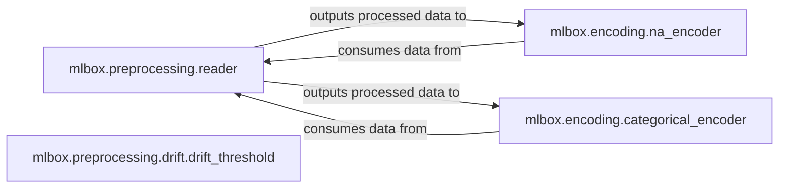

## Details

The `mlbox.preprocessing` and `mlbox.encoding` subsystems are critical for preparing raw data for machine learning models. The core functionality revolves around data ingestion, cleaning, handling missing values, encoding categorical features, and managing data drift. The system forms a sequential data pipeline where data initially enters through the `mlbox.preprocessing.reader` component for cleaning and preparation. This prepared data is then passed to `mlbox.encoding.na_encoder` and `mlbox.encoding.categorical_encoder` for handling missing values and transforming categorical features. The `mlbox.preprocessing.drift.drift_threshold` component operates in parallel or subsequent to these steps, ensuring data consistency and mitigating drift.

### mlbox.preprocessing.reader
This component is the initial entry point for data processing. It handles loading raw datasets, performing essential data type conversions (e.g., floats, dates, lists) through its `clean` operation, and splitting the data into training and testing sets using `train_test_split`. Its role is to transform raw input into a structured, usable format for subsequent stages.

**Related Classes/Methods**:

- <a href="https://github.com/AxeldeRomblay/MLBox/blob/master/mlbox/preprocessing/reader.py#L1-L2" target="_blank" rel="noopener noreferrer">`mlbox.preprocessing.reader:clean`:1-2</a>
- <a href="https://github.com/AxeldeRomblay/MLBox/blob/master/mlbox/preprocessing/reader.py#L1-L2" target="_blank" rel="noopener noreferrer">`mlbox.preprocessing.reader:convert_float_and_dates`:1-2</a>
- <a href="https://github.com/AxeldeRomblay/MLBox/blob/master/mlbox/preprocessing/reader.py#L1-L2" target="_blank" rel="noopener noreferrer">`mlbox.preprocessing.reader:convert_list`:1-2</a>
- <a href="https://github.com/AxeldeRomblay/MLBox/blob/master/mlbox/preprocessing/reader.py#L1-L2" target="_blank" rel="noopener noreferrer">`mlbox.preprocessing.reader:train_test_split`:1-2</a>

### mlbox.encoding.na_encoder
Specializes in handling missing (NA) values within the dataset. It provides mechanisms to `fit` an encoding strategy based on observed missing data patterns and `transform` the data by applying this strategy. This is crucial for data quality, as many ML algorithms cannot directly handle missing values.

**Related Classes/Methods**:

- <a href="https://github.com/AxeldeRomblay/MLBox/blob/master/mlbox/encoding/na_encoder.py#L1-L2" target="_blank" rel="noopener noreferrer">`mlbox.encoding.na_encoder:fit`:1-2</a>
- <a href="https://github.com/AxeldeRomblay/MLBox/blob/master/mlbox/encoding/na_encoder.py#L1-L2" target="_blank" rel="noopener noreferrer">`mlbox.encoding.na_encoder:transform`:1-2</a>
- <a href="https://github.com/AxeldeRomblay/MLBox/blob/master/mlbox/encoding/na_encoder.py#L1-L2" target="_blank" rel="noopener noreferrer">`mlbox.encoding.na_encoder:fit_transform`:1-2</a>

### mlbox.encoding.categorical_encoder
Focuses on converting categorical features into numerical representations suitable for machine learning algorithms. Similar to `na_encoder`, it supports `fit` to learn an encoding scheme and `transform` to apply it to the data.

**Related Classes/Methods**:

- <a href="https://github.com/AxeldeRomblay/MLBox/blob/master/mlbox/encoding/categorical_encoder.py#L1-L2" target="_blank" rel="noopener noreferrer">`mlbox.encoding.categorical_encoder:fit`:1-2</a>
- <a href="https://github.com/AxeldeRomblay/MLBox/blob/master/mlbox/encoding/categorical_encoder.py#L1-L2" target="_blank" rel="noopener noreferrer">`mlbox.encoding.categorical_encoder:transform`:1-2</a>
- <a href="https://github.com/AxeldeRomblay/MLBox/blob/master/mlbox/encoding/categorical_encoder.py#L1-L2" target="_blank" rel="noopener noreferrer">`mlbox.encoding.categorical_encoder:fit_transform`:1-2</a>

### mlbox.preprocessing.drift.drift_threshold
Manages data drift, ensuring consistency between training and inference data distributions over time. Its primary role is to `fit` a drift model and synchronize fit operations, which is crucial for maintaining model performance as data characteristics may change.

**Related Classes/Methods**:

- <a href="https://github.com/AxeldeRomblay/MLBox/blob/master/mlbox/preprocessing/drift/drift_threshold.py#L1-L2" target="_blank" rel="noopener noreferrer">`mlbox.preprocessing.drift.drift_threshold:fit`:1-2</a>
- <a href="https://github.com/AxeldeRomblay/MLBox/blob/master/mlbox/preprocessing/drift/drift_threshold.py#L1-L2" target="_blank" rel="noopener noreferrer">`mlbox.preprocessing.drift.drift_threshold:sync_fit`:1-2</a>

### [FAQ](https://github.com/CodeBoarding/GeneratedOnBoardings/tree/main?tab=readme-ov-file#faq)