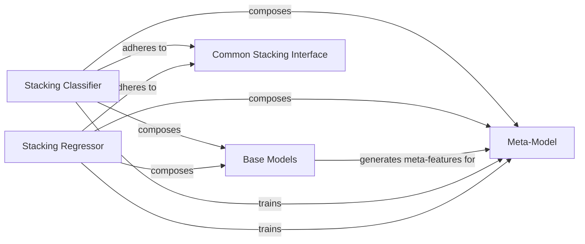

## Details

The MLBox stacking subsystem orchestrates ensemble learning by combining predictions from multiple base models via a meta-model. The `Stacking Classifier` and `Stacking Regressor` serve as the primary orchestrators, adhering to a `Common Stacking Interface` for consistent behavior. They manage the `Base Models` to generate meta-features and then train a `Meta-Model` on these features to produce final predictions. This layered approach enhances predictive performance by leveraging the strengths of diverse models.

### Stacking Classifier
Orchestrates the training and prediction phases for stacked classification models. It manages the configuration of base models and a meta-model, generates out-of-fold predictions (meta-features) from base models, and uses these to train the meta-model for final class probability or label predictions. This is a core concrete implementation of the ensemble strategy.

**Related Classes/Methods**:

- <a href="https://github.com/AxeldeRomblay/MLBox/blob/master/mlbox/model/classification/stacking_classifier.py#L15-L389" target="_blank" rel="noopener noreferrer">`mlbox.model.classification.stacking_classifier.StackingClassifier`:15-389</a>

### Stacking Regressor
Manages the training and prediction phases for stacked regression models. Similar to its classification counterpart, it handles parameter setting, fitting base models and a meta-model, and generating final target value predictions. This is another core concrete implementation, mirroring the classifier for regression tasks.

**Related Classes/Methods**:

- <a href="https://github.com/AxeldeRomblay/MLBox/blob/master/mlbox/model/regression/stacking_regressor.py#L15-L284" target="_blank" rel="noopener noreferrer">`mlbox.model.regression.stacking_regressor.StackingRegressor`:15-284</a>

### Base Models
Represents the collection of diverse underlying machine learning models (e.g., LightGBM, RandomForest) that serve as the initial learners in the stacking process. These models make predictions on the original features, which then become inputs for the meta-model. This is a fundamental conceptual component for any ensemble method.

**Related Classes/Methods**:

- <a href="https://github.com/AxeldeRomblay/MLBox/blob/master/mlbox/model/classification/classifier.py#L17-L400" target="_blank" rel="noopener noreferrer">`mlbox.model.classification.classifier.Classifier`:17-400</a>
- <a href="https://github.com/AxeldeRomblay/MLBox/blob/master/mlbox/model/regression/regressor.py#L18-L353" target="_blank" rel="noopener noreferrer">`mlbox.model.regression.regressor.Regressor`:18-353</a>

### Meta-Model
Represents the final machine learning model (e.g., Logistic Regression, simple tree model) that learns from the predictions (meta-features) generated by the Base Models. Its role is to combine these predictions to produce the ultimate output of the ensemble. This is the crucial final stage of the stacking process.

**Related Classes/Methods**:

### Common Stacking Interface
An implicit interface or shared protocol that both Stacking Classifier and Stacking Regressor adhere to. This promotes code reuse, ensures consistent interaction patterns, and allows for polymorphic handling of different stacking implementations through shared methods like `fit_transform`, `transform`, `fit`, and `predict`. This represents a key architectural pattern for extensibility and maintainability.

**Related Classes/Methods**:

- <a href="https://github.com/AxeldeRomblay/MLBox/blob/master/mlbox/model/classification/stacking_classifier.py#L15-L389" target="_blank" rel="noopener noreferrer">`mlbox.model.classification.stacking_classifier.StackingClassifier`:15-389</a>
- <a href="https://github.com/AxeldeRomblay/MLBox/blob/master/mlbox/model/regression/stacking_regressor.py#L15-L284" target="_blank" rel="noopener noreferrer">`mlbox.model.regression.stacking_regressor.StackingRegressor`:15-284</a>

### [FAQ](https://github.com/CodeBoarding/GeneratedOnBoardings/tree/main?tab=readme-ov-file#faq)