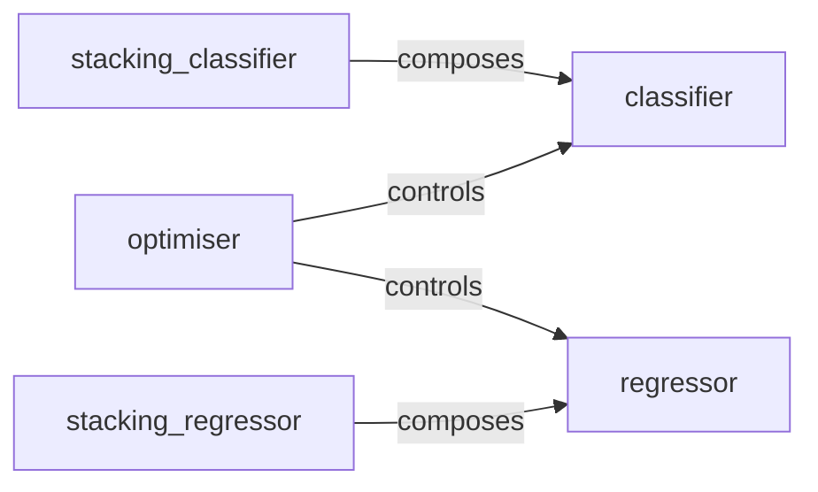

## Details

The MLBox `model` subsystem is designed around core machine learning tasks: classification and regression, with advanced ensemble capabilities. The `classifier` and `regressor` components serve as foundational wrappers for individual models, providing a standardized interface for training and analysis. Building upon these, `stacking_classifier` and `stacking_regressor` implement sophisticated ensemble techniques, orchestrating the training of multiple base models and a meta-model for enhanced predictive performance. The `optimiser` component acts as a central control, managing hyper-parameter tuning for both individual and stacked models, thereby driving the overall performance improvement of the system. This modular design facilitates clear separation of concerns, allowing for independent development and optimization of base models, ensemble strategies, and hyper-parameter tuning routines.

### classifier
Manages the configuration, initialization, and training of individual base classification models. It serves as a wrapper for various underlying classification algorithms, providing a unified interface for model fitting and introspection (e.g., feature importances).

**Related Classes/Methods**:

- <a href="https://github.com/AxeldeRomblay/MLBox/blob/master/mlbox/model/classification/classifier.py#L17-L400" target="_blank" rel="noopener noreferrer">`classifier`:17-400</a>

### regressor
Manages the configuration, initialization, and training of individual base regression models. Analogous to the classifier, it wraps diverse regression algorithms, offering a consistent interface for training and analysis.

**Related Classes/Methods**:

- <a href="https://github.com/AxeldeRomblay/MLBox/blob/master/mlbox/model/regression/regressor.py#L18-L353" target="_blank" rel="noopener noreferrer">`regressor`:18-353</a>

### stacking_classifier
Orchestrates the training of stacked classification models. This component implements the ensemble stacking technique, involving the training of multiple base classifier models, generating their predictions via cross-validation, and subsequently training a meta-model on these predictions to produce a final, robust classification output.

**Related Classes/Methods**: _None_

### stacking_regressor
Orchestrates the training of stacked regression models, following the same principles as the stacking classifier. It trains multiple base regressor models and a meta-model to generate final regression predictions.

**Related Classes/Methods**: _None_

### optimiser
Manages and executes hyper-parameter optimization routines. This component is responsible for configuring and iteratively tuning the parameters of base models (classifier and regressor) to enhance their performance. It embodies the "Hyper-parameter Optimization Module" pattern.

**Related Classes/Methods**:

- <a href="https://github.com/AxeldeRomblay/MLBox/blob/master/mlbox/optimisation/optimiser.py#L25-L597" target="_blank" rel="noopener noreferrer">`optimiser`:25-597</a>

### [FAQ](https://github.com/CodeBoarding/GeneratedOnBoardings/tree/main?tab=readme-ov-file#faq)