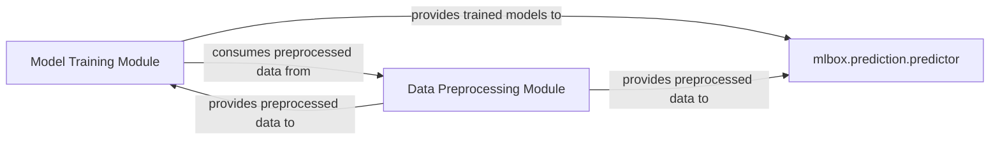

## Details

The mlbox.prediction.predictor subsystem is central to the MLBox project's prediction and evaluation capabilities. It orchestrates the entire prediction workflow, from initial configuration and parameter management to the execution of the final prediction phase. This subsystem relies on pre-trained models and preprocessed data, which are provided by the Model Training Module and Data Preprocessing Module, respectively. The predictor component also includes functionalities for persisting and visualizing feature importances, offering basic model interpretability.

### mlbox.prediction.predictor
This is the core component of the Prediction & Evaluation subsystem. It orchestrates the entire prediction workflow, from configuration and parameter management to executing the final prediction phase. It also handles the persistence and visualization of feature importances, providing basic model interpretability.

**Related Classes/Methods**:

- <a href="https://github.com/AxeldeRomblay/MLBox/blob/master/mlbox/prediction/predictor.py" target="_blank" rel="noopener noreferrer">`mlbox.prediction.predictor`</a>
- <a href="https://github.com/AxeldeRomblay/MLBox/blob/master/mlbox/prediction/predictor.py" target="_blank" rel="noopener noreferrer">`mlbox.prediction.predictor:fit_predict`</a>
- <a href="https://github.com/AxeldeRomblay/MLBox/blob/master/mlbox/prediction/predictor.py" target="_blank" rel="noopener noreferrer">`mlbox.prediction.predictor:set_params`</a>
- <a href="https://github.com/AxeldeRomblay/MLBox/blob/master/mlbox/prediction/predictor.py" target="_blank" rel="noopener noreferrer">`mlbox.prediction.predictor:get_params`</a>
- <a href="https://github.com/AxeldeRomblay/MLBox/blob/master/mlbox/prediction/predictor.py" target="_blank" rel="noopener noreferrer">`mlbox.prediction.predictor:__save_feature_importances`</a>
- <a href="https://github.com/AxeldeRomblay/MLBox/blob/master/mlbox/prediction/predictor.py" target="_blank" rel="noopener noreferrer">`mlbox.prediction.predictor:__plot_feature_importances`</a>

### Model Training Module
This module is responsible for training the machine learning models. It produces the trained models that the Prediction & Evaluation subsystem will use to generate predictions. It consumes preprocessed data to train these models.

**Related Classes/Methods**:

- <a href="https://github.com/AxeldeRomblay/MLBox/blob/master/mlbox/model/classification/classifier.py" target="_blank" rel="noopener noreferrer">`mlbox.model.classification.classifier`</a>
- <a href="https://github.com/AxeldeRomblay/MLBox/blob/master/mlbox/model/regression/regressor.py" target="_blank" rel="noopener noreferrer">`mlbox.model.regression.regressor`</a>

### Data Preprocessing Module
This module is responsible for preparing and transforming raw input data into a format suitable for model training and prediction. It ensures that the data fed into the prediction phase is consistent with the data used during training.

**Related Classes/Methods**:

- <a href="https://github.com/AxeldeRomblay/MLBox/blob/master/mlbox/preprocessing/reader.py" target="_blank" rel="noopener noreferrer">`mlbox.preprocessing.reader`</a>
- <a href="https://github.com/AxeldeRomblay/MLBox/blob/master/mlbox/preprocessing/drift/drift_estimator.py" target="_blank" rel="noopener noreferrer">`mlbox.preprocessing.drift.drift_estimator`</a>

### [FAQ](https://github.com/CodeBoarding/GeneratedOnBoardings/tree/main?tab=readme-ov-file#faq)