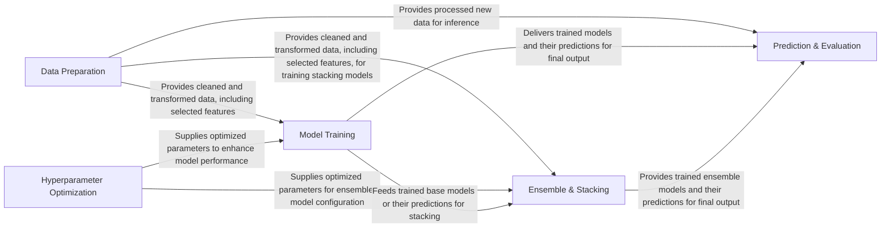

## Details

The MLBox architecture is designed as a streamlined machine learning pipeline, commencing with the Data Preparation component, which ingests and transforms raw data into a usable format. This prepared data is then channeled to the Model Training component for individual model development and to the Ensemble & Stacking component for advanced model combination. The Hyperparameter Optimization component iteratively refines the parameters for both base and ensemble models, enhancing their predictive power. Ultimately, the Prediction & Evaluation component receives the processed data from Data Preparation and the trained models from Model Training and Ensemble & Stacking to generate final predictions and comprehensive performance reports, completing the end-to-end machine learning workflow.

### Data Preparation [[Expand]](./Data_Preparation.md)
Responsible for loading, cleaning, transforming, and feature engineering raw datasets.

**Related Classes/Methods**: _None_

### Model Training [[Expand]](./Model_Training.md)
Manages the training and configuration of individual base machine learning models.

**Related Classes/Methods**: _None_

### Hyperparameter Optimization
Tunes hyperparameters for base and ensemble models to achieve optimal performance.

**Related Classes/Methods**: _None_

### Ensemble & Stacking [[Expand]](./Ensemble_Stacking.md)
Implements advanced ensemble techniques to combine predictions from multiple base models.

**Related Classes/Methods**: _None_

### Prediction & Evaluation [[Expand]](./Prediction_Evaluation.md)
Orchestrates the final prediction phase and generates reports or visualizations.

**Related Classes/Methods**: _None_

### [FAQ](https://github.com/CodeBoarding/GeneratedOnBoardings/tree/main?tab=readme-ov-file#faq)