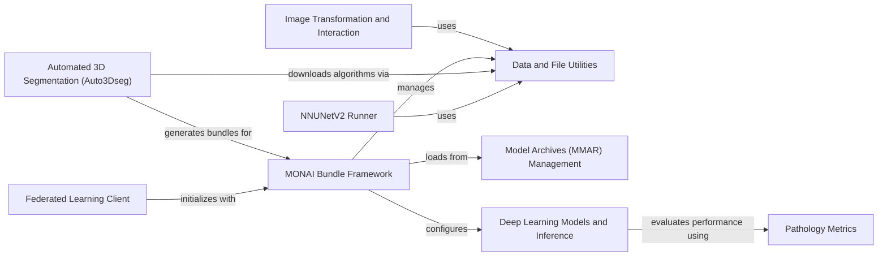

## Component Details

This component facilitates the packaging, sharing, and deployment of medical imaging AI models through self-contained bundles, offering specialized higher-level applications, and enabling client-side functionalities for federated learning experiments. It integrates various sub-components for data handling, model management, image transformations, and specialized application runners to provide a comprehensive solution for deploying and utilizing AI models in medical imaging.

### MONAI Bundle Framework
This component represents the core framework for managing MONAI bundles. It encompasses functionalities for parsing configurations, executing workflows, and providing scripts for downloading, loading, and running pre-defined bundles, enabling modular and reproducible research.

**Related Classes/Methods**:

- <a href="https://github.com/Project-MONAI/MONAI/blob/master/monai/bundle/config_parser.py#L101-L120" target="_blank" rel="noopener noreferrer">`MONAI.monai.bundle.config_parser.ConfigParser.__init__` (101:120)</a>
- <a href="https://github.com/Project-MONAI/MONAI/blob/master/monai/bundle/config_parser.py#L305-L319" target="_blank" rel="noopener noreferrer">`MONAI.monai.bundle.config_parser.ConfigParser.read_config` (305:319)</a>
- <a href="https://github.com/Project-MONAI/MONAI/blob/master/monai/bundle/scripts.py#L447-L626" target="_blank" rel="noopener noreferrer">`MONAI.monai.bundle.scripts.download` (447:626)</a>
- <a href="https://github.com/Project-MONAI/MONAI/blob/master/monai/bundle/scripts.py#L629-L769" target="_blank" rel="noopener noreferrer">`MONAI.monai.bundle.scripts.load` (629:769)</a>
- <a href="https://github.com/Project-MONAI/MONAI/blob/master/monai/bundle/scripts.py#L925-L1014" target="_blank" rel="noopener noreferrer">`MONAI.monai.bundle.scripts.run` (925:1014)</a>
- <a href="https://github.com/Project-MONAI/MONAI/blob/master/monai/bundle/workflows.py#L404-L463" target="_blank" rel="noopener noreferrer">`MONAI.monai.bundle.workflows.ConfigWorkflow.__init__` (404:463)</a>
- <a href="https://github.com/Project-MONAI/MONAI/blob/master/monai/bundle/reference_resolver.py#L88-L104" target="_blank" rel="noopener noreferrer">`MONAI.monai.bundle.reference_resolver.ReferenceResolver.get_item` (88:104)</a>
- <a href="https://github.com/Project-MONAI/MONAI/blob/master/monai/bundle/config_item.py#L274-L291" target="_blank" rel="noopener noreferrer">`MONAI.monai.bundle.config_item.ConfigComponent.instantiate` (274:291)</a>

### Data and File Utilities
This component provides core functionalities for downloading, extracting, and managing files, including dataset handling for various MONAI applications. It serves as a foundational layer for data access and preparation.

**Related Classes/Methods**:

- <a href="https://github.com/Project-MONAI/MONAI/blob/master/monai/apps/utils.py#L326-L369" target="_blank" rel="noopener noreferrer">`MONAI.monai.apps.utils.download_and_extract` (326:369)</a>

### Image Transformation and Interaction
This component focuses on image transformations and interactive functionalities tailored for specific applications like DeepEdit and Nuclick. It includes methods for generating guidance signals and applying point-based transformations to medical images.

**Related Classes/Methods**:

- <a href="https://github.com/Project-MONAI/MONAI/blob/master/monai/apps/deepedit/transforms.py#L243-L261" target="_blank" rel="noopener noreferrer">`MONAI.monai.apps.deepedit.transforms.AddGuidanceSignalDeepEditd.__call__` (243:261)</a>
- <a href="https://github.com/Project-MONAI/MONAI/blob/master/monai/apps/nuclick/transforms.py#L311-L330" target="_blank" rel="noopener noreferrer">`MONAI.monai.apps.nuclick.transforms.AddPointGuidanceSignald.__call__` (311:330)</a>
- <a href="https://github.com/Project-MONAI/MONAI/blob/master/monai/apps/deepgrow/interaction.py#L56-L89" target="_blank" rel="noopener noreferrer">`MONAI.monai.apps.deepgrow.interaction.Interaction.__call__` (56:89)</a>

### Model Archives (MMAR) Management
This component specifically handles the downloading and loading of MONAI Model Archives (MMARs). MMARs are self-contained packages that include models, data, and configurations, facilitating easy sharing and deployment of trained models.

**Related Classes/Methods**:

- <a href="https://github.com/Project-MONAI/MONAI/blob/master/monai/apps/mmars/mmars.py#L105-L184" target="_blank" rel="noopener noreferrer">`MONAI.monai.apps.mmars.mmars.download_mmar` (105:184)</a>

### NNUNetV2 Runner
This component provides a comprehensive runner for NNUNetV2, a popular framework for medical image segmentation. It manages the entire workflow, including dataset conversion, planning, processing, training, finding optimal configurations, and performing predictions with ensemble post-processing.

**Related Classes/Methods**:

- <a href="https://github.com/Project-MONAI/MONAI/blob/master/monai/apps/nnunet/nnunetv2_runner.py#L925-L958" target="_blank" rel="noopener noreferrer">`MONAI.monai.apps.nnunet.nnunetv2_runner.nnUNetV2Runner.run` (925:958)</a>

### Pathology Metrics
This component is dedicated to calculating specific metrics relevant to pathology image analysis. It includes functionalities for evaluating the performance of models, such as computing the Lesion Free-Response Receiver Operating Characteristic (FROC) curve and score.

**Related Classes/Methods**:

- <a href="https://github.com/Project-MONAI/MONAI/blob/master/monai/apps/pathology/metrics/lesion_froc.py#L158-L176" target="_blank" rel="noopener noreferrer">`MONAI.monai.apps.pathology.metrics.lesion_froc.LesionFROC.evaluate` (158:176)</a>

### Deep Learning Models and Inference
This component encompasses various deep learning network architectures designed for tasks such as detection, reconstruction, and generative modeling. It includes the forward pass logic and inference mechanisms for these specialized models.

**Related Classes/Methods**:

- <a href="https://github.com/Project-MONAI/MONAI/blob/master/monai/apps/reconstruction/networks/nets/varnet.py#L56-L78" target="_blank" rel="noopener noreferrer">`MONAI.monai.apps.reconstruction.networks.nets.varnet.VariationalNetworkModel.forward` (56:78)</a>
- <a href="https://github.com/Project-MONAI/MONAI/blob/master/monai/apps/vista3d/inferer.py#L27-L139" target="_blank" rel="noopener noreferrer">`MONAI.monai.apps.vista3d.inferer.point_based_window_inferer` (27:139)</a>
- <a href="https://github.com/Project-MONAI/MONAI/blob/master/monai/apps/generation/maisi/networks/autoencoderkl_maisi.py#L912-L994" target="_blank" rel="noopener noreferrer">`MONAI.monai.apps.generation.maisi.networks.autoencoderkl_maisi.AutoencoderKlMaisi.__init__` (912:994)</a>
- <a href="https://github.com/Project-MONAI/MONAI/blob/master/monai/apps/detection/networks/retinanet_detector.py#L466-L549" target="_blank" rel="noopener noreferrer">`MONAI.monai.apps.detection.networks.retinanet_detector.RetinaNetDetector.forward` (466:549)</a>

### Automated 3D Segmentation (Auto3Dseg)
This component provides automated workflows for 3D segmentation tasks. It includes functionalities for data analysis, automated bundle generation, training of segmentation algorithms, and ensemble building for improved performance.

**Related Classes/Methods**:

- <a href="https://github.com/Project-MONAI/MONAI/blob/master/monai/apps/auto3dseg/auto_runner.py#L802-L897" target="_blank" rel="noopener noreferrer">`MONAI.monai.apps.auto3dseg.auto_runner.AutoRunner.run` (802:897)</a>

### Federated Learning Client
This component implements the client-side logic for federated learning. It handles the initialization, training, and evaluation of MONAI algorithms in a federated setting, and manages the exchange of information through specialized exchange objects.

**Related Classes/Methods**:

- <a href="https://github.com/Project-MONAI/MONAI/blob/master/monai/fl/client/monai_algo.py#L410-L504" target="_blank" rel="noopener noreferrer">`MONAI.monai.fl.client.monai_algo.MonaiAlgo.initialize` (410:504)</a>
- <a href="https://github.com/Project-MONAI/MONAI/blob/master/monai/fl/client/monai_algo.py#L506-L544" target="_blank" rel="noopener noreferrer">`MONAI.monai.fl.client.monai_algo.MonaiAlgo.train` (506:544)</a>
- <a href="https://github.com/Project-MONAI/MONAI/blob/master/monai/fl/client/monai_algo.py#L625-L671" target="_blank" rel="noopener noreferrer">`MONAI.monai.fl.client.monai_algo.MonaiAlgo.evaluate` (625:671)</a>
- <a href="https://github.com/Project-MONAI/MONAI/blob/master/monai/fl/utils/exchange_object.py#L93-L100" target="_blank" rel="noopener noreferrer">`MONAI.monai.fl.utils.exchange_object.ExchangeObject.summary` (93:100)</a>

### [FAQ](https://github.com/CodeBoarding/GeneratedOnBoardings/tree/main?tab=readme-ov-file#faq)