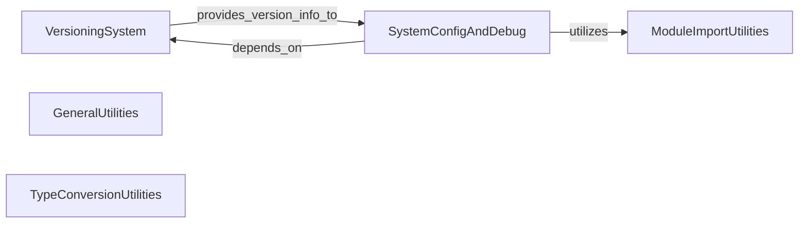

## Component Details

The Core Utilities subsystem in MONAI provides essential functionalities for managing versioning, system configuration, debugging, general utility functions, module import handling, and type conversions. It acts as a foundational layer, supporting various modules across the MONAI library by ensuring consistent data handling, environment setup, and dependency management. The main flow involves retrieving system and package information, formatting version strings, and providing helper functions for common data manipulations and module imports.

### VersioningSystem
Manages the retrieval and formatting of MONAI's version information, including integration with Git for version control details and rendering version strings according to PEP 440.

**Related Classes/Methods**:

- <a href="https://github.com/Project-MONAI/MONAI/blob/master/monai/_version.py#L38-L49" target="_blank" rel="noopener noreferrer">`MONAI.monai._version.get_config` (38:49)</a>
- <a href="https://github.com/Project-MONAI/MONAI/blob/master/monai/_version.py#L613-L656" target="_blank" rel="noopener noreferrer">`MONAI.monai._version.get_versions` (613:656)</a>
- <a href="https://github.com/Project-MONAI/MONAI/blob/master/monai/_version.py#L167-L227" target="_blank" rel="noopener noreferrer">`MONAI.monai._version.git_versions_from_keywords` (167:227)</a>
- <a href="https://github.com/Project-MONAI/MONAI/blob/master/monai/_version.py#L21-L31" target="_blank" rel="noopener noreferrer">`MONAI.monai._version.get_keywords` (21:31)</a>
- <a href="https://github.com/Project-MONAI/MONAI/blob/master/monai/_version.py#L231-L360" target="_blank" rel="noopener noreferrer">`MONAI.monai._version.git_pieces_from_vcs` (231:360)</a>
- <a href="https://github.com/Project-MONAI/MONAI/blob/master/monai/_version.py#L577-L610" target="_blank" rel="noopener noreferrer">`MONAI.monai._version.render` (577:610)</a>
- <a href="https://github.com/Project-MONAI/MONAI/blob/master/monai/_version.py#L114-L135" target="_blank" rel="noopener noreferrer">`MONAI.monai._version.versions_from_parentdir` (114:135)</a>
- <a href="https://github.com/Project-MONAI/MONAI/blob/master/monai/_version.py#L34-L35" target="_blank" rel="noopener noreferrer">`MONAI.monai._version.VersioneerConfig` (34:35)</a>
- <a href="https://github.com/Project-MONAI/MONAI/blob/master/monai/_version.py#L139-L163" target="_blank" rel="noopener noreferrer">`MONAI.monai._version.git_get_keywords` (139:163)</a>
- <a href="https://github.com/Project-MONAI/MONAI/blob/master/monai/_version.py#L60-L68" target="_blank" rel="noopener noreferrer">`MONAI.monai._version.register_vcs_handler` (60:68)</a>
- <a href="https://github.com/Project-MONAI/MONAI/blob/master/monai/_version.py#L370-L392" target="_blank" rel="noopener noreferrer">`MONAI.monai._version.render_pep440` (370:392)</a>
- <a href="https://github.com/Project-MONAI/MONAI/blob/master/monai/_version.py#L395-L422" target="_blank" rel="noopener noreferrer">`MONAI.monai._version.render_pep440_branch` (395:422)</a>
- <a href="https://github.com/Project-MONAI/MONAI/blob/master/monai/_version.py#L435-L456" target="_blank" rel="noopener noreferrer">`MONAI.monai._version.render_pep440_pre` (435:456)</a>
- <a href="https://github.com/Project-MONAI/MONAI/blob/master/monai/_version.py#L459-L483" target="_blank" rel="noopener noreferrer">`MONAI.monai._version.render_pep440_post` (459:483)</a>
- <a href="https://github.com/Project-MONAI/MONAI/blob/master/monai/_version.py#L486-L512" target="_blank" rel="noopener noreferrer">`MONAI.monai._version.render_pep440_post_branch` (486:512)</a>
- <a href="https://github.com/Project-MONAI/MONAI/blob/master/monai/_version.py#L363-L367" target="_blank" rel="noopener noreferrer">`MONAI.monai._version.plus_or_dot` (363:367)</a>
- <a href="https://github.com/Project-MONAI/MONAI/blob/master/monai/_version.py#L425-L432" target="_blank" rel="noopener noreferrer">`MONAI.monai._version.pep440_split_post` (425:432)</a>
- <a href="https://github.com/Project-MONAI/MONAI/blob/master/monai/_version.py#L515-L534" target="_blank" rel="noopener noreferrer">`MONAI.monai._version.render_pep440_old` (515:534)</a>
- <a href="https://github.com/Project-MONAI/MONAI/blob/master/monai/_version.py#L537-L554" target="_blank" rel="noopener noreferrer">`MONAI.monai._version.render_git_describe` (537:554)</a>
- <a href="https://github.com/Project-MONAI/MONAI/blob/master/monai/_version.py#L557-L574" target="_blank" rel="noopener noreferrer">`MONAI.monai._version.render_git_describe_long` (557:574)</a>

### SystemConfigAndDebug
Provides functionalities to retrieve and print configuration details related to the system, including device (GPU) and general MONAI settings, useful for debugging and environment understanding.

**Related Classes/Methods**:

- <a href="https://github.com/Project-MONAI/MONAI/blob/master/monai/config/deviceconfig.py#L244-L262" target="_blank" rel="noopener noreferrer">`MONAI.monai.config.deviceconfig.print_debug_info` (244:262)</a>
- <a href="https://github.com/Project-MONAI/MONAI/blob/master/monai/config/deviceconfig.py#L94-L116" target="_blank" rel="noopener noreferrer">`MONAI.monai.config.deviceconfig.print_config` (94:116)</a>
- <a href="https://github.com/Project-MONAI/MONAI/blob/master/monai/config/deviceconfig.py#L185-L196" target="_blank" rel="noopener noreferrer">`MONAI.monai.config.deviceconfig.print_system_info` (185:196)</a>
- <a href="https://github.com/Project-MONAI/MONAI/blob/master/monai/config/deviceconfig.py#L233-L241" target="_blank" rel="noopener noreferrer">`MONAI.monai.config.deviceconfig.print_gpu_info` (233:241)</a>
- <a href="https://github.com/Project-MONAI/MONAI/blob/master/monai/config/deviceconfig.py#L66-L91" target="_blank" rel="noopener noreferrer">`MONAI.monai.config.deviceconfig.get_optional_config_values` (66:91)</a>
- <a href="https://github.com/Project-MONAI/MONAI/blob/master/monai/config/deviceconfig.py#L53-L63" target="_blank" rel="noopener noreferrer">`MONAI.monai.config.deviceconfig.get_config_values` (53:63)</a>
- <a href="https://github.com/Project-MONAI/MONAI/blob/master/monai/config/deviceconfig.py#L126-L182" target="_blank" rel="noopener noreferrer">`MONAI.monai.config.deviceconfig.get_system_info` (126:182)</a>
- <a href="https://github.com/Project-MONAI/MONAI/blob/master/monai/config/deviceconfig.py#L119-L123" target="_blank" rel="noopener noreferrer">`MONAI.monai.config.deviceconfig._dict_append` (119:123)</a>
- <a href="https://github.com/Project-MONAI/MONAI/blob/master/monai/config/deviceconfig.py#L199-L230" target="_blank" rel="noopener noreferrer">`MONAI.monai.config.deviceconfig.get_gpu_info` (199:230)</a>

### GeneralUtilities
Contains miscellaneous utility functions that provide common helper functionalities, such as ensuring iterable types for consistent data handling.

**Related Classes/Methods**:

- <a href="https://github.com/Project-MONAI/MONAI/blob/master/monai/utils/misc.py#L161-L173" target="_blank" rel="noopener noreferrer">`MONAI.monai.utils.misc.ensure_tuple` (161:173)</a>
- <a href="https://github.com/Project-MONAI/MONAI/blob/master/monai/utils/misc.py#L140-L149" target="_blank" rel="noopener noreferrer">`MONAI.monai.utils.misc.issequenceiterable` (140:149)</a>

### ModuleImportUtilities
Offers utilities for handling optional module imports and parsing version strings, allowing for flexible dependency management and version compatibility checks within MONAI.

**Related Classes/Methods**:

- <a href="https://github.com/Project-MONAI/MONAI/blob/master/monai/utils/module.py#L314-L444" target="_blank" rel="noopener noreferrer">`MONAI.monai.utils.module.optional_import` (314:444)</a>
- <a href="https://github.com/Project-MONAI/MONAI/blob/master/monai/utils/module.py#L272-L284" target="_blank" rel="noopener noreferrer">`MONAI.monai.utils.module.min_version` (272:284)</a>
- <a href="https://github.com/Project-MONAI/MONAI/blob/master/monai/utils/module.py#L308-L311" target="_blank" rel="noopener noreferrer">`MONAI.monai.utils.module.OptionalImportError` (308:311)</a>
- <a href="https://github.com/Project-MONAI/MONAI/blob/master/monai/utils/module.py#L401-L432" target="_blank" rel="noopener noreferrer">`MONAI.monai.utils.module.optional_import._LazyRaise` (401:432)</a>
- <a href="https://github.com/Project-MONAI/MONAI/blob/master/monai/utils/module.py#L505-L528" target="_blank" rel="noopener noreferrer">`MONAI.monai.utils.module.parse_version_strs` (505:528)</a>
- <a href="https://github.com/Project-MONAI/MONAI/blob/master/monai/utils/module.py#L486-L493" target="_blank" rel="noopener noreferrer">`MONAI.monai.utils.module.get_package_version` (486:493)</a>

### TypeConversionUtilities
Provides a set of functions for converting data types, particularly for tensors, and managing data type ranges and equivalences between different frameworks like NumPy and PyTorch to ensure data consistency.

**Related Classes/Methods**:

- <a href="https://github.com/Project-MONAI/MONAI/blob/master/monai/utils/type_conversion.py#L112-L180" target="_blank" rel="noopener noreferrer">`MONAI.monai.utils.type_conversion.convert_to_tensor` (112:180)</a>
- <a href="https://github.com/Project-MONAI/MONAI/blob/master/monai/utils/type_conversion.py#L426-L478" target="_blank" rel="noopener noreferrer">`MONAI.monai.utils.type_conversion.safe_dtype_range` (426:478)</a>
- <a href="https://github.com/Project-MONAI/MONAI/blob/master/monai/utils/type_conversion.py#L66-L88" target="_blank" rel="noopener noreferrer">`MONAI.monai.utils.type_conversion.get_equivalent_dtype` (66:88)</a>
- <a href="https://github.com/Project-MONAI/MONAI/blob/master/monai/utils/type_conversion.py#L141-L153" target="_blank" rel="noopener noreferrer">`MONAI.monai.utils.type_conversion.convert_to_tensor._convert_tensor` (141:153)</a>
- <a href="https://github.com/Project-MONAI/MONAI/blob/master/monai/utils/type_conversion.py#L407-L423" target="_blank" rel="noopener noreferrer">`MONAI.monai.utils.type_conversion.get_dtype_bound_value` (407:423)</a>
- <a href="https://github.com/Project-MONAI/MONAI/blob/master/monai/utils/type_conversion.py#L437-L455" target="_blank" rel="noopener noreferrer">`MONAI.monai.utils.type_conversion.safe_dtype_range._safe_dtype_range` (437:455)</a>
- <a href="https://github.com/Project-MONAI/MONAI/blob/master/monai/utils/type_conversion.py#L61-L63" target="_blank" rel="noopener noreferrer">`MONAI.monai.utils.type_conversion.dtype_numpy_to_torch` (61:63)</a>
- <a href="https://github.com/Project-MONAI/MONAI/blob/master/monai/utils/type_conversion.py#L56-L58" target="_blank" rel="noopener noreferrer">`MONAI.monai.utils.type_conversion.dtype_torch_to_numpy` (56:58)</a>

### [FAQ](https://github.com/CodeBoarding/GeneratedOnBoardings/tree/main?tab=readme-ov-file#faq)