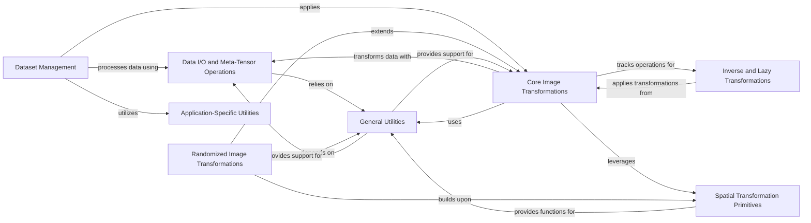

## Component Details

The Data I/O & Preprocessing subsystem in MONAI is a comprehensive pipeline designed to handle medical image data from acquisition to model readiness. It encompasses several key stages: data loading and organization from diverse sources (e.g., MedNIST, Decathlon, TCIA datasets), efficient data access through caching mechanisms, and a wide array of transformations for both augmentation and preprocessing. The system leverages `MetaTensor` to preserve crucial metadata throughout the pipeline, ensuring data integrity and traceability of applied operations. It also includes specialized utilities for file management and application-specific tasks, alongside fundamental and randomized spatial transformation primitives that are essential for robust medical image analysis and deep learning workflows. The subsystem is built to support both immediate and lazy execution of transformations, allowing for optimized performance and flexible data handling.

### Dataset Management
This component is responsible for handling the loading, preparation, and caching of various medical image datasets. It includes functionalities for downloading and extracting data, generating data lists, and integrating with caching mechanisms to optimize data access for training and evaluation workflows. It also manages random state for reproducibility in dataset generation.

**Related Classes/Methods**:

- <a href="https://github.com/Project-MONAI/MONAI/blob/master/monai/apps/datasets.py#L90-L145" target="_blank" rel="noopener noreferrer">`MONAI.monai.apps.datasets.MedNISTDataset.__init__` (90:145)</a>
- <a href="https://github.com/Project-MONAI/MONAI/blob/master/monai/apps/datasets.py#L287-L356" target="_blank" rel="noopener noreferrer">`MONAI.monai.apps.datasets.DecathlonDataset.__init__` (287:356)</a>
- <a href="https://github.com/Project-MONAI/MONAI/blob/master/monai/apps/datasets.py#L494-L574" target="_blank" rel="noopener noreferrer">`MONAI.monai.apps.datasets.TciaDataset.__init__` (494:574)</a>
- <a href="https://github.com/Project-MONAI/MONAI/blob/master/monai/data/dataset.py#L738-L808" target="_blank" rel="noopener noreferrer">`MONAI.monai.data.dataset.CacheDataset.__init__` (738:808)</a>
- <a href="https://github.com/Project-MONAI/MONAI/blob/master/monai/data/dataloader.py#L78-L105" target="_blank" rel="noopener noreferrer">`MONAI.monai.data.dataloader.DataLoader.__init__` (78:105)</a>
- <a href="https://github.com/Project-MONAI/MONAI/blob/master/monai/data/decathlon_datalist.py#L86-L132" target="_blank" rel="noopener noreferrer">`MONAI.monai.data.decathlon_datalist.load_decathlon_datalist` (86:132)</a>
- <a href="https://github.com/Project-MONAI/MONAI/blob/master/monai/data/dataset.py#L71-L83" target="_blank" rel="noopener noreferrer">`MONAI.monai.data.dataset.Dataset.__init__` (71:83)</a>
- <a href="https://github.com/Project-MONAI/MONAI/blob/master/monai/apps/datasets.py#L154-L193" target="_blank" rel="noopener noreferrer">`MONAI.monai.apps.datasets.MedNISTDataset._generate_data_list` (154:193)</a>
- <a href="https://github.com/Project-MONAI/MONAI/blob/master/monai/apps/datasets.py#L380-L385" target="_blank" rel="noopener noreferrer">`MONAI.monai.apps.datasets.DecathlonDataset._generate_data_list` (380:385)</a>
- <a href="https://github.com/Project-MONAI/MONAI/blob/master/monai/apps/datasets.py#L642-L659" target="_blank" rel="noopener noreferrer">`MONAI.monai.apps.datasets.TciaDataset._generate_data_list` (642:659)</a>
- <a href="https://github.com/Project-MONAI/MONAI/blob/master/monai/apps/datasets.py#L387-L400" target="_blank" rel="noopener noreferrer">`MONAI.monai.apps.datasets.DecathlonDataset._split_datalist` (387:400)</a>
- <a href="https://github.com/Project-MONAI/MONAI/blob/master/monai/apps/datasets.py#L661-L674" target="_blank" rel="noopener noreferrer">`MONAI.monai.apps.datasets.TciaDataset._split_datalist` (661:674)</a>
- <a href="https://github.com/Project-MONAI/MONAI/blob/master/monai/data/dataset.py#L810-L845" target="_blank" rel="noopener noreferrer">`MONAI.monai.data.dataset.CacheDataset.set_data` (810:845)</a>
- <a href="https://github.com/Project-MONAI/MONAI/blob/master/monai/data/dataset.py#L847-L865" target="_blank" rel="noopener noreferrer">`MONAI.monai.data.dataset.CacheDataset._fill_cache` (847:865)</a>
- <a href="https://github.com/Project-MONAI/MONAI/blob/master/monai/data/dataset.py#L867-L881" target="_blank" rel="noopener noreferrer">`MONAI.monai.data.dataset.CacheDataset._load_cache_item` (867:881)</a>

### Data I/O and Meta-Tensor Operations
This component focuses on reading and writing medical image data from various sources and formats, including DICOM and WSI. It also encompasses the `MetaTensor` class, which extends PyTorch tensors to include metadata, ensuring that crucial information like affine transformations and applied operations are preserved and managed throughout the data processing pipeline. This component facilitates seamless data flow and metadata consistency.

**Related Classes/Methods**:

- <a href="https://github.com/Project-MONAI/MONAI/blob/master/monai/data/image_reader.py#L490-L545" target="_blank" rel="noopener noreferrer">`MONAI.monai.data.image_reader.PydicomReader.read` (490:545)</a>
- <a href="https://github.com/Project-MONAI/MONAI/blob/master/monai/data/image_writer.py#L450-L475" target="_blank" rel="noopener noreferrer">`MONAI.monai.data.image_writer.ITKWriter.write` (450:475)</a>
- <a href="https://github.com/Project-MONAI/MONAI/blob/master/monai/data/meta_tensor.py#L118-L171" target="_blank" rel="noopener noreferrer">`MONAI.monai.data.meta_tensor.MetaTensor.__init__` (118:171)</a>
- <a href="https://github.com/Project-MONAI/MONAI/blob/master/monai/data/wsi_reader.py#L634-L646" target="_blank" rel="noopener noreferrer">`MONAI.monai.data.wsi_reader.WSIReader.read` (634:646)</a>
- <a href="https://github.com/Project-MONAI/MONAI/blob/master/monai/transforms/io/array.py#L236-L303" target="_blank" rel="noopener noreferrer">`MONAI.monai.transforms.io.array.LoadImage.__call__` (236:303)</a>
- <a href="https://github.com/Project-MONAI/MONAI/blob/master/monai/transforms/io/dictionary.py#L39-L177" target="_blank" rel="noopener noreferrer">`MONAI.monai.transforms.io.dictionary.LoadImaged` (39:177)</a>
- <a href="https://github.com/Project-MONAI/MONAI/blob/master/monai/data/image_writer.py#L478-L529" target="_blank" rel="noopener noreferrer">`MONAI.monai.data.image_writer.ITKWriter.create_backend_obj` (478:529)</a>
- <a href="https://github.com/Project-MONAI/MONAI/blob/master/monai/data/image_writer.py#L193-L196" target="_blank" rel="noopener noreferrer">`MONAI.monai.data.image_writer.ImageWriter.write` (193:196)</a>
- <a href="https://github.com/Project-MONAI/MONAI/blob/master/monai/data/image_writer.py#L199-L204" target="_blank" rel="noopener noreferrer">`MONAI.monai.data.image_writer.ImageWriter.create_backend_obj` (199:204)</a>
- <a href="https://github.com/Project-MONAI/MONAI/blob/master/monai/data/meta_tensor.py#L533-L580" target="_blank" rel="noopener noreferrer">`MONAI.monai.data.meta_tensor.MetaTensor.ensure_torch_and_prune_meta` (533:580)</a>
- <a href="https://github.com/Project-MONAI/MONAI/blob/master/monai/data/meta_tensor.py#L174-L226" target="_blank" rel="noopener noreferrer">`MONAI.monai.data.meta_tensor.MetaTensor.update_meta` (174:226)</a>
- <a href="https://github.com/Project-MONAI/MONAI/blob/master/monai/data/meta_tensor.py#L229-L275" target="_blank" rel="noopener noreferrer">`MONAI.monai.data.meta_tensor.MetaTensor._handle_batched` (229:275)</a>
- <a href="https://github.com/Project-MONAI/MONAI/blob/master/monai/data/meta_tensor.py#L345-L346" target="_blank" rel="noopener noreferrer">`MONAI.monai.data.meta_tensor.MetaTensor.get_default_affine` (345:346)</a>
- <a href="https://github.com/Project-MONAI/MONAI/blob/master/monai/data/meta_obj.py#L81-L85" target="_blank" rel="noopener noreferrer">`MONAI.monai.data.meta_obj.MetaObj.__init__` (81:85)</a>
- <a href="https://github.com/Project-MONAI/MONAI/blob/master/monai/data/meta_obj.py#L149-L155" target="_blank" rel="noopener noreferrer">`MONAI.monai.data.meta_obj.MetaObj.get_default_applied_operations` (149:155)</a>
- <a href="https://github.com/Project-MONAI/MONAI/blob/master/monai/data/meta_obj.py#L46-L59" target="_blank" rel="noopener noreferrer">`MONAI.monai.data.meta_obj.get_track_meta` (46:59)</a>
- <a href="https://github.com/Project-MONAI/MONAI/blob/master/monai/data/meta_obj.py#L62-L243" target="_blank" rel="noopener noreferrer">`MONAI.monai.data.meta_obj.MetaObj` (62:243)</a>
- <a href="https://github.com/Project-MONAI/MONAI/blob/master/monai/data/meta_obj.py#L226-L227" target="_blank" rel="noopener noreferrer">`MONAI.monai.data.meta_obj.MetaObj.push_pending_operation` (226:227)</a>
- <a href="https://github.com/Project-MONAI/MONAI/blob/master/monai/data/meta_obj.py#L204-L205" target="_blank" rel="noopener noreferrer">`MONAI.monai.data.meta_obj.MetaObj.push_applied_operation` (204:205)</a>

### Core Image Transformations
This component provides a comprehensive set of fundamental image transformations essential for medical image processing. It includes operations for composing multiple transforms, spatial resampling, intensity normalization, padding, discrete conversion, channel management, point coordinate transformation, and inversion. These transformations are designed to be traceable, allowing for the tracking and potential inversion of operations.

**Related Classes/Methods**:

- <a href="https://github.com/Project-MONAI/MONAI/blob/master/monai/transforms/compose.py#L343-L358" target="_blank" rel="noopener noreferrer">`MONAI.monai.transforms.compose.Compose.__call__` (343:358)</a>
- <a href="https://github.com/Project-MONAI/MONAI/blob/master/monai/transforms/spatial/array.py#L169-L235" target="_blank" rel="noopener noreferrer">`MONAI.monai.transforms.spatial.array.SpatialResample.__call__` (169:235)</a>
- <a href="https://github.com/Project-MONAI/MONAI/blob/master/monai/transforms/intensity/array.py#L898-L923" target="_blank" rel="noopener noreferrer">`MONAI.monai.transforms.intensity.array.NormalizeIntensity.__call__` (898:923)</a>
- <a href="https://github.com/Project-MONAI/MONAI/blob/master/monai/transforms/croppad/array.py#L429-L477" target="_blank" rel="noopener noreferrer">`MONAI.monai.transforms.croppad.array.SpatialPad.__call__` (429:477)</a>
- <a href="https://github.com/Project-MONAI/MONAI/blob/master/monai/transforms/post/array.py#L187-L235" target="_blank" rel="noopener noreferrer">`MONAI.monai.transforms.post.array.AsDiscrete.__call__` (187:235)</a>
- <a href="https://github.com/Project-MONAI/MONAI/blob/master/monai/transforms/utility/array.py#L195-L232" target="_blank" rel="noopener noreferrer">`MONAI.monai.transforms.utility.array.EnsureChannelFirst.__call__` (195:232)</a>
- <a href="https://github.com/Project-MONAI/MONAI/blob/master/monai/transforms/utility/array.py#L1924-L1939" target="_blank" rel="noopener noreferrer">`MONAI.monai.transforms.utility.array.ApplyTransformToPoints.__call__` (1924:1939)</a>
- <a href="https://github.com/Project-MONAI/MONAI/blob/master/monai/transforms/post/array.py#L865-L882" target="_blank" rel="noopener noreferrer">`MONAI.monai.transforms.post.array.Invert.__call__` (865:882)</a>
- <a href="https://github.com/Project-MONAI/MONAI/blob/master/monai/transforms/compose.py#L46-L119" target="_blank" rel="noopener noreferrer">`MONAI.monai.transforms.compose.execute_compose` (46:119)</a>
- <a href="https://github.com/Project-MONAI/MONAI/blob/master/monai/transforms/intensity/array.py#L864-L896" target="_blank" rel="noopener noreferrer">`MONAI.monai.transforms.intensity.array.NormalizeIntensity._normalize` (864:896)</a>
- <a href="https://github.com/Project-MONAI/MONAI/blob/master/monai/transforms/croppad/array.py#L120-L129" target="_blank" rel="noopener noreferrer">`MONAI.monai.transforms.croppad.array.Pad.compute_pad_width` (120:129)</a>
- <a href="https://github.com/Project-MONAI/MONAI/blob/master/monai/transforms/croppad/functional.py#L150-L209" target="_blank" rel="noopener noreferrer">`MONAI.monai.transforms.croppad.functional.pad_func` (150:209)</a>
- <a href="https://github.com/Project-MONAI/MONAI/blob/master/monai/transforms/croppad/functional.py#L72-L113" target="_blank" rel="noopener noreferrer">`MONAI.monai.transforms.croppad.functional.pad_nd` (72:113)</a>
- <a href="https://github.com/Project-MONAI/MONAI/blob/master/monai/transforms/io/array.py#L73-L105" target="_blank" rel="noopener noreferrer">`MONAI.monai.transforms.io.array.switch_endianness` (73:105)</a>
- <a href="https://github.com/Project-MONAI/MONAI/blob/master/monai/transforms/croppad/array.py#L479-L486" target="_blank" rel="noopener noreferrer">`MONAI.monai.transforms.croppad.array.SpatialCrop.__call__` (479:486)</a>
- <a href="https://github.com/Project-MONAI/MONAI/blob/master/monai/transforms/croppad/array.py#L407-L424" target="_blank" rel="noopener noreferrer">`MONAI.monai.transforms.croppad.array.Crop.__call__` (407:424)</a>
- <a href="https://github.com/Project-MONAI/MONAI/blob/master/monai/transforms/croppad/functional.py#L212-L247" target="_blank" rel="noopener noreferrer">`MONAI.monai.transforms.croppad.functional.crop_func` (212:247)</a>
- <a href="https://github.com/Project-MONAI/MONAI/blob/master/monai/transforms/utility/array.py#L1883-L1922" target="_blank" rel="noopener noreferrer">`MONAI.monai.transforms.utility.array.ApplyTransformToPoints.transform_coordinates` (1883:1922)</a>
- <a href="https://github.com/Project-MONAI/MONAI/blob/master/monai/transforms/utility/array.py#L1859-L1881" target="_blank" rel="noopener noreferrer">`MONAI.monai.transforms.utility.array.ApplyTransformToPoints._compute_final_affine` (1859:1881)</a>
- <a href="https://github.com/Project-MONAI/MONAI/blob/master/monai/transforms/utility/array.py#L413-L421" target="_blank" rel="noopener noreferrer">`MONAI.monai.transforms.utility.array.ToTensor.__call__` (413:421)</a>
- <a href="https://github.com/Project-MONAI/MONAI/blob/master/monai/transforms/transform.py#L100-L179" target="_blank" rel="noopener noreferrer">`MONAI.monai.transforms.transform.apply_transform` (100:179)</a>
- <a href="https://github.com/Project-MONAI/MONAI/blob/master/monai/transforms/transform.py#L45-L97" target="_blank" rel="noopener noreferrer">`MONAI.monai.transforms.transform._apply_transform` (45:97)</a>
- <a href="https://github.com/Project-MONAI/MONAI/blob/master/monai/transforms/transform.py#L62-L70" target="_blank" rel="noopener noreferrer">`MONAI.monai.transforms.transform.apply_transform._log_stats` (62:70)</a>
- <a href="https://github.com/Project-MONAI/MONAI/blob/master/monai/transforms/utility/array.py#L638-L744" target="_blank" rel="noopener noreferrer">`MONAI.monai.transforms.utility.array.DataStats` (638:744)</a>
- <a href="https://github.com/Project-MONAI/MONAI/blob/master/monai/transforms/compose.py#L237-L262" target="_blank" rel="noopener noreferrer">`MONAI.monai.transforms.compose.Compose.__init__` (237:262)</a>
- <a href="https://github.com/Project-MONAI/MONAI/blob/master/monai/transforms/compose.py#L268-L274" target="_blank" rel="noopener noreferrer">`MONAI.monai.transforms.compose.Compose.set_random_state` (268:274)</a>
- <a href="https://github.com/Project-MONAI/MONAI/blob/master/monai/transforms/compose.py#L288-L321" target="_blank" rel="noopener noreferrer">`MONAI.monai.transforms.compose.Compose.get_index_of_first` (288:321)</a>
- <a href="https://github.com/Project-MONAI/MONAI/blob/master/monai/transforms/utility/dictionary.py#L660-L695" target="_blank" rel="noopener noreferrer">`MONAI.monai.transforms.utility.dictionary.DeleteItemsd` (660:695)</a>

### Randomized Image Transformations
This component provides a suite of randomized image transformations crucial for data augmentation in medical imaging. These transformations introduce variability into the dataset, helping to improve model generalization and robustness. Examples include random affine transformations, random rotations, random flips, random cropping based on positive/negative labels, and random Gaussian noise application.

**Related Classes/Methods**:

- <a href="https://github.com/Project-MONAI/MONAI/blob/master/monai/transforms/spatial/array.py#L2475-L2547" target="_blank" rel="noopener noreferrer">`MONAI.monai.transforms.spatial.array.RandAffine.__call__` (2475:2547)</a>
- <a href="https://github.com/Project-MONAI/MONAI/blob/master/monai/transforms/spatial/array.py#L1230-L1251" target="_blank" rel="noopener noreferrer">`MONAI.monai.transforms.spatial.array.RandRotate90.__call__` (1230:1251)</a>
- <a href="https://github.com/Project-MONAI/MONAI/blob/master/monai/transforms/spatial/array.py#L1424-L1439" target="_blank" rel="noopener noreferrer">`MONAI.monai.transforms.spatial.array.RandFlip.__call__` (1424:1439)</a>
- <a href="https://github.com/Project-MONAI/MONAI/blob/master/monai/transforms/croppad/array.py#L1170-L1216" target="_blank" rel="noopener noreferrer">`MONAI.monai.transforms.croppad.array.RandCropByPosNegLabel.__call__` (1170:1216)</a>
- <a href="https://github.com/Project-MONAI/MONAI/blob/master/monai/transforms/intensity/array.py#L124-L139" target="_blank" rel="noopener noreferrer">`MONAI.monai.transforms.intensity.array.RandGaussianNoise.__call__` (124:139)</a>
- <a href="https://github.com/Project-MONAI/MONAI/blob/master/monai/transforms/spatial/array.py#L2469-L2473" target="_blank" rel="noopener noreferrer">`MONAI.monai.transforms.spatial.array.RandAffine.randomize` (2469:2473)</a>
- <a href="https://github.com/Project-MONAI/MONAI/blob/master/monai/transforms/spatial/array.py#L1874-L1910" target="_blank" rel="noopener noreferrer">`MONAI.monai.transforms.spatial.array.RandAffineGrid.__call__` (1874:1910)</a>
- <a href="https://github.com/Project-MONAI/MONAI/blob/master/monai/transforms/spatial/array.py#L1868-L1872" target="_blank" rel="noopener noreferrer">`MONAI.monai.transforms.spatial.array.RandAffineGrid.randomize` (1868:1872)</a>
- <a href="https://github.com/Project-MONAI/MONAI/blob/master/monai/transforms/spatial/array.py#L1857-L1866" target="_blank" rel="noopener noreferrer">`MONAI.monai.transforms.spatial.array.RandAffineGrid._get_rand_param` (1857:1866)</a>
- <a href="https://github.com/Project-MONAI/MONAI/blob/master/monai/transforms/spatial/array.py#L2444-L2462" target="_blank" rel="noopener noreferrer">`MONAI.monai.transforms.spatial.array.RandAffine.get_identity_grid` (2444:2462)</a>
- <a href="https://github.com/Project-MONAI/MONAI/blob/master/monai/transforms/spatial/array.py#L1224-L1228" target="_blank" rel="noopener noreferrer">`MONAI.monai.transforms.spatial.array.RandRotate90.randomize` (1224:1228)</a>
- <a href="https://github.com/Project-MONAI/MONAI/blob/master/monai/transforms/spatial/array.py#L1167-L1178" target="_blank" rel="noopener noreferrer">`MONAI.monai.transforms.spatial.array.Rotate90.__call__` (1167:1178)</a>
- <a href="https://github.com/Project-MONAI/MONAI/blob/master/monai/transforms/spatial/array.py#L690-L700" target="_blank" rel="noopener noreferrer">`MONAI.monai.transforms.spatial.array.Flip.__call__` (690:700)</a>
- <a href="https://github.com/Project-MONAI/MONAI/blob/master/monai/transforms/croppad/array.py#L1131-L1160" target="_blank" rel="noopener noreferrer">`MONAI.monai.transforms.croppad.array.RandCropByPosNegLabel.randomize` (1131:1160)</a>
- <a href="https://github.com/Project-MONAI/MONAI/blob/master/monai/transforms/intensity/array.py#L115-L122" target="_blank" rel="noopener noreferrer">`MONAI.monai.transforms.intensity.array.RandGaussianNoise.randomize` (115:122)</a>

### General Utilities
This component provides a collection of general utility functions that support various operations across the MONAI framework. This includes functions for data manipulation (e.g., decollating batches, setting random seeds, handling bounding boxes), type conversion (e.g., converting data types, ensuring tuples, handling tensors and NumPy arrays), and module-related operations (e.g., optional imports, looking up options). These utilities ensure consistency and efficiency in data processing.

**Related Classes/Methods**:

- <a href="https://github.com/Project-MONAI/MONAI/blob/master/monai/data/utils.py#L565-L665" target="_blank" rel="noopener noreferrer">`MONAI.monai.data.utils.decollate_batch` (565:665)</a>
- <a href="https://github.com/Project-MONAI/MONAI/blob/master/monai/data/box_utils.py#L545-L602" target="_blank" rel="noopener noreferrer">`MONAI.monai.data.box_utils.convert_box_mode` (545:602)</a>
- <a href="https://github.com/Project-MONAI/MONAI/blob/master/monai/data/utils.py#L711-L733" target="_blank" rel="noopener noreferrer">`MONAI.monai.data.utils.set_rnd` (711:733)</a>
- <a href="https://github.com/Project-MONAI/MONAI/blob/master/monai/utils/misc.py#L161-L173" target="_blank" rel="noopener noreferrer">`MONAI.monai.utils.misc.ensure_tuple` (161:173)</a>
- <a href="https://github.com/Project-MONAI/MONAI/blob/master/monai/utils/type_conversion.py#L273-L339" target="_blank" rel="noopener noreferrer">`MONAI.monai.utils.type_conversion.convert_data_type` (273:339)</a>
- <a href="https://github.com/Project-MONAI/MONAI/blob/master/monai/utils/module.py#L60-L140" target="_blank" rel="noopener noreferrer">`MONAI.monai.utils.module.look_up_option` (60:140)</a>
- <a href="https://github.com/Project-MONAI/MONAI/blob/master/monai/data/utils.py#L539-L562" target="_blank" rel="noopener noreferrer">`MONAI.monai.data.utils._non_zipping_check` (539:562)</a>
- <a href="https://github.com/Project-MONAI/MONAI/blob/master/monai/data/utils.py#L423-L443" target="_blank" rel="noopener noreferrer">`MONAI.monai.data.utils.pickle_operations` (423:443)</a>
- <a href="https://github.com/Project-MONAI/MONAI/blob/master/monai/data/utils.py#L1425-L1429" target="_blank" rel="noopener noreferrer">`MONAI.monai.data.utils.sorted_dict` (1425:1429)</a>
- <a href="https://github.com/Project-MONAI/MONAI/blob/master/monai/data/utils.py#L482-L536" target="_blank" rel="noopener noreferrer">`MONAI.monai.data.utils.list_data_collate` (482:536)</a>
- <a href="https://github.com/Project-MONAI/MONAI/blob/master/monai/data/utils.py#L1540-L1551" target="_blank" rel="noopener noreferrer">`MONAI.monai.data.utils.remove_extra_metadata` (1540:1551)</a>
- <a href="https://github.com/Project-MONAI/MONAI/blob/master/monai/data/utils.py#L1554-L1585" target="_blank" rel="noopener noreferrer">`MONAI.monai.data.utils.get_extra_metadata_keys` (1554:1585)</a>
- <a href="https://github.com/Project-MONAI/MONAI/blob/master/monai/data/utils.py#L1525-L1537" target="_blank" rel="noopener noreferrer">`MONAI.monai.data.utils.remove_keys` (1525:1537)</a>
- <a href="https://github.com/Project-MONAI/MONAI/blob/master/monai/data/utils.py#L356-L417" target="_blank" rel="noopener noreferrer">`MONAI.monai.data.utils.dev_collate` (356:417)</a>
- <a href="https://github.com/Project-MONAI/MONAI/blob/master/monai/data/box_utils.py#L456-L515" target="_blank" rel="noopener noreferrer">`MONAI.monai.data.box_utils.get_boxmode` (456:515)</a>
- <a href="https://github.com/Project-MONAI/MONAI/blob/master/monai/data/box_utils.py#L84-L94" target="_blank" rel="noopener noreferrer">`MONAI.monai.data.box_utils.BoxMode.get_name` (84:94)</a>
- <a href="https://github.com/Project-MONAI/MONAI/blob/master/monai/data/box_utils.py#L139-L163" target="_blank" rel="noopener noreferrer">`MONAI.monai.data.box_utils.CornerCornerModeTypeA` (139:163)</a>
- <a href="https://github.com/Project-MONAI/MONAI/blob/master/monai/data/box_utils.py#L364-L453" target="_blank" rel="noopener noreferrer">`MONAI.monai.data.box_utils.get_spatial_dims` (364:453)</a>
- <a href="https://github.com/Project-MONAI/MONAI/blob/master/monai/utils/misc.py#L189-L221" target="_blank" rel="noopener noreferrer">`MONAI.monai.utils.misc.ensure_tuple_rep` (189:221)</a>
- <a href="https://github.com/Project-MONAI/MONAI/blob/master/monai/utils/misc.py#L255-L298" target="_blank" rel="noopener noreferrer">`MONAI.monai.utils.misc.fall_back_tuple` (255:298)</a>
- <a href="https://github.com/Project-MONAI/MONAI/blob/master/monai/utils/misc.py#L124-L124" target="_blank" rel="noopener noreferrer">`MONAI.monai.utils.misc.first` (124:124)</a>
- <a href="https://github.com/Project-MONAI/MONAI/blob/master/monai/utils/misc.py#L330-L331" target="_blank" rel="noopener noreferrer">`MONAI.monai.utils.misc.get_seed` (330:331)</a>
- <a href="https://github.com/Project-MONAI/MONAI/blob/master/monai/utils/misc.py#L152-L158" target="_blank" rel="noopener noreferrer">`MONAI.monai.utils.misc.is_immutable` (152:158)</a>
- <a href="https://github.com/Project-MONAI/MONAI/blob/master/monai/utils/misc.py#L140-L149" target="_blank" rel="noopener noreferrer">`MONAI.monai.utils.misc.issequenceiterable` (140:149)</a>
- <a href="https://github.com/Project-MONAI/MONAI/blob/master/monai/utils/misc.py#L538-L540" target="_blank" rel="noopener noreferrer">`MONAI.monai.utils.misc.MONAIEnvVars.debug` (538:540)</a>
- <a href="https://github.com/Project-MONAI/MONAI/blob/master/monai/utils/misc.py#L461-L493" target="_blank" rel="noopener noreferrer">`MONAI.monai.utils.misc.str2bool` (461:493)</a>
- <a href="https://github.com/Project-MONAI/MONAI/blob/master/monai/utils/type_conversion.py#L112-L180" target="_blank" rel="noopener noreferrer">`MONAI.monai.utils.type_conversion.convert_to_tensor` (112:180)</a>
- <a href="https://github.com/Project-MONAI/MONAI/blob/master/monai/utils/type_conversion.py#L183-L225" target="_blank" rel="noopener noreferrer">`MONAI.monai.utils.type_conversion.convert_to_numpy` (183:225)</a>
- <a href="https://github.com/Project-MONAI/MONAI/blob/master/monai/utils/type_conversion.py#L228-L270" target="_blank" rel="noopener noreferrer">`MONAI.monai.utils.type_conversion.convert_to_cupy` (228:270)</a>
- <a href="https://github.com/Project-MONAI/MONAI/blob/master/monai/utils/type_conversion.py#L105-L109" target="_blank" rel="noopener noreferrer">`MONAI.monai.utils.type_conversion.get_dtype_string` (105:109)</a>
- <a href="https://github.com/Project-MONAI/MONAI/blob/master/monai/utils/type_conversion.py#L426-L478" target="_blank" rel="noopener noreferrer">`MONAI.monai.utils.type_conversion.safe_dtype_range` (426:478)</a>
- <a href="https://github.com/Project-MONAI/MONAI/blob/master/monai/utils/type_conversion.py#L407-L423" target="_blank" rel="noopener noreferrer">`MONAI.monai.utils.type_conversion.get_dtype_bound_value` (407:423)</a>
- <a href="https://github.com/Project-MONAI/MONAI/blob/master/monai/utils/type_conversion.py#L437-L455" target="_blank" rel="noopener noreferrer">`MONAI.monai.utils.type_conversion.safe_dtype_range._safe_dtype_range` (437:455)</a>
- <a href="https://github.com/Project-MONAI/MONAI/blob/master/monai/utils/type_conversion.py#L141-L153" target="_blank" rel="noopener noreferrer">`MONAI.monai.utils.type_conversion.convert_to_tensor._convert_tensor` (141:153)</a>
- <a href="https://github.com/Project-MONAI/MONAI/blob/master/monai/utils/type_conversion.py#L342-L392" target="_blank" rel="noopener noreferrer">`MONAI.monai.utils.type_conversion.convert_to_dst_type` (342:392)</a>
- <a href="https://github.com/Project-MONAI/MONAI/blob/master/monai/utils/module.py#L143-L169" target="_blank" rel="noopener noreferrer">`MONAI.monai.utils.module.damerau_levenshtein_distance` (143:169)</a>
- <a href="https://github.com/Project-MONAI/MONAI/blob/master/monai/utils/module.py#L272-L284" target="_blank" rel="noopener noreferrer">`MONAI.monai.utils.module.min_version` (272:284)</a>
- <a href="https://github.com/Project-MONAI/MONAI/blob/master/monai/utils/module.py#L308-L311" target="_blank" rel="noopener noreferrer">`MONAI.monai.utils.module.OptionalImportError` (308:311)</a>
- <a href="https://github.com/Project-MONAI/MONAI/blob/master/monai/utils/module.py#L401-L432" target="_blank" rel="noopener noreferrer">`MONAI.monai.utils.module.optional_import._LazyRaise` (401:432)</a>
- <a href="https://github.com/Project-MONAI/MONAI/blob/master/monai/data/utils.py#L1509-L1522" target="_blank" rel="noopener noreferrer">`MONAI.monai.data.utils.orientation_ras_lps` (1509:1522)</a>
- <a href="https://github.com/Project-MONAI/MONAI/blob/master/monai/data/utils.py#L937-L981" target="_blank" rel="noopener noreferrer">`MONAI.monai.data.utils.to_affine_nd` (937:981)</a>
- <a href="https://github.com/Project-MONAI/MONAI/blob/master/monai/data/utils.py#L736-L759" target="_blank" rel="noopener noreferrer">`MONAI.monai.data.utils.affine_to_spacing` (736:759)</a>
- <a href="https://github.com/Project-MONAI/MONAI/blob/master/monai/data/utils.py#L874-L934" target="_blank" rel="noopener noreferrer">`MONAI.monai.data.utils.compute_shape_offset` (874:934)</a>
- <a href="https://github.com/Project-MONAI/MONAI/blob/master/monai/data/utils.py#L1588-L1596" target="_blank" rel="noopener noreferrer">`MONAI.monai.data.utils.is_no_channel` (1588:1596)</a>
- <a href="https://github.com/Project-MONAI/MONAI/blob/master/monai/utils/enums.py#L126-L141" target="_blank" rel="noopener noreferrer">`MONAI.monai.utils.enums.GridSampleMode` (126:141)</a>
- <a href="https://github.com/Project-MONAI/MONAI/blob/master/monai/utils/enums.py#L338-L341" target="_blank" rel="noopener noreferrer">`MONAI.monai.utils.enums.TraceStatusKeys` (338:341)</a>

### Application-Specific Utilities
This component provides specialized utility functions tailored for application-specific tasks, particularly for managing external data. It includes functionalities for downloading files from URLs, extracting compressed archives, and verifying file integrity using hash checks. Additionally, it offers specific utilities for interacting with TCIA (The Cancer Imaging Archive) datasets, such as retrieving metadata and downloading series instances.

**Related Classes/Methods**:

- <a href="https://github.com/Project-MONAI/MONAI/blob/master/monai/apps/utils.py#L326-L369" target="_blank" rel="noopener noreferrer">`MONAI.monai.apps.utils.download_and_extract` (326:369)</a>
- <a href="https://github.com/Project-MONAI/MONAI/blob/master/monai/apps/utils.py#L158-L241" target="_blank" rel="noopener noreferrer">`MONAI.monai.apps.utils.download_url` (158:241)</a>
- <a href="https://github.com/Project-MONAI/MONAI/blob/master/monai/apps/utils.py#L244-L300" target="_blank" rel="noopener noreferrer">`MONAI.monai.apps.utils.extractall` (244:300)</a>
- <a href="https://github.com/Project-MONAI/MONAI/blob/master/monai/apps/tcia/utils.py#L75-L113" target="_blank" rel="noopener noreferrer">`MONAI.monai.apps.tcia.utils.download_tcia_series_instance` (75:113)</a>
- <a href="https://github.com/Project-MONAI/MONAI/blob/master/monai/apps/tcia/utils.py#L36-L72" target="_blank" rel="noopener noreferrer">`MONAI.monai.apps.tcia.utils.get_tcia_metadata` (36:72)</a>
- <a href="https://github.com/Project-MONAI/MONAI/blob/master/monai/apps/utils.py#L303-L323" target="_blank" rel="noopener noreferrer">`MONAI.monai.apps.utils.get_filename_from_url` (303:323)</a>
- <a href="https://github.com/Project-MONAI/MONAI/blob/master/monai/apps/utils.py#L83-L86" target="_blank" rel="noopener noreferrer">`MONAI.monai.apps.utils._basename` (83:86)</a>
- <a href="https://github.com/Project-MONAI/MONAI/blob/master/monai/apps/utils.py#L124-L155" target="_blank" rel="noopener noreferrer">`MONAI.monai.apps.utils.check_hash` (124:155)</a>
- <a href="https://github.com/Project-MONAI/MONAI/blob/master/monai/apps/utils.py#L89-L121" target="_blank" rel="noopener noreferrer">`MONAI.monai.apps.utils._download_with_progress` (89:121)</a>
- <a href="https://github.com/Project-MONAI/MONAI/blob/master/monai/apps/utils.py#L101-L112" target="_blank" rel="noopener noreferrer">`MONAI.monai.apps.utils._download_with_progress.TqdmUpTo` (101:112)</a>
- <a href="https://github.com/Project-MONAI/MONAI/blob/master/monai/apps/tcia/utils.py#L116-L145" target="_blank" rel="noopener noreferrer">`MONAI.monai.apps.tcia.utils.get_tcia_ref_uid` (116:145)</a>
- <a href="https://github.com/Project-MONAI/MONAI/blob/master/monai/apps/tcia/utils.py#L148-L164" target="_blank" rel="noopener noreferrer">`MONAI.monai.apps.tcia.utils.match_tcia_ref_uid_in_study` (148:164)</a>
- <a href="https://github.com/Project-MONAI/MONAI/blob/master/monai/apps/utils.py#L50-L75" target="_blank" rel="noopener noreferrer">`MONAI.monai.apps.utils.get_logger` (50:75)</a>

### Inverse and Lazy Transformations
This component manages the complex aspects of inverse transformations and lazy evaluation within the MONAI framework. It provides mechanisms to track the history of applied transformations, allowing for their reversal or the application of pending transformations in a deferred manner. This is crucial for maintaining data integrity and enabling advanced functionalities like coordinate system transformations and efficient processing of large datasets.

**Related Classes/Methods**:

- <a href="https://github.com/Project-MONAI/MONAI/blob/master/monai/transforms/inverse.py#L117-L127" target="_blank" rel="noopener noreferrer">`MONAI.monai.transforms.inverse.TraceableTransform.get_transform_info` (117:127)</a>
- <a href="https://github.com/Project-MONAI/MONAI/blob/master/monai/transforms/inverse.py#L129-L164" target="_blank" rel="noopener noreferrer">`MONAI.monai.transforms.inverse.TraceableTransform.push_transform` (129:164)</a>
- <a href="https://github.com/Project-MONAI/MONAI/blob/master/monai/transforms/inverse.py#L167-L296" target="_blank" rel="noopener noreferrer">`MONAI.monai.transforms.inverse.TraceableTransform.track_transform_meta` (167:296)</a>
- <a href="https://github.com/Project-MONAI/MONAI/blob/master/monai/transforms/inverse.py#L354-L369" target="_blank" rel="noopener noreferrer">`MONAI.monai.transforms.inverse.TraceableTransform.pop_transform` (354:369)</a>
- <a href="https://github.com/Project-MONAI/MONAI/blob/master/monai/transforms/lazy/functional.py#L83-L141" target="_blank" rel="noopener noreferrer">`MONAI.monai.transforms.lazy.functional.apply_pending_transforms` (83:141)</a>
- <a href="https://github.com/Project-MONAI/MONAI/blob/master/monai/transforms/inverse.py#L113-L115" target="_blank" rel="noopener noreferrer">`MONAI.monai.transforms.inverse.TraceableTransform.transform_info_keys` (113:115)</a>
- <a href="https://github.com/Project-MONAI/MONAI/blob/master/monai/transforms/inverse.py#L106-L110" target="_blank" rel="noopener noreferrer">`MONAI.monai.transforms.inverse.TraceableTransform.trace_key` (106:110)</a>
- <a href="https://github.com/Project-MONAI/MONAI/blob/master/monai/transforms/inverse.py#L318-L352" target="_blank" rel="noopener noreferrer">`MONAI.monai.transforms.inverse.TraceableTransform.get_most_recent_transform` (318:352)</a>
- <a href="https://github.com/Project-MONAI/MONAI/blob/master/monai/transforms/inverse.py#L298-L316" target="_blank" rel="noopener noreferrer">`MONAI.monai.transforms.inverse.TraceableTransform.check_transforms_match` (298:316)</a>
- <a href="https://github.com/Project-MONAI/MONAI/blob/master/monai/transforms/inverse.py#L372-L377" target="_blank" rel="noopener noreferrer">`MONAI.monai.transforms.inverse.TraceableTransform.trace_transform` (372:377)</a>
- <a href="https://github.com/Project-MONAI/MONAI/blob/master/monai/transforms/lazy/functional.py#L144-L192" target="_blank" rel="noopener noreferrer">`MONAI.monai.transforms.lazy.functional.apply_pending_transforms_in_order` (144:192)</a>
- <a href="https://github.com/Project-MONAI/MONAI/blob/master/monai/transforms/lazy/functional.py#L195-L295" target="_blank" rel="noopener noreferrer">`MONAI.monai.transforms.lazy.functional.apply_pending` (195:295)</a>
- <a href="https://github.com/Project-MONAI/MONAI/blob/master/monai/transforms/lazy/functional.py#L38-L70" target="_blank" rel="noopener noreferrer">`MONAI.monai.transforms.lazy.functional._log_pending_info` (38:70)</a>
- <a href="https://github.com/Project-MONAI/MONAI/blob/master/monai/transforms/lazy/functional.py#L73-L80" target="_blank" rel="noopener noreferrer">`MONAI.monai.transforms.lazy.functional._log_applied_info` (73:80)</a>
- <a href="https://github.com/Project-MONAI/MONAI/blob/master/monai/transforms/lazy/utils.py#L82-L88" target="_blank" rel="noopener noreferrer">`MONAI.monai.transforms.lazy.utils.affine_from_pending` (82:88)</a>
- <a href="https://github.com/Project-MONAI/MONAI/blob/master/monai/transforms/lazy/utils.py#L91-L103" target="_blank" rel="noopener noreferrer">`MONAI.monai.transforms.lazy.utils.kwargs_from_pending` (91:103)</a>
- <a href="https://github.com/Project-MONAI/MONAI/blob/master/monai/transforms/lazy/utils.py#L106-L108" target="_blank" rel="noopener noreferrer">`MONAI.monai.transforms.lazy.utils.is_compatible_apply_kwargs` (106:108)</a>
- <a href="https://github.com/Project-MONAI/MONAI/blob/master/monai/transforms/lazy/utils.py#L147-L228" target="_blank" rel="noopener noreferrer">`MONAI.monai.transforms.lazy.utils.resample` (147:228)</a>
- <a href="https://github.com/Project-MONAI/MONAI/blob/master/monai/transforms/lazy/utils.py#L67-L79" target="_blank" rel="noopener noreferrer">`MONAI.monai.transforms.lazy.utils.combine_transforms` (67:79)</a>
- <a href="https://github.com/Project-MONAI/MONAI/blob/master/monai/transforms/lazy/utils.py#L36-L44" target="_blank" rel="noopener noreferrer">`MONAI.monai.transforms.lazy.utils.Affine.is_affine_shaped` (36:44)</a>
- <a href="https://github.com/Project-MONAI/MONAI/blob/master/monai/transforms/lazy/utils.py#L56-L64" target="_blank" rel="noopener noreferrer">`MONAI.monai.transforms.lazy.utils.DisplacementField.is_ddf_shaped` (56:64)</a>
- <a href="https://github.com/Project-MONAI/MONAI/blob/master/monai/transforms/lazy/utils.py#L111-L141" target="_blank" rel="noopener noreferrer">`MONAI.monai.transforms.lazy.utils.requires_interp` (111:141)</a>
- <a href="https://github.com/Project-MONAI/MONAI/blob/master/monai/transforms/transform.py#L196-L226" target="_blank" rel="noopener noreferrer">`MONAI.monai.transforms.transform.Randomizable.set_random_state` (196:226)</a>
- <a href="https://github.com/Project-MONAI/MONAI/blob/master/monai/transforms/transform.py#L359-L368" target="_blank" rel="noopener noreferrer">`MONAI.monai.transforms.transform.RandomizableTransform.randomize` (359:368)</a>
- <a href="https://github.com/Project-MONAI/MONAI/blob/master/monai/transforms/transform.py#L406-L414" target="_blank" rel="noopener noreferrer">`MONAI.monai.transforms.transform.MapTransform.__init__` (406:414)</a>
- <a href="https://github.com/Project-MONAI/MONAI/blob/master/monai/transforms/transform.py#L305-L309" target="_blank" rel="noopener noreferrer">`MONAI.monai.transforms.transform.LazyTransform.__init__` (305:309)</a>
- <a href="https://github.com/Project-MONAI/MONAI/blob/master/monai/transforms/utils.py#L1751-L1784" target="_blank" rel="noopener noreferrer">`MONAI.monai.transforms.utils.convert_applied_interp_mode` (1751:1784)</a>
- <a href="https://github.com/Project-MONAI/MONAI/blob/master/monai/transforms/utils.py#L2378-L2422" target="_blank" rel="noopener noreferrer">`MONAI.monai.transforms.utils.has_status_keys` (2378:2422)</a>
- <a href="https://github.com/Project-MONAI/MONAI/blob/master/monai/transforms/utils.py#L2350-L2375" target="_blank" rel="noopener noreferrer">`MONAI.monai.transforms.utils.check_applied_operations` (2350:2375)</a>
- <a href="https://github.com/Project-MONAI/MONAI/blob/master/monai/transforms/utils.py#L357-L375" target="_blank" rel="noopener noreferrer">`MONAI.monai.transforms.utils.check_non_lazy_pending_ops` (357:375)</a>
- <a href="https://github.com/Project-MONAI/MONAI/blob/master/monai/transforms/utils.py#L2070-L2089" target="_blank" rel="noopener noreferrer">`MONAI.monai.transforms.utils.convert_to_contiguous` (2070:2089)</a>

### Spatial Transformation Primitives
This component provides the fundamental building blocks and functional implementations for various spatial transformations. It includes functions for creating transformation matrices (e.g., grid, rotate, shear, translate, scale), applying affine transformations, and performing operations like 90-degree rotations and flips. These primitives are often used by higher-level randomized and core transformations.

**Related Classes/Methods**:

- <a href="https://github.com/Project-MONAI/MONAI/blob/master/monai/transforms/spatial/functional.py#L67-L183" target="_blank" rel="noopener noreferrer">`MONAI.monai.transforms.spatial.functional.spatial_resample` (67:183)</a>
- <a href="https://github.com/Project-MONAI/MONAI/blob/master/monai/transforms/spatial/functional.py#L56-L64" target="_blank" rel="noopener noreferrer">`MONAI.monai.transforms.spatial.functional._maybe_new_metatensor` (56:64)</a>
- <a href="https://github.com/Project-MONAI/MONAI/blob/master/monai/transforms/spatial/array.py#L1722-L1782" target="_blank" rel="noopener noreferrer">`MONAI.monai.transforms.spatial.array.AffineGrid.__call__` (1722:1782)</a>
- <a href="https://github.com/Project-MONAI/MONAI/blob/master/monai/transforms/spatial/functional.py#L547-L612" target="_blank" rel="noopener noreferrer">`MONAI.monai.transforms.spatial.functional.affine_func` (547:612)</a>
- <a href="https://github.com/Project-MONAI/MONAI/blob/master/monai/transforms/spatial/array.py#L2282-L2288" target="_blank" rel="noopener noreferrer">`MONAI.monai.transforms.spatial.array.Affine.compute_w_affine` (2282:2288)</a>
- <a href="https://github.com/Project-MONAI/MONAI/blob/master/monai/transforms/spatial/functional.py#L497-L544" target="_blank" rel="noopener noreferrer">`MONAI.monai.transforms.spatial.functional.rotate90` (497:544)</a>
- <a href="https://github.com/Project-MONAI/MONAI/blob/master/monai/transforms/spatial/functional.py#L232-L265" target="_blank" rel="noopener noreferrer">`MONAI.monai.transforms.spatial.functional.flip` (232:265)</a>
- <a href="https://github.com/Project-MONAI/MONAI/blob/master/monai/transforms/utils.py#L757-L786" target="_blank" rel="noopener noreferrer">`MONAI.monai.transforms.utils.create_grid` (757:786)</a>
- <a href="https://github.com/Project-MONAI/MONAI/blob/master/monai/transforms/utils.py#L858-L893" target="_blank" rel="noopener noreferrer">`MONAI.monai.transforms.utils.create_rotate` (858:893)</a>
- <a href="https://github.com/Project-MONAI/MONAI/blob/master/monai/transforms/utils.py#L943-L978" target="_blank" rel="noopener noreferrer">`MONAI.monai.transforms.utils.create_shear` (943:978)</a>
- <a href="https://github.com/Project-MONAI/MONAI/blob/master/monai/transforms/utils.py#L1029-L1055" target="_blank" rel="noopener noreferrer">`MONAI.monai.transforms.utils.create_translate` (1029:1055)</a>
- <a href="https://github.com/Project-MONAI/MONAI/blob/master/monai/transforms/utils.py#L997-L1021" target="_blank" rel="noopener noreferrer">`MONAI.monai.transforms.utils.create_scale` (997:1021)</a>
- <a href="https://github.com/Project-MONAI/MONAI/blob/master/monai/transforms/utils.py#L789-L803" target="_blank" rel="noopener noreferrer">`MONAI.monai.transforms.utils._create_grid_numpy` (789:803)</a>
- <a href="https://github.com/Project-MONAI/MONAI/blob/master/monai/transforms/utils.py#L806-L830" target="_blank" rel="noopener noreferrer">`MONAI.monai.transforms.utils._create_grid_torch` (806:830)</a>
- <a href="https://github.com/Project-MONAI/MONAI/blob/master/monai/transforms/utils.py#L1058-L1065" target="_blank" rel="noopener noreferrer">`MONAI.monai.transforms.utils._create_translate` (1058:1065)</a>
- <a href="https://github.com/Project-MONAI/MONAI/blob/master/monai/transforms/utils.py#L2231-L2247" target="_blank" rel="noopener noreferrer">`MONAI.monai.transforms.utils._to_numpy_resample_interp_mode` (2231:2247)</a>
- <a href="https://github.com/Project-MONAI/MONAI/blob/master/monai/transforms/utils.py#L2265-L2277" target="_blank" rel="noopener noreferrer">`MONAI.monai.transforms.utils._to_numpy_resample_padding_mode` (2265:2277)</a>
- <a href="https://github.com/Project-MONAI/MONAI/blob/master/monai/transforms/utils.py#L2250-L2262" target="_blank" rel="noopener noreferrer">`MONAI.monai.transforms.utils._to_torch_resample_interp_mode` (2250:2262)</a>
- <a href="https://github.com/Project-MONAI/MONAI/blob/master/monai/transforms/utils.py#L2280-L2296" target="_blank" rel="noopener noreferrer">`MONAI.monai.transforms.utils._to_torch_resample_padding_mode` (2280:2296)</a>
- <a href="https://github.com/Project-MONAI/MONAI/blob/master/monai/transforms/utils.py#L1666-L1698" target="_blank" rel="noopener noreferrer">`MONAI.monai.transforms.utils.map_spatial_axes` (1666:1698)</a>
- <a href="https://github.com/Project-MONAI/MONAI/blob/master/monai/transforms/utils.py#L442-L475" target="_blank" rel="noopener noreferrer">`MONAI.monai.transforms.utils.map_binary_to_indices` (442:475)</a>
- <a href="https://github.com/Project-MONAI/MONAI/blob/master/monai/transforms/utils.py#L636-L691" target="_blank" rel="noopener noreferrer">`MONAI.monai.transforms.utils.generate_pos_neg_label_crop_centers` (636:691)</a>
- <a href="https://github.com/Project-MONAI/MONAI/blob/master/monai/transforms/utils.py#L592-L633" target="_blank" rel="noopener noreferrer">`MONAI.monai.transforms.utils.correct_crop_centers` (592:633)</a>
- <a href="https://github.com/Project-MONAI/MONAI/blob/master/monai/transforms/utils.py#L2562-L2580" target="_blank" rel="noopener noreferrer">`MONAI.monai.transforms.utils.apply_affine_to_points` (2562:2580)</a>
- <a href="https://github.com/Project-MONAI/MONAI/blob/master/monai/transforms/utils_pytorch_numpy_unification.py#L71-L76" target="_blank" rel="noopener noreferrer">`MONAI.monai.transforms.utils_pytorch_numpy_unification.allclose` (71:76)</a>
- <a href="https://github.com/Project-MONAI/MONAI/blob/master/monai/transforms/utils_pytorch_numpy_unification.py#L449-L457" target="_blank" rel="noopener noreferrer">`MONAI.monai.transforms.utils_pytorch_numpy_unification.linalg_inv` (449:457)</a>
- <a href="https://github.com/Project-MONAI/MONAI/blob/master/monai/transforms/utils_pytorch_numpy_unification.py#L254-L267" target="_blank" rel="noopener noreferrer">`MONAI.monai.transforms.utils_pytorch_numpy_unification.ravel` (254:267)</a>
- <a href="https://github.com/Project-MONAI/MONAI/blob/master/monai/transforms/utils_pytorch_numpy_unification.py#L270-L293" target="_blank" rel="noopener noreferrer">`MONAI.monai.transforms.utils_pytorch_numpy_unification.any_np_pt` (270:293)</a>
- <a href="https://github.com/Project-MONAI/MONAI/blob/master/monai/transforms/utils_pytorch_numpy_unification.py#L188-L199" target="_blank" rel="noopener noreferrer">`MONAI.monai.transforms.utils_pytorch_numpy_unification.nonzero` (188:199)</a>
- <a href="https://github.com/Project-MONAI/MONAI/blob/master/monai/transforms/utils_pytorch_numpy_unification.py#L221-L237" target="_blank" rel="noopener noreferrer">`MONAI.monai.transforms.utils_pytorch_numpy_unification.unravel_index` (221:237)</a>
- <a href="https://github.com/Project-MONAI/MONAI/blob/master/monai/transforms/utils_pytorch_numpy_unification.py#L311-L315" target="_blank" rel="noopener noreferrer">`MONAI.monai.transforms.utils_pytorch_numpy_unification.concatenate` (311:315)</a>
- <a href="https://github.com/Project-MONAI/MONAI/blob/master/monai/transforms/utils_pytorch_numpy_unification.py#L395-L410" target="_blank" rel="noopener noreferrer">`MONAI.monai.transforms.utils_pytorch_numpy_unification.ascontiguousarray` (395:410)</a>
- <a href="https://github.com/Project-MONAI/MONAI/blob/master/monai/transforms/croppad/functional.py#L44-L55" target="_blank" rel="noopener noreferrer">`MONAI.monai.transforms.croppad.functional._np_pad` (44:55)</a>
- <a href="https://github.com/Project-MONAI/MONAI/blob/master/monai/transforms/croppad/functional.py#L116-L147" target="_blank" rel="noopener noreferrer">`MONAI.monai.transforms.croppad.functional.crop_or_pad_nd` (116:147)</a>
- <a href="https://github.com/Project-MONAI/MONAI/blob/master/monai/transforms/croppad/functional.py#L33-L41" target="_blank" rel="noopener noreferrer">`MONAI.monai.transforms.croppad.functional._convert_pt_pad_mode` (33:41)</a>
- <a href="https://github.com/Project-MONAI/MONAI/blob/master/monai/networks/layers/spatial_transforms.py#L438-L591" target="_blank" rel="noopener noreferrer">`MONAI.monai.networks.layers.spatial_transforms.AffineTransform` (438:591)</a>
- <a href="https://github.com/Project-MONAI/MONAI/blob/master/monai/networks/utils.py#L169-L219" target="_blank" rel="noopener noreferrer">`MONAI.monai.networks.utils.one_hot` (169:219)</a>
- <a href="https://github.com/Project-MONAI/MONAI/blob/master/monai/networks/utils.py#L1070-L1074" target="_blank" rel="noopener noreferrer">`MONAI.monai.networks.utils.meshgrid_ij` (1070:1074)</a>
- <a href="https://github.com/Project-MONAI/MONAI/blob/master/monai/transforms/spatial/array.py#L2119-L2313" target="_blank" rel="noopener noreferrer">`MONAI.monai.transforms.spatial.array.Affine` (2119:2313)</a>
- <a href="https://github.com/Project-MONAI/MONAI/blob/master/monai/transforms/spatial/array.py#L1961-L2116" target="_blank" rel="noopener noreferrer">`MONAI.monai.transforms.spatial.array.Resample` (1961:2116)</a>
- <a href="https://github.com/Project-MONAI/MONAI/blob/master/monai/transforms/spatial/array.py#L121-L252" target="_blank" rel="noopener noreferrer">`MONAI.monai.transforms.spatial.array.SpatialResample` (121:252)</a>

### [FAQ](https://github.com/CodeBoarding/GeneratedOnBoardings/tree/main?tab=readme-ov-file#faq)