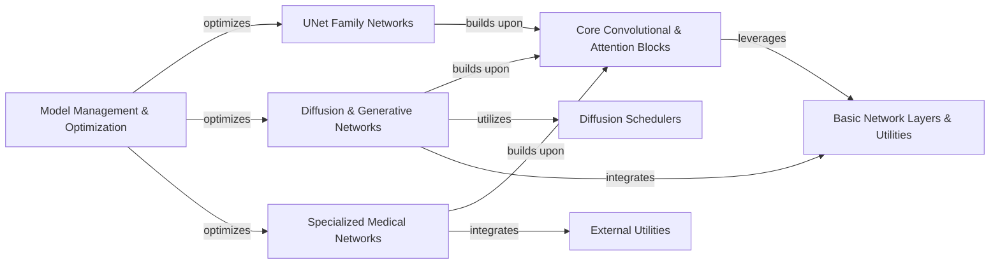

## Component Details

This component overview details the 'Model Definition' subsystem within MONAI, focusing on the core elements for constructing deep learning models. It encompasses various network architectures like UNet variants, diffusion models, and specialized medical networks. The subsystem is built upon fundamental convolutional and attention blocks, leveraging basic network layers and utilities. It also includes components for diffusion scheduling and model management/optimization, ensuring efficient model building, training, and deployment. The overall purpose is to provide a comprehensive and modular framework for developing state-of-the-art deep learning models for medical image analysis.

### UNet Family Networks
This component encompasses various UNet-like architectures designed for medical image segmentation and other tasks. It includes the classic UNet, the Swin UNETR which integrates Swin Transformers, and the MedNeXt model, all leveraging different structural approaches for hierarchical feature extraction and reconstruction.

**Related Classes/Methods**:

- <a href="https://github.com/Project-MONAI/MONAI/blob/master/monai/networks/nets/unet.py#L105-L181" target="_blank" rel="noopener noreferrer">`MONAI.monai.networks.nets.unet.UNet.__init__` (105:181)</a>
- <a href="https://github.com/Project-MONAI/MONAI/blob/master/monai/networks/nets/swin_unetr.py#L51-L255" target="_blank" rel="noopener noreferrer">`MONAI.monai.networks.nets.swin_unetr.SwinUNETR.__init__` (51:255)</a>
- <a href="https://github.com/Project-MONAI/MONAI/blob/master/monai/networks/nets/mednext.py#L68-L212" target="_blank" rel="noopener noreferrer">`MONAI.monai.networks.nets.mednext.MedNeXt.__init__` (68:212)</a>

### Diffusion & Generative Networks
This component focuses on generative models, including the Diffusion Model UNet, AutoencoderKL, and ControlNet. These networks are designed for tasks such as image synthesis, denoising, and conditional image generation, often incorporating attention mechanisms and specialized blocks for their respective generative processes.

**Related Classes/Methods**:

- <a href="https://github.com/Project-MONAI/MONAI/blob/master/monai/networks/nets/diffusion_model_unet.py#L1534-L1728" target="_blank" rel="noopener noreferrer">`MONAI.monai.networks.nets.diffusion_model_unet.DiffusionModelUNet.__init__` (1534:1728)</a>
- <a href="https://github.com/Project-MONAI/MONAI/blob/master/monai/networks/nets/autoencoderkl.py#L497-L591" target="_blank" rel="noopener noreferrer">`MONAI.monai.networks.nets.autoencoderkl.AutoencoderKL.__init__` (497:591)</a>
- <a href="https://github.com/Project-MONAI/MONAI/blob/master/monai/networks/nets/controlnet.py#L151-L351" target="_blank" rel="noopener noreferrer">`MONAI.monai.networks.nets.controlnet.ControlNet.__init__` (151:351)</a>

### Core Convolutional & Attention Blocks
This component provides fundamental building blocks for neural networks, including various types of convolutional layers, activation and normalization units, patch embedding, multi-layer perceptrons, and different attention mechanisms (self-attention, cross-attention, spatial attention). These blocks are designed to be modular and reusable across different network architectures.

**Related Classes/Methods**:

- <a href="https://github.com/Project-MONAI/MONAI/blob/master/monai/networks/blocks/convolutions.py#L97-L170" target="_blank" rel="noopener noreferrer">`MONAI.monai.networks.blocks.convolutions.Convolution.__init__` (97:170)</a>

### Basic Network Layers & Utilities
This component provides foundational layers and utility functions for constructing neural networks. It includes various filtering operations (Gaussian, Median, Savitzky-Golay), skip connections, convolution utilities for padding and stride calculations, spatial transformation layers, weight initialization methods, and general utilities for retrieving normalization, activation, dropout, and relative position embedding layers.

**Related Classes/Methods**:

- <a href="https://github.com/Project-MONAI/MONAI/blob/master/monai/networks/layers/simplelayers.py#L543-L586" target="_blank" rel="noopener noreferrer">`MONAI.monai.networks.layers.simplelayers.GaussianFilter.__init__` (543:586)</a>

### Diffusion Schedulers
This component provides various scheduling algorithms essential for the training and inference of diffusion models. It includes implementations for DDIM, Rectified Flow, PNDM, and DDPM schedulers, managing the noise addition and removal process over timesteps to generate high-quality samples.

**Related Classes/Methods**:

- <a href="https://github.com/Project-MONAI/MONAI/blob/master/monai/networks/schedulers/ddim.py#L65-L101" target="_blank" rel="noopener noreferrer">`MONAI.monai.networks.schedulers.ddim.DDIMScheduler.__init__` (65:101)</a>

### Model Management & Optimization
This component provides a suite of utilities for managing, optimizing, and converting neural network models. It includes functionalities for copying and saving model states, initializing weights, and converting models to optimized formats like ONNX and NVIDIA TensorRT (TRT) for improved inference performance. It also handles module replacement, casting, and freezing layers.

**Related Classes/Methods**:

- <a href="https://github.com/Project-MONAI/MONAI/blob/master/monai/networks/trt_compiler.py#L600-L674" target="_blank" rel="noopener noreferrer">`MONAI.monai.networks.trt_compiler.trt_compile` (600:674)</a>
- <a href="https://github.com/Project-MONAI/MONAI/blob/master/monai/networks/utils.py#L541-L623" target="_blank" rel="noopener noreferrer">`MONAI.monai.networks.utils.copy_model_state` (541:623)</a>

### Specialized Medical Networks
This component includes specialized neural network architectures tailored for specific medical imaging tasks beyond general segmentation or generative models. It features ResNet for classification and feature extraction, HoVerNet for histology image analysis (e.g., nuclear segmentation and classification), and VISTA3D for 3D point cloud processing and combination strategies.

**Related Classes/Methods**:

- <a href="https://github.com/Project-MONAI/MONAI/blob/master/monai/networks/nets/resnet.py#L571-L580" target="_blank" rel="noopener noreferrer">`MONAI.monai.networks.nets.resnet.resnet50` (571:580)</a>
- <a href="https://github.com/Project-MONAI/MONAI/blob/master/monai/networks/nets/hovernet.py#L458-L579" target="_blank" rel="noopener noreferrer">`MONAI.monai.networks.nets.hovernet.HoVerNet.__init__` (458:579)</a>
- <a href="https://github.com/Project-MONAI/MONAI/blob/master/monai/networks/nets/vista3d.py#L335-L471" target="_blank" rel="noopener noreferrer">`MONAI.monai.networks.nets.vista3d.VISTA3D.forward` (335:471)</a>

### External Utilities
This component provides utility functions that support the network architectures, primarily for data handling and transformations. It includes functionalities for downloading URLs, checking file hashes, and performing specific image transformations like point-to-disc conversion and component merging, which are crucial for preparing and processing data for various medical imaging tasks.

**Related Classes/Methods**:

- <a href="https://github.com/Project-MONAI/MONAI/blob/master/monai/apps/utils.py#L158-L241" target="_blank" rel="noopener noreferrer">`monai.apps.utils.download_url` (158:241)</a>
- <a href="https://github.com/Project-MONAI/MONAI/blob/master/monai/apps/utils.py#L83-L86" target="_blank" rel="noopener noreferrer">`MONAI.monai.apps.utils._basename` (83:86)</a>
- <a href="https://github.com/Project-MONAI/MONAI/blob/master/monai/apps/utils.py#L124-L155" target="_blank" rel="noopener noreferrer">`MONAI.monai.apps.utils.check_hash` (124:155)</a>
- <a href="https://github.com/Project-MONAI/MONAI/blob/master/monai/apps/utils.py#L89-L121" target="_blank" rel="noopener noreferrer">`MONAI.monai.apps.utils._download_with_progress` (89:121)</a>
- `MONAI.monai.apps.utils._download_with_progress.TqdmUpTo` (full file reference)
- <a href="https://github.com/Project-MONAI/MONAI/blob/master/monai/transforms/utils.py#L1182-L1251" target="_blank" rel="noopener noreferrer">`monai.transforms.utils.keep_merge_components_with_points` (1182:1251)</a>
- <a href="https://github.com/Project-MONAI/MONAI/blob/master/monai/transforms/utils.py#L1297-L1330" target="_blank" rel="noopener noreferrer">`monai.transforms.utils.convert_points_to_disc` (1297:1330)</a>
- <a href="https://github.com/Project-MONAI/MONAI/blob/master/monai/utils/misc.py#L915-L917" target="_blank" rel="noopener noreferrer">`monai.utils.misc.unsqueeze_left` (915:917)</a>
- <a href="https://github.com/Project-MONAI/MONAI/blob/master/monai/utils/misc.py#L910-L912" target="_blank" rel="noopener noreferrer">`monai.utils.misc.unsqueeze_right` (910:912)</a>

### [FAQ](https://github.com/CodeBoarding/GeneratedOnBoardings/tree/main?tab=readme-ov-file#faq)