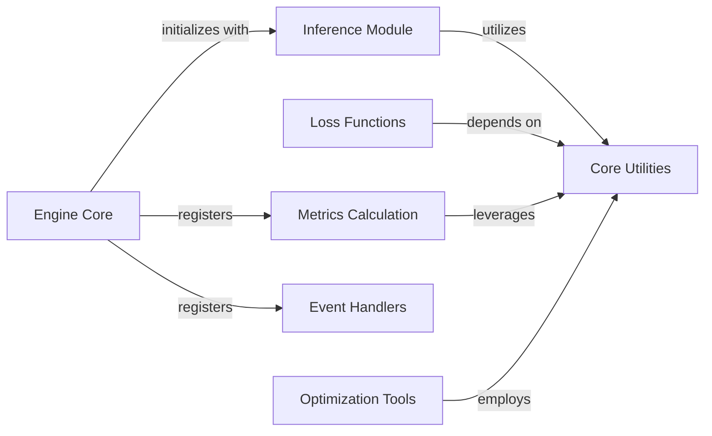

## Component Details

The Training & Evaluation Engine subsystem in MONAI orchestrates the complete machine learning experiment lifecycle for deep learning models, particularly in medical imaging. It integrates various core functionalities including data loading, model training, loss calculation, metric evaluation, inference strategies, and event handling. The main flow involves the Engine Core managing the overall training and evaluation loops, utilizing specialized components for inference, loss computation, metric tracking, and event-driven actions. Optimization tools are also integrated to refine the training process, while a set of core utilities provides foundational support across all components for data manipulation and common operations. This structured approach ensures efficient and reproducible experimentation.

### Engine Core
The Engine Core component is responsible for orchestrating the overall training and evaluation workflows within MONAI. It provides base classes and functionalities for supervised training and evaluation, managing the execution flow, event handling, and integration of various sub-components like inferers, metrics, and handlers.

**Related Classes/Methods**:

- <a href="https://github.com/Project-MONAI/MONAI/blob/master/monai/engines/trainer.py#L135-L191" target="_blank" rel="noopener noreferrer">`MONAI.monai.engines.trainer.SupervisedTrainer.__init__` (135:191)</a>
- <a href="https://github.com/Project-MONAI/MONAI/blob/master/monai/engines/evaluator.py#L225-L275" target="_blank" rel="noopener noreferrer">`MONAI.monai.engines.evaluator.SupervisedEvaluator.__init__` (225:275)</a>
- <a href="https://github.com/Project-MONAI/MONAI/blob/master/monai/engines/evaluator.py#L89-L136" target="_blank" rel="noopener noreferrer">`MONAI.monai.engines.evaluator.Evaluator.__init__` (89:136)</a>
- <a href="https://github.com/Project-MONAI/MONAI/blob/master/monai/engines/workflow.py#L102-L193" target="_blank" rel="noopener noreferrer">`MONAI.monai.engines.workflow.Workflow.__init__` (102:193)</a>
- <a href="https://github.com/Project-MONAI/MONAI/blob/master/monai/engines/workflow.py#L270-L281" target="_blank" rel="noopener noreferrer">`MONAI.monai.engines.workflow.Workflow.run` (270:281)</a>

### Inference Module
The Inference Module provides different strategies for performing inference on medical images. This includes simple inference and more complex sliding window inference, which is crucial for processing large volumetric data by dividing it into smaller, manageable patches.

**Related Classes/Methods**:

- <a href="https://github.com/Project-MONAI/MONAI/blob/master/monai/inferers/inferer.py#L372-L395" target="_blank" rel="noopener noreferrer">`monai.inferers.inferer.SimpleInferer` (372:395)</a>
- <a href="https://github.com/Project-MONAI/MONAI/blob/master/monai/inferers/inferer.py#L506-L551" target="_blank" rel="noopener noreferrer">`MONAI.monai.inferers.inferer.SlidingWindowInferer.__call__` (506:551)</a>
- <a href="https://github.com/Project-MONAI/MONAI/blob/master/monai/inferers/utils.py#L41-L320" target="_blank" rel="noopener noreferrer">`monai.inferers.utils.sliding_window_inference` (41:320)</a>
- <a href="https://github.com/Project-MONAI/MONAI/blob/master/monai/inferers/utils.py#L362-L383" target="_blank" rel="noopener noreferrer">`MONAI.monai.inferers.utils._get_scan_interval` (362:383)</a>
- <a href="https://github.com/Project-MONAI/MONAI/blob/master/monai/inferers/utils.py#L323-L347" target="_blank" rel="noopener noreferrer">`MONAI.monai.inferers.utils._create_buffered_slices` (323:347)</a>
- <a href="https://github.com/Project-MONAI/MONAI/blob/master/monai/inferers/utils.py#L386-L396" target="_blank" rel="noopener noreferrer">`MONAI.monai.inferers.utils._flatten_struct` (386:396)</a>
- <a href="https://github.com/Project-MONAI/MONAI/blob/master/monai/inferers/utils.py#L350-L359" target="_blank" rel="noopener noreferrer">`MONAI.monai.inferers.utils._compute_coords` (350:359)</a>
- <a href="https://github.com/Project-MONAI/MONAI/blob/master/monai/inferers/utils.py#L399-L404" target="_blank" rel="noopener noreferrer">`MONAI.monai.inferers.utils._pack_struct` (399:404)</a>

### Loss Functions
The Loss Functions component encompasses various loss calculations essential for training deep learning models in medical imaging. These functions quantify the difference between predicted and ground truth values, guiding the model's learning process.

**Related Classes/Methods**:

- <a href="https://github.com/Project-MONAI/MONAI/blob/master/monai/losses/dice.py#L130-L228" target="_blank" rel="noopener noreferrer">`MONAI.monai.losses.dice.DiceLoss.forward` (130:228)</a>
- <a href="https://github.com/Project-MONAI/MONAI/blob/master/monai/losses/focal_loss.py#L119-L201" target="_blank" rel="noopener noreferrer">`MONAI.monai.losses.focal_loss.FocalLoss.forward` (119:201)</a>
- <a href="https://github.com/Project-MONAI/MONAI/blob/master/monai/losses/focal_loss.py#L204-L223" target="_blank" rel="noopener noreferrer">`MONAI.monai.losses.focal_loss.softmax_focal_loss` (204:223)</a>
- <a href="https://github.com/Project-MONAI/MONAI/blob/master/monai/losses/focal_loss.py#L226-L254" target="_blank" rel="noopener noreferrer">`MONAI.monai.losses.focal_loss.sigmoid_focal_loss` (226:254)</a>

### Metrics Calculation
The Metrics Calculation component is responsible for computing and aggregating various evaluation metrics to assess model performance. It includes functionalities for common metrics like Dice and ROC AUC, and provides mechanisms for cumulative metric tracking.

**Related Classes/Methods**:

- <a href="https://github.com/Project-MONAI/MONAI/blob/master/monai/metrics/meandice.py#L100-L123" target="_blank" rel="noopener noreferrer">`MONAI.monai.metrics.meandice.DiceMetric.__init__` (100:123)</a>
- <a href="https://github.com/Project-MONAI/MONAI/blob/master/monai/metrics/rocauc.py#L59-L74" target="_blank" rel="noopener noreferrer">`MONAI.monai.metrics.rocauc.ROCAUCMetric.aggregate` (59:74)</a>
- <a href="https://github.com/Project-MONAI/MONAI/blob/master/monai/metrics/metric.py#L182-L191" target="_blank" rel="noopener noreferrer">`MONAI.monai.metrics.metric.Cumulative.__init__` (182:191)</a>
- <a href="https://github.com/Project-MONAI/MONAI/blob/master/monai/metrics/metric.py#L281-L292" target="_blank" rel="noopener noreferrer">`MONAI.monai.metrics.metric.Cumulative.get_buffer` (281:292)</a>
- <a href="https://github.com/Project-MONAI/MONAI/blob/master/monai/metrics/metric.py#L255-L269" target="_blank" rel="noopener noreferrer">`MONAI.monai.metrics.metric.Cumulative._sync` (255:269)</a>
- <a href="https://github.com/Project-MONAI/MONAI/blob/master/monai/metrics/rocauc.py#L114-L181" target="_blank" rel="noopener noreferrer">`MONAI.monai.metrics.rocauc.compute_roc_auc` (114:181)</a>
- <a href="https://github.com/Project-MONAI/MONAI/blob/master/monai/metrics/rocauc.py#L77-L111" target="_blank" rel="noopener noreferrer">`MONAI.monai.metrics.rocauc._calculate` (77:111)</a>
- <a href="https://github.com/Project-MONAI/MONAI/blob/master/monai/metrics/meandice.py#L209-L336" target="_blank" rel="noopener noreferrer">`MONAI.monai.metrics.meandice.DiceHelper` (209:336)</a>

### Event Handlers
The Event Handlers component provides a set of callback mechanisms that can be integrated into the training and evaluation loops. These handlers perform specific actions at different stages, such as saving checkpoints or logging experiment details to platforms like MLFlow.

**Related Classes/Methods**:

- <a href="https://github.com/Project-MONAI/MONAI/blob/master/monai/handlers/checkpoint_saver.py#L88-L204" target="_blank" rel="noopener noreferrer">`MONAI.monai.handlers.checkpoint_saver.CheckpointSaver.__init__` (88:204)</a>
- <a href="https://github.com/Project-MONAI/MONAI/blob/master/monai/handlers/checkpoint_saver.py#L26-L85" target="_blank" rel="noopener noreferrer">`MONAI.monai.handlers.checkpoint_saver.CheckpointSaver._DiskSaver` (26:85)</a>
- <a href="https://github.com/Project-MONAI/MONAI/blob/master/monai/handlers/mlflow_handler.py#L208-L238" target="_blank" rel="noopener noreferrer">`MONAI.monai.handlers.mlflow_handler.MLFlowHandler.start` (208:238)</a>
- <a href="https://github.com/Project-MONAI/MONAI/blob/master/monai/handlers/mlflow_handler.py#L240-L261" target="_blank" rel="noopener noreferrer">`MONAI.monai.handlers.mlflow_handler.MLFlowHandler._set_experiment` (240:261)</a>
- <a href="https://github.com/Project-MONAI/MONAI/blob/master/monai/handlers/mlflow_handler.py#L293-L297" target="_blank" rel="noopener noreferrer">`MONAI.monai.handlers.mlflow_handler.MLFlowHandler._log_params` (293:297)</a>
- <a href="https://github.com/Project-MONAI/MONAI/blob/master/monai/handlers/mlflow_handler.py#L166-L181" target="_blank" rel="noopener noreferrer">`MONAI.monai.handlers.mlflow_handler.MLFlowHandler._delete_exist_param_in_dict` (166:181)</a>
- <a href="https://github.com/Project-MONAI/MONAI/blob/master/monai/handlers/mlflow_handler.py#L426-L482" target="_blank" rel="noopener noreferrer">`MONAI.monai.handlers.mlflow_handler.MLFlowHandler._default_dataset_log` (426:482)</a>
- <a href="https://github.com/Project-MONAI/MONAI/blob/master/monai/handlers/mlflow_handler.py#L271-L291" target="_blank" rel="noopener noreferrer">`MONAI.monai.handlers.mlflow_handler.MLFlowHandler._log_dataset` (271:291)</a>

### Optimization Tools
The Optimization Tools component offers utilities to assist in the optimization process of deep learning models. This includes functionalities like learning rate finding, which helps in determining optimal learning rates for stable and efficient training.

**Related Classes/Methods**:

- <a href="https://github.com/Project-MONAI/MONAI/blob/master/monai/optimizers/lr_finder.py#L254-L374" target="_blank" rel="noopener noreferrer">`MONAI.monai.optimizers.lr_finder.LearningRateFinder.range_test` (254:374)</a>
- <a href="https://github.com/Project-MONAI/MONAI/blob/master/monai/optimizers/lr_finder.py#L388-L392" target="_blank" rel="noopener noreferrer">`MONAI.monai.optimizers.lr_finder.LearningRateFinder._check_for_scheduler` (388:392)</a>
- <a href="https://github.com/Project-MONAI/MONAI/blob/master/monai/optimizers/lr_finder.py#L376-L386" target="_blank" rel="noopener noreferrer">`MONAI.monai.optimizers.lr_finder.LearningRateFinder._set_learning_rate` (376:386)</a>
- <a href="https://github.com/Project-MONAI/MONAI/blob/master/monai/optimizers/lr_scheduler.py#L50-L57" target="_blank" rel="noopener noreferrer">`monai.optimizers.lr_scheduler.ExponentialLR` (50:57)</a>
- <a href="https://github.com/Project-MONAI/MONAI/blob/master/monai/optimizers/lr_scheduler.py#L40-L47" target="_blank" rel="noopener noreferrer">`monai.optimizers.lr_scheduler.LinearLR` (40:47)</a>
- <a href="https://github.com/Project-MONAI/MONAI/blob/master/monai/optimizers/lr_finder.py#L73-L92" target="_blank" rel="noopener noreferrer">`MONAI.monai.optimizers.lr_finder.TrainDataLoaderIter` (73:92)</a>
- <a href="https://github.com/Project-MONAI/MONAI/blob/master/monai/optimizers/lr_finder.py#L95-L129" target="_blank" rel="noopener noreferrer">`MONAI.monai.optimizers.lr_finder.ValDataLoaderIter` (95:129)</a>
- <a href="https://github.com/Project-MONAI/MONAI/blob/master/monai/optimizers/lr_finder.py#L394-L427" target="_blank" rel="noopener noreferrer">`MONAI.monai.optimizers.lr_finder.LearningRateFinder._train_batch` (394:427)</a>
- <a href="https://github.com/Project-MONAI/MONAI/blob/master/monai/optimizers/lr_finder.py#L429-L444" target="_blank" rel="noopener noreferrer">`MONAI.monai.optimizers.lr_finder.LearningRateFinder._validate` (429:444)</a>
- <a href="https://github.com/Project-MONAI/MONAI/blob/master/monai/optimizers/lr_finder.py#L247-L252" target="_blank" rel="noopener noreferrer">`MONAI.monai.optimizers.lr_finder.LearningRateFinder.reset` (247:252)</a>

### Core Utilities
The Core Utilities component provides a collection of fundamental helper functions and classes that are widely used across various MONAI modules. These utilities handle common tasks such as data type conversions, tensor manipulations, and general-purpose operations, ensuring consistency and efficiency throughout the library.

**Related Classes/Methods**:

- <a href="https://github.com/Project-MONAI/MONAI/blob/master/monai/networks/utils.py#L169-L219" target="_blank" rel="noopener noreferrer">`monai.networks.utils.one_hot` (169:219)</a>
- <a href="https://github.com/Project-MONAI/MONAI/blob/master/monai/losses/utils.py#L17-L67" target="_blank" rel="noopener noreferrer">`monai.losses.utils.compute_tp_fp_fn` (17:67)</a>
- <a href="https://github.com/Project-MONAI/MONAI/blob/master/monai/utils/misc.py#L305-L308" target="_blank" rel="noopener noreferrer">`monai.utils.misc.is_scalar` (305:308)</a>
- <a href="https://github.com/Project-MONAI/MONAI/blob/master/monai/utils/module.py#L60-L140" target="_blank" rel="noopener noreferrer">`monai.utils.module.look_up_option` (60:140)</a>
- <a href="https://github.com/Project-MONAI/MONAI/blob/master/monai/utils/misc.py#L427-L458" target="_blank" rel="noopener noreferrer">`monai.utils.misc.copy_to_device` (427:458)</a>
- <a href="https://github.com/Project-MONAI/MONAI/blob/master/monai/networks/utils.py#L457-L488" target="_blank" rel="noopener noreferrer">`monai.networks.utils.eval_mode` (457:488)</a>
- <a href="https://github.com/Project-MONAI/MONAI/blob/master/monai/utils/misc.py#L189-L221" target="_blank" rel="noopener noreferrer">`monai.utils.misc.ensure_tuple_rep` (189:221)</a>
- <a href="https://github.com/Project-MONAI/MONAI/blob/master/monai/data/meta_obj.py#L117-L137" target="_blank" rel="noopener noreferrer">`monai.data.meta_obj.MetaObj.copy_meta_from` (117:137)</a>
- <a href="https://github.com/Project-MONAI/MONAI/blob/master/monai/data/meta_tensor.py#L51-L608" target="_blank" rel="noopener noreferrer">`monai.data.meta_tensor.MetaTensor` (51:608)</a>
- <a href="https://github.com/Project-MONAI/MONAI/blob/master/monai/utils/type_conversion.py#L273-L339" target="_blank" rel="noopener noreferrer">`monai.utils.type_conversion.convert_data_type` (273:339)</a>
- <a href="https://github.com/Project-MONAI/MONAI/blob/master/monai/utils/misc.py#L255-L298" target="_blank" rel="noopener noreferrer">`monai.utils.misc.fall_back_tuple` (255:298)</a>
- <a href="https://github.com/Project-MONAI/MONAI/blob/master/monai/data/utils.py#L165-L205" target="_blank" rel="noopener noreferrer">`monai.data.utils.dense_patch_slices` (165:205)</a>
- <a href="https://github.com/Project-MONAI/MONAI/blob/master/monai/data/utils.py#L342-L353" target="_blank" rel="noopener noreferrer">`monai.data.utils.get_valid_patch_size` (342:353)</a>
- <a href="https://github.com/Project-MONAI/MONAI/blob/master/monai/utils/misc.py#L161-L173" target="_blank" rel="noopener noreferrer">`monai.utils.misc.ensure_tuple` (161:173)</a>
- <a href="https://github.com/Project-MONAI/MONAI/blob/master/monai/data/utils.py#L1083-L1133" target="_blank" rel="noopener noreferrer">`monai.data.utils.compute_importance_map` (1083:1133)</a>
- <a href="https://github.com/Project-MONAI/MONAI/blob/master/monai/utils/type_conversion.py#L342-L392" target="_blank" rel="noopener noreferrer">`monai.utils.type_conversion.convert_to_dst_type` (342:392)</a>

### [FAQ](https://github.com/CodeBoarding/GeneratedOnBoardings/tree/main?tab=readme-ov-file#faq)