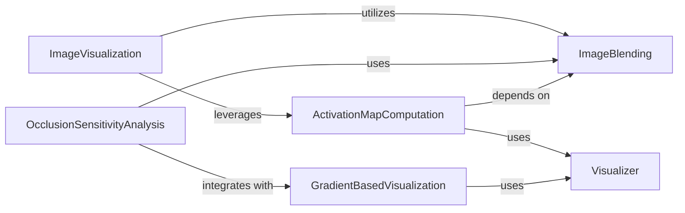

## Component Details

The Visualization & Debugging subsystem in MONAI provides a comprehensive set of tools for visualizing medical images, model predictions, and interpretability maps. It supports integration with external tools for experiment tracking and visual analysis, enabling users to gain insights into model behavior and data characteristics. Key functionalities include 2D/3D image plotting, GIF conversion for TensorBoard, computation of activation maps, occlusion sensitivity analysis, gradient-based visualizations, and image blending for overlaying annotations.

### ImageVisualization
This component handles the visualization of 2D and 3D images, converting 3D images into GIF format for TensorBoard. It supports plotting images with different channel configurations (e.g., grayscale, RGB) and can rescale array data for proper visualization. It interacts with TensorBoard writers to add images and animated GIFs.

**Related Classes/Methods**:

- <a href="https://github.com/Project-MONAI/MONAI/blob/master/monai/visualize/img2tensorboard.py#L145-L212" target="_blank" rel="noopener noreferrer">`monai.visualize.img2tensorboard.plot_2d_or_3d_image` (145:212)</a>
- <a href="https://github.com/Project-MONAI/MONAI/blob/master/monai/transforms/utils.py#L228-L256" target="_blank" rel="noopener noreferrer">`monai.transforms.utils.rescale_array` (228:256)</a>
- <a href="https://github.com/Project-MONAI/MONAI/blob/master/monai/visualize/img2tensorboard.py#L115-L142" target="_blank" rel="noopener noreferrer">`monai.visualize.img2tensorboard.add_animated_gif` (115:142)</a>

### ActivationMapComputation
This component is responsible for computing activation maps, which are used to visualize the regions of an input image that are most important for a neural network's prediction. It involves an initial computation of the map followed by upsampling and post-processing steps to refine the visualization.

**Related Classes/Methods**:

- <a href="https://github.com/Project-MONAI/MONAI/blob/master/monai/visualize/class_activation_maps.py#L301-L315" target="_blank" rel="noopener noreferrer">`monai.visualize.class_activation_maps.CAM.__call__` (301:315)</a>
- <a href="https://github.com/Project-MONAI/MONAI/blob/master/monai/visualize/class_activation_maps.py#L289-L299" target="_blank" rel="noopener noreferrer">`monai.visualize.class_activation_maps.CAM.compute_map` (289:299)</a>
- <a href="https://github.com/Project-MONAI/MONAI/blob/master/monai/visualize/class_activation_maps.py#L207-L211" target="_blank" rel="noopener noreferrer">`monai.visualize.class_activation_maps.CAMBase._upsample_and_post_process` (207:211)</a>

### OcclusionSensitivityAnalysis
This component performs occlusion sensitivity analysis to understand the impact of occluding parts of an image on the model's inference. It supports different occlusion modes (constant, mean image, gaussian) and can crop the analysis to a specific bounding box. It leverages sliding window inference for efficient computation.

**Related Classes/Methods**:

- <a href="https://github.com/Project-MONAI/MONAI/blob/master/monai/visualize/occlusion_sensitivity.py#L253-L349" target="_blank" rel="noopener noreferrer">`monai.visualize.occlusion_sensitivity.OcclusionSensitivity.__call__` (253:349)</a>
- <a href="https://github.com/Project-MONAI/MONAI/blob/master/monai/utils/misc.py#L189-L221" target="_blank" rel="noopener noreferrer">`monai.utils.misc.ensure_tuple_rep` (189:221)</a>
- <a href="https://github.com/Project-MONAI/MONAI/blob/master/monai/data/meta_tensor.py#L51-L608" target="_blank" rel="noopener noreferrer">`monai.data.meta_tensor.MetaTensor` (51:608)</a>
- <a href="https://github.com/Project-MONAI/MONAI/blob/master/monai/visualize/occlusion_sensitivity.py#L227-L251" target="_blank" rel="noopener noreferrer">`monai.visualize.occlusion_sensitivity.OcclusionSensitivity.crop_meshgrid` (227:251)</a>
- <a href="https://github.com/Project-MONAI/MONAI/blob/master/monai/visualize/occlusion_sensitivity.py#L122-L125" target="_blank" rel="noopener noreferrer">`monai.visualize.occlusion_sensitivity.OcclusionSensitivity.constant_occlusion` (122:125)</a>
- <a href="https://github.com/Project-MONAI/MONAI/blob/master/monai/visualize/occlusion_sensitivity.py#L128-L148" target="_blank" rel="noopener noreferrer">`monai.visualize.occlusion_sensitivity.OcclusionSensitivity.gaussian_occlusion` (128:148)</a>
- <a href="https://github.com/Project-MONAI/MONAI/blob/master/monai/networks/utils.py#L457-L488" target="_blank" rel="noopener noreferrer">`monai.networks.utils.eval_mode` (457:488)</a>
- <a href="https://github.com/Project-MONAI/MONAI/blob/master/monai/inferers/utils.py#L41-L320" target="_blank" rel="noopener noreferrer">`monai.inferers.utils.sliding_window_inference` (41:320)</a>
- <a href="https://github.com/Project-MONAI/MONAI/blob/master/monai/transforms/croppad/array.py#L426-L433" target="_blank" rel="noopener noreferrer">`monai.transforms.croppad.array.Crop.inverse` (426:433)</a>
- <a href="https://github.com/Project-MONAI/MONAI/blob/master/monai/transforms/croppad/array.py#L436-L486" target="_blank" rel="noopener noreferrer">`monai.transforms.croppad.array.SpatialCrop` (436:486)</a>

### GradientBasedVisualization
This component focuses on gradient-based visualization techniques, specifically providing a mechanism to retrieve gradients from a neural network's output with respect to its input. This is a fundamental operation for understanding model decisions through saliency maps.

**Related Classes/Methods**:

- <a href="https://github.com/Project-MONAI/MONAI/blob/master/monai/visualize/gradient_based.py#L98-L99" target="_blank" rel="noopener noreferrer">`monai.visualize.gradient_based.VanillaGrad.__call__` (98:99)</a>
- <a href="https://github.com/Project-MONAI/MONAI/blob/master/monai/visualize/gradient_based.py#L87-L96" target="_blank" rel="noopener noreferrer">`monai.visualize.gradient_based.VanillaGrad.get_grad` (87:96)</a>

### ImageBlending
This component provides functionality to blend an image with a label, allowing for the overlay of segmentation masks or other annotations onto an image. It supports various blending parameters like alpha transparency and colormaps, and can rescale arrays and handle transparent backgrounds.

**Related Classes/Methods**:

- <a href="https://github.com/Project-MONAI/MONAI/blob/master/monai/visualize/utils.py#L163-L229" target="_blank" rel="noopener noreferrer">`monai.visualize.utils.blend_images` (163:229)</a>
- <a href="https://github.com/Project-MONAI/MONAI/blob/master/monai/transforms/utils.py#L228-L256" target="_blank" rel="noopener noreferrer">`monai.transforms.utils.rescale_array` (228:256)</a>
- <a href="https://github.com/Project-MONAI/MONAI/blob/master/monai/transforms/utils_pytorch_numpy_unification.py#L363-L377" target="_blank" rel="noopener noreferrer">`monai.transforms.utils_pytorch_numpy_unification.repeat` (363:377)</a>
- <a href="https://github.com/Project-MONAI/MONAI/blob/master/monai/utils/type_conversion.py#L273-L339" target="_blank" rel="noopener noreferrer">`monai.utils.type_conversion.convert_data_type` (273:339)</a>
- <a href="https://github.com/Project-MONAI/MONAI/blob/master/monai/utils/type_conversion.py#L342-L392" target="_blank" rel="noopener noreferrer">`monai.utils.type_conversion.convert_to_dst_type` (342:392)</a>
- <a href="https://github.com/Project-MONAI/MONAI/blob/master/monai/visualize/utils.py#L209-L215" target="_blank" rel="noopener noreferrer">`monai.visualize.utils.blend_images.get_label_rgb` (209:215)</a>

### Visualizer
The Visualizer component acts as a central orchestrator for various visualization tasks within the MONAI framework. It provides a unified interface for different visualization methods, including class activation maps (CAM) and other interpretability techniques. It manages the underlying models and data necessary for generating visualizations.

**Related Classes/Methods**:

- `monai.visualize.visualizer.Visualizer` (full file reference)

### [FAQ](https://github.com/CodeBoarding/GeneratedOnBoardings/tree/main?tab=readme-ov-file#faq)