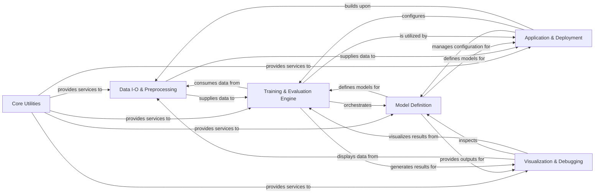

## Component Details

The MONAI framework provides a comprehensive ecosystem for medical imaging AI, encompassing data handling, deep learning model development, training orchestration, and application deployment. Its core functionality revolves around efficient data loading and preprocessing, flexible neural network architectures, and a robust training and evaluation engine. Higher-level applications and a bundle system facilitate easy deployment and sharing of models, while visualization tools aid in understanding data and model behavior. The framework is designed to be modular and extensible, supporting various research and clinical workflows in medical image analysis.

### Core Utilities
Provides fundamental helper functions, configuration management, and version information essential for the overall operation of the MONAI library, supporting various modules with basic data manipulation, environment setup, and import mechanisms.

**Related Classes/Methods**:

- <a href="https://github.com/Project-MONAI/MONAI/blob/master/monai/_version.py#L38-L49" target="_blank" rel="noopener noreferrer">`MONAI.monai._version.get_config` (38:49)</a>
- <a href="https://github.com/Project-MONAI/MONAI/blob/master/monai/_version.py#L613-L656" target="_blank" rel="noopener noreferrer">`MONAI.monai._version.get_versions` (613:656)</a>
- <a href="https://github.com/Project-MONAI/MONAI/blob/master/monai/config/deviceconfig.py#L244-L262" target="_blank" rel="noopener noreferrer">`MONAI.monai.config.deviceconfig.print_debug_info` (244:262)</a>
- <a href="https://github.com/Project-MONAI/MONAI/blob/master/monai/utils/misc.py#L161-L173" target="_blank" rel="noopener noreferrer">`MONAI.monai.utils.misc.ensure_tuple` (161:173)</a>
- <a href="https://github.com/Project-MONAI/MONAI/blob/master/monai/utils/module.py#L314-L444" target="_blank" rel="noopener noreferrer">`MONAI.monai.utils.module.optional_import` (314:444)</a>
- <a href="https://github.com/Project-MONAI/MONAI/blob/master/monai/utils/type_conversion.py#L112-L180" target="_blank" rel="noopener noreferrer">`MONAI.monai.utils.type_conversion.convert_to_tensor` (112:180)</a>

### Data I-O & Preprocessing
Manages the entire data pipeline, from loading and organizing medical image data from various sources to applying a comprehensive range of transformations for augmentation and preprocessing, ensuring data is ready for model input.

**Related Classes/Methods**:

- <a href="https://github.com/Project-MONAI/MONAI/blob/master/monai/apps/datasets.py#L90-L145" target="_blank" rel="noopener noreferrer">`MONAI.monai.apps.datasets.MedNISTDataset.__init__` (90:145)</a>
- <a href="https://github.com/Project-MONAI/MONAI/blob/master/monai/apps/datasets.py#L287-L356" target="_blank" rel="noopener noreferrer">`MONAI.monai.apps.datasets.DecathlonDataset.__init__` (287:356)</a>
- <a href="https://github.com/Project-MONAI/MONAI/blob/master/monai/apps/datasets.py#L494-L574" target="_blank" rel="noopener noreferrer">`MONAI.monai.apps.datasets.TciaDataset.__init__` (494:574)</a>
- <a href="https://github.com/Project-MONAI/MONAI/blob/master/monai/data/dataset.py#L738-L808" target="_blank" rel="noopener noreferrer">`MONAI.monai.data.dataset.CacheDataset.__init__` (738:808)</a>
- <a href="https://github.com/Project-MONAI/MONAI/blob/master/monai/data/image_reader.py#L490-L545" target="_blank" rel="noopener noreferrer">`MONAI.monai.data.image_reader.PydicomReader.read` (490:545)</a>
- <a href="https://github.com/Project-MONAI/MONAI/blob/master/monai/data/image_writer.py#L450-L475" target="_blank" rel="noopener noreferrer">`MONAI.monai.data.image_writer.ITKWriter.write` (450:475)</a>
- <a href="https://github.com/Project-MONAI/MONAI/blob/master/monai/data/meta_tensor.py#L118-L171" target="_blank" rel="noopener noreferrer">`MONAI.monai.data.meta_tensor.MetaTensor.__init__` (118:171)</a>
- <a href="https://github.com/Project-MONAI/MONAI/blob/master/monai/data/utils.py#L565-L665" target="_blank" rel="noopener noreferrer">`MONAI.monai.data.utils.decollate_batch` (565:665)</a>
- <a href="https://github.com/Project-MONAI/MONAI/blob/master/monai/data/wsi_reader.py#L634-L646" target="_blank" rel="noopener noreferrer">`MONAI.monai.data.wsi_reader.WSIReader.read` (634:646)</a>
- <a href="https://github.com/Project-MONAI/MONAI/blob/master/monai/data/decathlon_datalist.py#L86-L132" target="_blank" rel="noopener noreferrer">`MONAI.monai.data.decathlon_datalist.load_decathlon_datalist` (86:132)</a>
- <a href="https://github.com/Project-MONAI/MONAI/blob/master/monai/data/dataloader.py#L78-L105" target="_blank" rel="noopener noreferrer">`MONAI.monai.data.dataloader.DataLoader.__init__` (78:105)</a>
- <a href="https://github.com/Project-MONAI/MONAI/blob/master/monai/data/box_utils.py#L545-L602" target="_blank" rel="noopener noreferrer">`MONAI.monai.data.box_utils.convert_box_mode` (545:602)</a>
- <a href="https://github.com/Project-MONAI/MONAI/blob/master/monai/transforms/compose.py#L343-L358" target="_blank" rel="noopener noreferrer">`MONAI.monai.transforms.compose.Compose.__call__` (343:358)</a>
- <a href="https://github.com/Project-MONAI/MONAI/blob/master/monai/transforms/spatial/array.py#L169-L235" target="_blank" rel="noopener noreferrer">`MONAI.monai.transforms.spatial.array.SpatialResample.__call__` (169:235)</a>
- <a href="https://github.com/Project-MONAI/MONAI/blob/master/monai/transforms/intensity/array.py#L898-L923" target="_blank" rel="noopener noreferrer">`MONAI.monai.transforms.intensity.array.NormalizeIntensity.__call__` (898:923)</a>
- `MONAI.monai.transforms.croppad.array.SpatialPad.__call__` (full file reference)
- <a href="https://github.com/Project-MONAI/MONAI/blob/master/monai/transforms/io/array.py#L236-L303" target="_blank" rel="noopener noreferrer">`MONAI.monai.transforms.io.array.LoadImage.__call__` (236:303)</a>
- <a href="https://github.com/Project-MONAI/MONAI/blob/master/monai/transforms/post/array.py#L187-L235" target="_blank" rel="noopener noreferrer">`MONAI.monai.transforms.post.array.AsDiscrete.__call__` (187:235)</a>
- <a href="https://github.com/Project-MONAI/MONAI/blob/master/monai/transforms/utility/array.py#L195-L232" target="_blank" rel="noopener noreferrer">`MONAI.monai.transforms.utility.array.EnsureChannelFirst.__call__` (195:232)</a>
- <a href="https://github.com/Project-MONAI/MONAI/blob/master/monai/transforms/spatial/array.py#L2475-L2547" target="_blank" rel="noopener noreferrer">`MONAI.monai.transforms.spatial.array.RandAffine.__call__` (2475:2547)</a>
- <a href="https://github.com/Project-MONAI/MONAI/blob/master/monai/transforms/spatial/array.py#L1230-L1251" target="_blank" rel="noopener noreferrer">`MONAI.monai.transforms.spatial.array.RandRotate90.__call__` (1230:1251)</a>
- <a href="https://github.com/Project-MONAI/MONAI/blob/master/monai/transforms/spatial/array.py#L1424-L1439" target="_blank" rel="noopener noreferrer">`MONAI.monai.transforms.spatial.array.RandFlip.__call__` (1424:1439)</a>
- <a href="https://github.com/Project-MONAI/MONAI/blob/master/monai/transforms/croppad/array.py#L1170-L1216" target="_blank" rel="noopener noreferrer">`MONAI.monai.transforms.croppad.array.RandCropByPosNegLabel.__call__` (1170:1216)</a>
- <a href="https://github.com/Project-MONAI/MONAI/blob/master/monai/transforms/intensity/array.py#L124-L139" target="_blank" rel="noopener noreferrer">`MONAI.monai.transforms.intensity.array.RandGaussianNoise.__call__` (124:139)</a>
- <a href="https://github.com/Project-MONAI/MONAI/blob/master/monai/transforms/utility/array.py#L1924-L1939" target="_blank" rel="noopener noreferrer">`MONAI.monai.transforms.utility.array.ApplyTransformToPoints.__call__` (1924:1939)</a>
- <a href="https://github.com/Project-MONAI/MONAI/blob/master/monai/transforms/post/array.py#L865-L882" target="_blank" rel="noopener noreferrer">`MONAI.monai.transforms.post.array.Invert.__call__` (865:882)</a>

### Model Definition
Encompasses the core components for building deep learning models, including various network architectures, fundamental building blocks, layers, weight initialization, and tools for model optimization.

**Related Classes/Methods**:

- <a href="https://github.com/Project-MONAI/MONAI/blob/master/monai/networks/nets/unet.py#L105-L181" target="_blank" rel="noopener noreferrer">`MONAI.monai.networks.nets.unet.UNet.__init__` (105:181)</a>
- <a href="https://github.com/Project-MONAI/MONAI/blob/master/monai/networks/nets/resnet.py#L571-L580" target="_blank" rel="noopener noreferrer">`MONAI.monai.networks.nets.resnet.resnet50` (571:580)</a>
- <a href="https://github.com/Project-MONAI/MONAI/blob/master/monai/networks/nets/swin_unetr.py#L51-L255" target="_blank" rel="noopener noreferrer">`MONAI.monai.networks.nets.swin_unetr.SwinUNETR.__init__` (51:255)</a>
- <a href="https://github.com/Project-MONAI/MONAI/blob/master/monai/networks/nets/diffusion_model_unet.py#L1534-L1728" target="_blank" rel="noopener noreferrer">`MONAI.monai.networks.nets.diffusion_model_unet.DiffusionModelUNet.__init__` (1534:1728)</a>
- <a href="https://github.com/Project-MONAI/MONAI/blob/master/monai/networks/nets/hovernet.py#L458-L579" target="_blank" rel="noopener noreferrer">`MONAI.monai.networks.nets.hovernet.HoVerNet.__init__` (458:579)</a>
- <a href="https://github.com/Project-MONAI/MONAI/blob/master/monai/networks/blocks/convolutions.py#L97-L170" target="_blank" rel="noopener noreferrer">`MONAI.monai.networks.blocks.convolutions.Convolution.__init__` (97:170)</a>
- <a href="https://github.com/Project-MONAI/MONAI/blob/master/monai/networks/layers/simplelayers.py#L543-L586" target="_blank" rel="noopener noreferrer">`MONAI.monai.networks.layers.simplelayers.GaussianFilter.__init__` (543:586)</a>
- <a href="https://github.com/Project-MONAI/MONAI/blob/master/monai/networks/trt_compiler.py#L600-L674" target="_blank" rel="noopener noreferrer">`MONAI.monai.networks.trt_compiler.trt_compile` (600:674)</a>
- <a href="https://github.com/Project-MONAI/MONAI/blob/master/monai/networks/utils.py#L541-L623" target="_blank" rel="noopener noreferrer">`MONAI.monai.networks.utils.copy_model_state` (541:623)</a>
- <a href="https://github.com/Project-MONAI/MONAI/blob/master/monai/networks/schedulers/ddim.py#L65-L101" target="_blank" rel="noopener noreferrer">`MONAI.monai.networks.schedulers.ddim.DDIMScheduler.__init__` (65:101)</a>
- <a href="https://github.com/Project-MONAI/MONAI/blob/master/monai/networks/nets/vista3d.py#L335-L471" target="_blank" rel="noopener noreferrer">`MONAI.monai.networks.nets.vista3d.VISTA3D.forward` (335:471)</a>
- <a href="https://github.com/Project-MONAI/MONAI/blob/master/monai/networks/nets/mednext.py#L68-L212" target="_blank" rel="noopener noreferrer">`MONAI.monai.networks.nets.mednext.MedNeXt.__init__` (68:212)</a>
- <a href="https://github.com/Project-MONAI/MONAI/blob/master/monai/networks/nets/autoencoderkl.py#L497-L591" target="_blank" rel="noopener noreferrer">`MONAI.monai.networks.nets.autoencoderkl.AutoencoderKL.__init__` (497:591)</a>
- <a href="https://github.com/Project-MONAI/MONAI/blob/master/monai/networks/nets/controlnet.py#L151-L351" target="_blank" rel="noopener noreferrer">`MONAI.monai.networks.nets.controlnet.ControlNet.__init__` (151:351)</a>

### Training & Evaluation Engine
Orchestrates the training and evaluation workflows for deep learning models, integrating data loaders, networks, loss functions, metrics, inferers, and event handlers to manage the entire machine learning experiment lifecycle.

**Related Classes/Methods**:

- <a href="https://github.com/Project-MONAI/MONAI/blob/master/monai/engines/trainer.py#L135-L191" target="_blank" rel="noopener noreferrer">`MONAI.monai.engines.trainer.SupervisedTrainer.__init__` (135:191)</a>
- <a href="https://github.com/Project-MONAI/MONAI/blob/master/monai/engines/evaluator.py#L225-L275" target="_blank" rel="noopener noreferrer">`MONAI.monai.engines.evaluator.SupervisedEvaluator.__init__` (225:275)</a>
- <a href="https://github.com/Project-MONAI/MONAI/blob/master/monai/losses/dice.py#L130-L228" target="_blank" rel="noopener noreferrer">`MONAI.monai.losses.dice.DiceLoss.forward` (130:228)</a>
- <a href="https://github.com/Project-MONAI/MONAI/blob/master/monai/metrics/meandice.py#L100-L123" target="_blank" rel="noopener noreferrer">`MONAI.monai.metrics.meandice.DiceMetric.__init__` (100:123)</a>
- <a href="https://github.com/Project-MONAI/MONAI/blob/master/monai/inferers/inferer.py#L506-L551" target="_blank" rel="noopener noreferrer">`MONAI.monai.inferers.inferer.SlidingWindowInferer.__call__` (506:551)</a>
- <a href="https://github.com/Project-MONAI/MONAI/blob/master/monai/handlers/checkpoint_saver.py#L88-L204" target="_blank" rel="noopener noreferrer">`MONAI.monai.handlers.checkpoint_saver.CheckpointSaver.__init__` (88:204)</a>
- <a href="https://github.com/Project-MONAI/MONAI/blob/master/monai/optimizers/lr_finder.py#L254-L374" target="_blank" rel="noopener noreferrer">`MONAI.monai.optimizers.lr_finder.LearningRateFinder.range_test` (254:374)</a>
- <a href="https://github.com/Project-MONAI/MONAI/blob/master/monai/engines/workflow.py#L270-L281" target="_blank" rel="noopener noreferrer">`MONAI.monai.engines.workflow.Workflow.run` (270:281)</a>
- <a href="https://github.com/Project-MONAI/MONAI/blob/master/monai/losses/focal_loss.py#L119-L201" target="_blank" rel="noopener noreferrer">`MONAI.monai.losses.focal_loss.FocalLoss.forward` (119:201)</a>
- <a href="https://github.com/Project-MONAI/MONAI/blob/master/monai/metrics/rocauc.py#L59-L74" target="_blank" rel="noopener noreferrer">`MONAI.monai.metrics.rocauc.ROCAUCMetric.aggregate` (59:74)</a>
- <a href="https://github.com/Project-MONAI/MONAI/blob/master/monai/handlers/mlflow_handler.py#L208-L238" target="_blank" rel="noopener noreferrer">`MONAI.monai.handlers.mlflow_handler.MLFlowHandler.start` (208:238)</a>

### Application & Deployment
Facilitates the packaging, sharing, and deployment of medical imaging AI models through self-contained bundles, offering specialized higher-level applications, and enabling client-side functionalities for federated learning experiments.

**Related Classes/Methods**:

- <a href="https://github.com/Project-MONAI/MONAI/blob/master/monai/bundle/config_parser.py#L101-L120" target="_blank" rel="noopener noreferrer">`MONAI.monai.bundle.config_parser.ConfigParser.__init__` (101:120)</a>
- <a href="https://github.com/Project-MONAI/MONAI/blob/master/monai/bundle/config_parser.py#L305-L319" target="_blank" rel="noopener noreferrer">`MONAI.monai.bundle.config_parser.ConfigParser.read_config` (305:319)</a>
- <a href="https://github.com/Project-MONAI/MONAI/blob/master/monai/bundle/scripts.py#L447-L626" target="_blank" rel="noopener noreferrer">`MONAI.monai.bundle.scripts.download` (447:626)</a>
- <a href="https://github.com/Project-MONAI/MONAI/blob/master/monai/bundle/scripts.py#L629-L769" target="_blank" rel="noopener noreferrer">`MONAI.monai.bundle.scripts.load` (629:769)</a>
- <a href="https://github.com/Project-MONAI/MONAI/blob/master/monai/bundle/scripts.py#L925-L1014" target="_blank" rel="noopener noreferrer">`MONAI.monai.bundle.scripts.run` (925:1014)</a>
- <a href="https://github.com/Project-MONAI/MONAI/blob/master/monai/bundle/workflows.py#L404-L463" target="_blank" rel="noopener noreferrer">`MONAI.monai.bundle.workflows.ConfigWorkflow.__init__` (404:463)</a>
- <a href="https://github.com/Project-MONAI/MONAI/blob/master/monai/bundle/reference_resolver.py#L88-L104" target="_blank" rel="noopener noreferrer">`MONAI.monai.bundle.reference_resolver.ReferenceResolver.get_item` (88:104)</a>
- <a href="https://github.com/Project-MONAI/MONAI/blob/master/monai/bundle/config_item.py#L274-L291" target="_blank" rel="noopener noreferrer">`MONAI.monai.bundle.config_item.ConfigComponent.instantiate` (274:291)</a>
- <a href="https://github.com/Project-MONAI/MONAI/blob/master/monai/apps/utils.py#L326-L369" target="_blank" rel="noopener noreferrer">`MONAI.monai.apps.utils.download_and_extract` (326:369)</a>
- <a href="https://github.com/Project-MONAI/MONAI/blob/master/monai/apps/deepedit/transforms.py#L243-L261" target="_blank" rel="noopener noreferrer">`MONAI.monai.apps.deepedit.transforms.AddGuidanceSignalDeepEditd.__call__` (243:261)</a>
- <a href="https://github.com/Project-MONAI/MONAI/blob/master/monai/apps/nuclick/transforms.py#L311-L330" target="_blank" rel="noopener noreferrer">`MONAI.monai.apps.nuclick.transforms.AddPointGuidanceSignald.__call__` (311:330)</a>
- <a href="https://github.com/Project-MONAI/MONAI/blob/master/monai/apps/mmars/mmars.py#L105-L184" target="_blank" rel="noopener noreferrer">`MONAI.monai.apps.mmars.mmars.download_mmar` (105:184)</a>
- <a href="https://github.com/Project-MONAI/MONAI/blob/master/monai/apps/nnunet/nnunetv2_runner.py#L925-L958" target="_blank" rel="noopener noreferrer">`MONAI.monai.apps.nnunet.nnunetv2_runner.nnUNetV2Runner.run` (925:958)</a>
- <a href="https://github.com/Project-MONAI/MONAI/blob/master/monai/apps/pathology/metrics/lesion_froc.py#L158-L176" target="_blank" rel="noopener noreferrer">`MONAI.monai.apps.pathology.metrics.lesion_froc.LesionFROC.evaluate` (158:176)</a>
- <a href="https://github.com/Project-MONAI/MONAI/blob/master/monai/apps/reconstruction/networks/nets/varnet.py#L56-L78" target="_blank" rel="noopener noreferrer">`MONAI.monai.apps.reconstruction.networks.nets.varnet.VariationalNetworkModel.forward` (56:78)</a>
- <a href="https://github.com/Project-MONAI/MONAI/blob/master/monai/apps/vista3d/inferer.py#L27-L139" target="_blank" rel="noopener noreferrer">`MONAI.monai.apps.vista3d.inferer.point_based_window_inferer` (27:139)</a>
- <a href="https://github.com/Project-MONAI/MONAI/blob/master/monai/apps/generation/maisi/networks/autoencoderkl_maisi.py#L912-L994" target="_blank" rel="noopener noreferrer">`MONAI.monai.apps.generation.maisi.networks.autoencoderkl_maisi.AutoencoderKlMaisi.__init__` (912:994)</a>
- <a href="https://github.com/Project-MONAI/MONAI/blob/master/monai/apps/deepgrow/interaction.py#L56-L89" target="_blank" rel="noopener noreferrer">`MONAI.monai.apps.deepgrow.interaction.Interaction.__call__` (56:89)</a>
- <a href="https://github.com/Project-MONAI/MONAI/blob/master/monai/apps/auto3dseg/auto_runner.py#L802-L897" target="_blank" rel="noopener noreferrer">`MONAI.monai.apps.auto3dseg.auto_runner.AutoRunner.run` (802:897)</a>
- <a href="https://github.com/Project-MONAI/MONAI/blob/master/monai/apps/detection/networks/retinanet_detector.py#L466-L549" target="_blank" rel="noopener noreferrer">`MONAI.monai.apps.detection.networks.retinanet_detector.RetinaNetDetector.forward` (466:549)</a>
- <a href="https://github.com/Project-MONAI/MONAI/blob/master/monai/fl/client/monai_algo.py#L410-L504" target="_blank" rel="noopener noreferrer">`MONAI.monai.fl.client.monai_algo.MonaiAlgo.initialize` (410:504)</a>
- <a href="https://github.com/Project-MONAI/MONAI/blob/master/monai/fl/client/monai_algo.py#L506-L544" target="_blank" rel="noopener noreferrer">`MONAI.monai.fl.client.monai_algo.MonaiAlgo.train` (506:544)</a>
- <a href="https://github.com/Project-MONAI/MONAI/blob/master/monai/fl/client/monai_algo.py#L625-L671" target="_blank" rel="noopener noreferrer">`MONAI.monai.fl.client.monai_algo.MonaiAlgo.evaluate` (625:671)</a>
- <a href="https://github.com/Project-MONAI/MONAI/blob/master/monai/fl/utils/exchange_object.py#L93-L100" target="_blank" rel="noopener noreferrer">`MONAI.monai.fl.utils.exchange_object.ExchangeObject.summary` (93:100)</a>

### Visualization & Debugging
Offers a suite of tools for visualizing medical images, model predictions, and interpretability maps, supporting integration with external tools for experiment tracking and visual analysis.

**Related Classes/Methods**:

- <a href="https://github.com/Project-MONAI/MONAI/blob/master/monai/visualize/img2tensorboard.py#L145-L212" target="_blank" rel="noopener noreferrer">`MONAI.monai.visualize.img2tensorboard.plot_2d_or_3d_image` (145:212)</a>
- <a href="https://github.com/Project-MONAI/MONAI/blob/master/monai/visualize/class_activation_maps.py#L301-L315" target="_blank" rel="noopener noreferrer">`MONAI.monai.visualize.class_activation_maps.CAM.__call__` (301:315)</a>
- <a href="https://github.com/Project-MONAI/MONAI/blob/master/monai/visualize/occlusion_sensitivity.py#L253-L349" target="_blank" rel="noopener noreferrer">`MONAI.monai.visualize.occlusion_sensitivity.OcclusionSensitivity.__call__` (253:349)</a>
- <a href="https://github.com/Project-MONAI/MONAI/blob/master/monai/visualize/gradient_based.py#L98-L99" target="_blank" rel="noopener noreferrer">`MONAI.monai.visualize.gradient_based.VanillaGrad.__call__` (98:99)</a>
- <a href="https://github.com/Project-MONAI/MONAI/blob/master/monai/visualize/utils.py#L163-L229" target="_blank" rel="noopener noreferrer">`MONAI.monai.visualize.utils.blend_images` (163:229)</a>

### [FAQ](https://github.com/CodeBoarding/GeneratedOnBoardings/tree/main?tab=readme-ov-file#faq)

### [FAQ](https://github.com/CodeBoarding/GeneratedOnBoardings/tree/main?tab=readme-ov-file#faq)