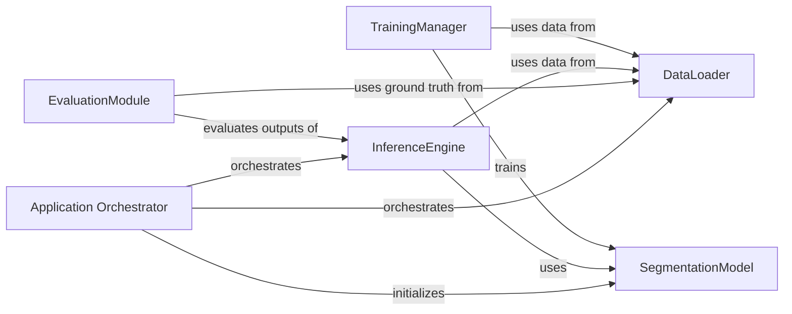

## Component Details

The project aims to perform MS lesion segmentation from MRI scans. The Application Orchestrator coordinates the overall workflow, including loading configuration, initializing the trained model, and orchestrating data processing and segmentation inference. It interacts with components like DataLoader for data handling, SegmentationModel for defining the neural network architecture, TrainingManager for model training, InferenceEngine for making predictions, and EvaluationModule for assessing segmentation accuracy.

### Application Orchestrator
Coordinates the overall segmentation workflow. It is responsible for loading the configuration, initializing the trained model, and orchestrating the data processing and segmentation inference, likely by interacting with an external deep learning framework like NiftyNet.

**Related Classes/Methods**: _None_

### DataLoader
Handles the loading, normalization, and augmentation of medical image data for training and inference. It prepares the input for the neural network.

**Related Classes/Methods**:

- `ms_lesion_segmentation.data.DataLoader` (full file reference)
- `ms_lesion_segmentation.data.ImageProcessor` (full file reference)

### SegmentationModel
Defines the architecture of the deep learning model (e.g., U-Net, V-Net) used for segmenting MS lesions from MRI scans.

**Related Classes/Methods**:

- `ms_lesion_segmentation.model.UNet` (full file reference)
- `ms_lesion_segmentation.model.VNet` (full file reference)

### TrainingManager
Orchestrates the training process, including defining loss functions, optimizers, and managing training epochs and validation.

**Related Classes/Methods**:

- `ms_lesion_segmentation.train.Trainer` (full file reference)
- `ms_lesion_segmentation.train.LossFunction` (full file reference)

### InferenceEngine
Performs predictions on new, unseen MRI scans using the trained segmentation model to generate lesion masks.

**Related Classes/Methods**:

- `ms_lesion_segmentation.inference.Predictor` (full file reference)
- `ms_lesion_segmentation.inference.PostProcessor` (full file reference)

### EvaluationModule
Calculates and reports performance metrics (e.g., Dice score, Jaccard index) to assess the accuracy of the segmentation results.

**Related Classes/Methods**:

- `ms_lesion_segmentation.eval.MetricsCalculator` (full file reference)
- `ms_lesion_segmentation.eval.Visualizer` (full file reference)

### [FAQ](https://github.com/CodeBoarding/GeneratedOnBoardings/tree/main?tab=readme-ov-file#faq)