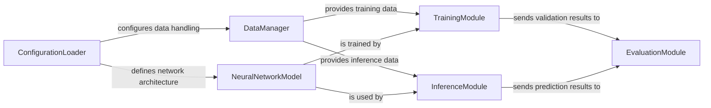

## Component Details

This system is designed for medical image segmentation, specifically for MS lesion segmentation. The `ConfigurationLoader` initializes the system by parsing network, training, and data parameters from `config_network.ini`. The `DataManager` prepares the medical image data for both training and inference. The `NeuralNetworkModel` defines the deep learning architecture, which is then trained by the `TrainingModule`. After training, the `InferenceModule` uses the trained model to perform predictions on new data. Finally, the `EvaluationModule` assesses the performance of the segmentation results.

### ConfigurationLoader
This component is responsible for loading and parsing configuration settings from 'config_network.ini'. It defines parameters crucial for network architecture, training processes, and data handling.

**Related Classes/Methods**:

- `config_network.ini` (full file reference)

### DataManager
This component is assumed to handle the loading, preprocessing (e.g., normalization, resizing), and augmentation of medical image data. It would prepare the data for both model training and inference.

**Related Classes/Methods**: _None_

### NeuralNetworkModel
This component would encapsulate the definition of the deep learning model architecture specifically designed for MS lesion segmentation. Its structure and parameters would likely be configured based on inputs from the ConfigurationLoader.

**Related Classes/Methods**: _None_

### TrainingModule
This component is envisioned to manage the entire training lifecycle of the NeuralNetworkModel. This includes iterating over epochs, computing loss functions, performing backpropagation, and updating model weights based on optimization algorithms.

**Related Classes/Methods**: _None_

### InferenceModule
This component is expected to utilize the trained NeuralNetworkModel to perform segmentation predictions on new, unseen medical images. It would take preprocessed data and output segmentation masks.

**Related Classes/Methods**: _None_

### EvaluationModule
This component is hypothesized to calculate and report various performance metrics, such as the Dice coefficient or Jaccard index, to quantitatively assess the accuracy and effectiveness of the segmentation results produced by the TrainingModule (for validation) and InferenceModule.

**Related Classes/Methods**: _None_

### [FAQ](https://github.com/CodeBoarding/GeneratedOnBoardings/tree/main?tab=readme-ov-file#faq)