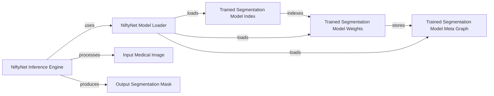

## Component Details

This component overview describes the structure and interaction of the Trained Segmentation Model within the project. The core purpose of this subsystem is to perform MS lesion segmentation using a pre-trained deep learning model. It primarily involves the loading and utilization of the model's weights and architecture, which are stored in TensorFlow checkpoint files. The model's definition and inference logic are likely handled by components within the NiftyNet framework, which interacts with these checkpoint files to execute the segmentation task.

### Trained Segmentation Model Weights
This component represents the actual numerical weights of the deep learning model, learned during the training process. These weights are crucial for the model to make predictions.

**Related Classes/Methods**:

- `Trained model/model.ckpt-80000.data-00000-of-00001` (full file reference)

### Trained Segmentation Model Index
This component acts as an index for the model's weights, allowing efficient lookup and loading of specific parts of the model's state. It's a metadata file for the checkpoint.

**Related Classes/Methods**:

- `Trained model/model.ckpt-80000.index` (full file reference)

### Trained Segmentation Model Meta Graph
This component contains the TensorFlow MetaGraphDef, which describes the computational graph of the deep learning model. It includes the model's architecture, variables, and operations, allowing the model to be reconstructed.

**Related Classes/Methods**:

- `Trained model/model.ckpt-80000.meta` (full file reference)

### NiftyNet Model Loader
This component is responsible for loading the pre-trained model from the checkpoint files into memory, reconstructing the computational graph and loading the learned weights.

**Related Classes/Methods**: _None_

### NiftyNet Inference Engine
This component utilizes the loaded model to perform inference, taking input medical images and applying the segmentation logic to produce output segmentations.

**Related Classes/Methods**: _None_

### Input Medical Image
This component represents the raw medical image data (e.g., MRI scans) that serves as input to the segmentation model.

**Related Classes/Methods**: _None_

### Output Segmentation Mask
This component represents the segmented output, typically a binary mask highlighting the MS lesions in the input medical image.

**Related Classes/Methods**: _None_

### [FAQ](https://github.com/CodeBoarding/GeneratedOnBoardings/tree/main?tab=readme-ov-file#faq)