```mermaid
graph LR
    Configuration_Manager["Configuration Manager"]
    Trained_Segmentation_Model["Trained Segmentation Model"]
    Application_Orchestrator["Application Orchestrator"]
    Configuration_Manager -- "configures" --> Application_Orchestrator
    Application_Orchestrator -- "uses" --> Configuration_Manager
    Application_Orchestrator -- "loads and utilizes" --> Trained_Segmentation_Model
    Trained_Segmentation_Model -- "provides weights for" --> Application_Orchestrator
    click Configuration_Manager href "https://github.com/CodeBoarding/GeneratedOnBoardings/blob/main/MS-lesion-segmentation/Configuration Manager.md" "Details"
    click Trained_Segmentation_Model href "https://github.com/CodeBoarding/GeneratedOnBoardings/blob/main/MS-lesion-segmentation/Trained Segmentation Model.md" "Details"
    click Application_Orchestrator href "https://github.com/CodeBoarding/GeneratedOnBoardings/blob/main/MS-lesion-segmentation/Application Orchestrator.md" "Details"
```

## Component Details

This project focuses on MS lesion segmentation, primarily by utilizing a pre-trained deep learning model. The main flow involves loading network configurations, loading the pre-trained segmentation model, and then applying this model to input data to perform the segmentation task. The project structure suggests a reliance on an external framework, likely NiftyNet, for the core deep learning operations, with this repository providing the specific configuration and trained weights for the MS lesion segmentation task.

### Configuration Manager
Manages and provides network configuration parameters, including model architecture, training settings, and data paths, which are crucial for initializing and running the segmentation process.

**Related Classes/Methods**:

- `config_network.ini` (full file reference)

### Trained Segmentation Model
Encapsulates the pre-trained deep learning model weights and architecture, responsible for performing the actual MS lesion segmentation on input medical images.

**Related Classes/Methods**:

- `model.ckpt-80000` (full file reference)

### Application Orchestrator
Coordinates the overall segmentation workflow. It is responsible for loading the configuration, initializing the trained model, and orchestrating the data processing and segmentation inference, likely by interacting with an external deep learning framework like NiftyNet.

**Related Classes/Methods**: _None_

### [FAQ](https://github.com/CodeBoarding/GeneratedOnBoardings/tree/main?tab=readme-ov-file#faq)

### [FAQ](https://github.com/CodeBoarding/GeneratedOnBoardings/tree/main?tab=readme-ov-file#faq)