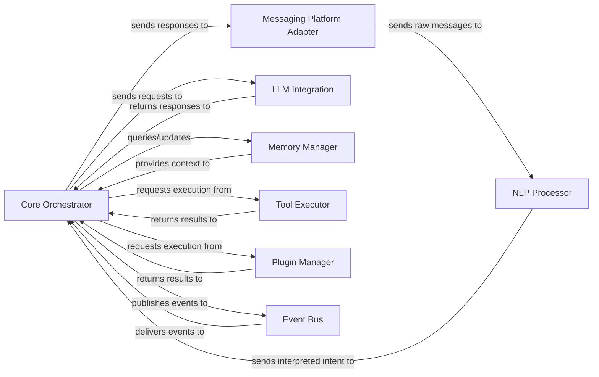

## Details

One paragraph explaining the functionality which is represented by this graph. What the main flow is and what is its purpose.

### Core Orchestrator [[Expand]](./Core_Orchestrator.md)
The central control unit and "brain" of MaiBot. It interprets user intent, orchestrates the entire conversational flow, and coordinates interactions between all other components to generate appropriate bot responses. It manages the overall conversational state, decision-making, and the sequence of operations (e.g., memory lookup, tool invocation, LLM interaction).

**Related Classes/Methods**:

- `maibot.core.orchestrator.Orchestrator` (1:1)
- `maibot.core.event_bus.EventBus` (1:1)

### NLP Processor
Responsible for processing natural language input from users to extract intent, entities, and other linguistic features necessary for the `Core Orchestrator` to understand the user's request.

**Related Classes/Methods**: _None_

### Messaging Platform Adapter
Handles the interface with external messaging platforms (e.g., Telegram, Discord, web chat). It translates incoming messages into a standardized internal format for the `NLP Processor` and `Core Orchestrator`, and formats outgoing responses for the specific platform.

**Related Classes/Methods**: _None_

### LLM Integration [[Expand]](./LLM_Integration.md)
Manages all interactions with Large Language Models (LLMs). It is responsible for formatting prompts, sending requests to the LLM, and processing the LLM's responses, often integrating with external LLM APIs.

**Related Classes/Methods**: _None_

### Memory Manager
Manages the conversational memory and state for the bot. This includes short-term context, long-term knowledge, and user-specific information, providing the `Core Orchestrator` with the necessary context for coherent conversations.

**Related Classes/Methods**: _None_

### Tool Executor
Responsible for executing various external tools and functionalities that the `Core Orchestrator` determines are necessary to fulfill a user's request (e.g., fetching data, performing calculations, interacting with external APIs).

**Related Classes/Methods**: _None_

### Plugin Manager
Manages the loading, lifecycle, and integration of external plugins. It allows the system to be extended with new functionalities and behaviors without modifying the core codebase, supporting the modular/plugin architecture.

**Related Classes/Methods**: _None_

### Event Bus
Facilitates decoupled communication between all components through an event-driven mechanism. Components publish events when something happens, and other components subscribe to events they are interested in, promoting loose coupling and scalability.

**Related Classes/Methods**:

- `maibot.core.event_bus.EventBus` (1:1)

### [FAQ](https://github.com/CodeBoarding/GeneratedOnBoardings/tree/main?tab=readme-ov-file#faq)