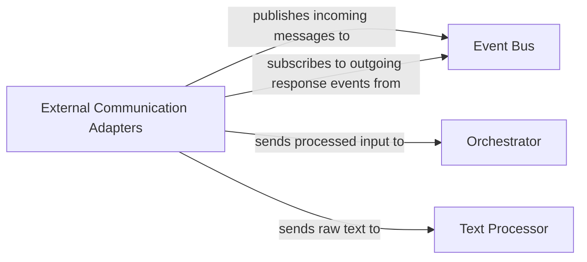

## Details

One paragraph explaining the functionality which is represented by this graph. What the main flow is and what is its purpose.

### External Communication Adapters [[Expand]](./External_Communication_Adapters.md)
Provides standardized interfaces for MaiBot to interact with various external platforms, including messaging services (e.g., Discord, Slack) and programmatic APIs. It receives incoming messages/requests, translates platform-specific data formats into a standardized internal format, delivers outgoing responses/messages in their native format, and manages connection and authentication with external services. This component is crucial for the bot's ability to communicate with the outside world, acting as the primary entry and exit point for all external interactions.

**Related Classes/Methods**:

- `maibot.interfaces.messaging_platform_adapter.DiscordAdapter`
- `maibot.interfaces.messaging_platform_adapter.SlackAdapter`
- `maibot.interfaces.api_interface.FastAPIApp`
- `maibot.interfaces.api_interface.endpoints`

### Event Bus
Serves as a central communication backbone for the MaiBot system, enabling asynchronous, decoupled message exchange between various internal components. It facilitates the broadcasting of events (e.g., incoming messages, processed results, system notifications) and allows components to subscribe to specific event types, ensuring efficient and scalable inter-component communication without direct dependencies.

**Related Classes/Methods**: _None_

### Orchestrator [[Expand]](./Orchestrator.md)
Manages the overall flow of operations and business logic within MaiBot. It receives processed input from communication adapters, determines the appropriate sequence of actions, coordinates interactions between different internal components (e.g., Text Processor, knowledge base), and directs the generation of responses. This component acts as the central decision-maker for fulfilling user requests.

**Related Classes/Methods**: _None_

### Text Processor
Responsible for analyzing and processing raw text input received by MaiBot. This includes tasks such as natural language understanding (NLU), intent recognition, entity extraction, and potentially sentiment analysis or summarization. It transforms unstructured text into a structured format that can be further utilized by the Orchestrator or other components for logical processing.

**Related Classes/Methods**: _None_

### [FAQ](https://github.com/CodeBoarding/GeneratedOnBoardings/tree/main?tab=readme-ov-file#faq)