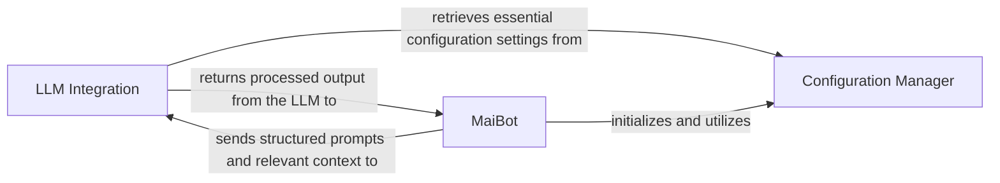

## Details

One paragraph explaining the functionality which is represented by this graph. What the main flow is and what is its purpose.

### LLM Integration [[Expand]](./LLM_Integration.md)
The LLM Integration component serves as the dedicated interface for all interactions with Large Language Models (LLMs). Its primary responsibility is to abstract the complexities of LLM communication, encompassing the construction of prompts, sending requests to various LLM providers, and parsing the diverse outputs generated by these models. This component ensures that the core agent logic can leverage LLM capabilities without direct exposure to API specifics or prompt engineering nuances.

**Related Classes/Methods**:

- `maibot.core.llm_integration.LLMClient` (1:100)
- `maibot.core.llm_integration.PromptBuilder` (1:100)

### MaiBot
The MaiBot component, primarily embodied by the `MainSystem` class, acts as the core orchestrator of the entire system. It is responsible for initializing various system components, scheduling and managing asynchronous tasks, and handling the overall lifecycle of the application, including graceful shutdown procedures. It coordinates interactions between different modules, ensuring the smooth flow of operations and responses.

**Related Classes/Methods**:

- <a href="https://github.com/MaiM-with-u/MaiBot/blob/main/src/main.py#L39-L180" target="_blank" rel="noopener noreferrer">`src.main.MainSystem` (39:180)</a>
- <a href="https://github.com/MaiM-with-u/MaiBot/blob/main/bot.py#L1-L100" target="_blank" rel="noopener noreferrer">`bot.py` (1:100)</a>

### Configuration Manager
The Configuration Manager component is responsible for loading, validating, and providing access to the application's configuration settings. It handles the loading of environment variables, specifically focusing on sensitive information like API keys and base URLs for external providers. This component ensures that all other parts of the system can securely and consistently retrieve necessary configuration parameters without directly interacting with environment-specific details.

**Related Classes/Methods**:

- <a href="https://github.com/MaiM-with-u/MaiBot/blob/main/bot.py#L1-L100" target="_blank" rel="noopener noreferrer">`bot.py` (1:100)</a>

### [FAQ](https://github.com/CodeBoarding/GeneratedOnBoardings/tree/main?tab=readme-ov-file#faq)