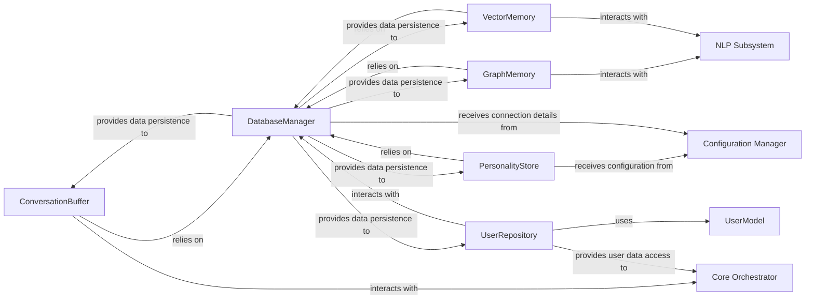

## Details

Abstract Components Overview

### ConversationBuffer
Manages the immediate conversational context by storing and retrieving recent dialogue turns, providing the short-term memory for the bot's current interaction.

**Related Classes/Methods**:

- `maibot.memory.short_term_memory.ConversationBuffer` (1:1)

### GraphMemory
Stores and manages complex, interconnected knowledge as a graph structure, enabling the bot to understand relationships between entities and infer new information for long-term knowledge.

**Related Classes/Methods**:

- `maibot.memory.long_term_memory.GraphMemory` (1:1)

### VectorMemory
Handles the storage and retrieval of knowledge in a high-dimensional vector space, facilitating semantic search and similarity-based knowledge retrieval for long-term memory.

**Related Classes/Methods**:

- `maibot.memory.long_term_memory.VectorMemory` (1:1)

### PersonalityStore
Stores and manages the bot's defined personality traits, behavioral guidelines, and preferences, ensuring a consistent persona across interactions.

**Related Classes/Methods**:

- `maibot.memory.personality_memory.PersonalityStore` (1:1)

### DatabaseManager
Provides a unified interface for managing connections to various underlying data stores (e.g., Peewee for relational, PyMongo for NoSQL) and orchestrating fundamental data persistence operations. It acts as the central data access layer.

**Related Classes/Methods**:

- `maibot.data.database.DatabaseManager` (1:1)

### UserModel
Defines the data structure and schema for user-related information, serving as a blueprint for how user data is represented within the system. It's a passive data model.

**Related Classes/Methods**:

- `maibot.data.models.UserModel` (1:1)

### UserRepository
Abstracts the data access logic for UserModel objects, providing a clean interface for CRUD (Create, Read, Update, Delete) operations on user data, interacting with the DatabaseManager.

**Related Classes/Methods**:

- `maibot.data.repositories.UserRepository` (1:1)

### Core Orchestrator [[Expand]](./Core_Orchestrator.md)
Acts as the central control unit, coordinating interactions between various system components, managing the flow of conversation, and integrating data from different sources to drive the bot's responses.

**Related Classes/Methods**: _None_

### NLP Subsystem
Responsible for processing and understanding natural language input, including tasks such as parsing, entity recognition, sentiment analysis, and generating natural language responses. It provides linguistic intelligence to the bot.

**Related Classes/Methods**: _None_

### Configuration Manager
Centralizes the management of system configurations, settings, and external service connection details, providing a unified interface for other components to retrieve necessary operational parameters.

**Related Classes/Methods**: _None_

### [FAQ](https://github.com/CodeBoarding/GeneratedOnBoardings/tree/main?tab=readme-ov-file#faq)