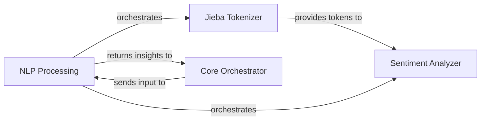

## Details

Abstract Components Overview of a conversational agent system

### NLP Processing [[Expand]](./NLP_Processing.md)
The overarching subsystem that performs natural language processing tasks on user input, including text parsing, tokenization, and sentiment analysis. It enhances the bot's understanding and assists in formatting responses.

**Related Classes/Methods**:

### Jieba Tokenizer
A specialized module within NLP Processing responsible for segmenting raw text into individual words or tokens, particularly optimized for Chinese language processing using the Jieba library. This is the foundational step for further linguistic analysis.

**Related Classes/Methods**:

### Sentiment Analyzer
A module within NLP Processing dedicated to determining the emotional tone or sentiment (e.g., positive, negative, neutral) of the processed user input. This insight is crucial for generating contextually appropriate bot responses.

**Related Classes/Methods**:

### Core Orchestrator [[Expand]](./Core_Orchestrator.md)
The central component responsible for managing the overall flow of the conversational agent. It acts as the primary consumer and producer of information for the NLP Processing subsystem, sending raw user input for analysis and receiving processed insights.

**Related Classes/Methods**: _None_

### [FAQ](https://github.com/CodeBoarding/GeneratedOnBoardings/tree/main?tab=readme-ov-file#faq)