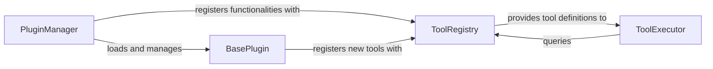

## Details

Component overview for Tool & Plugin Management. The selected components (PluginManager, BasePlugin, ToolRegistry, ToolExecutor) are fundamental to implementing the "Tool-Use/Function Calling Pattern" and "Modular/Plugin Architecture" identified in the project context. They collectively enable the dynamic extension of the bot's capabilities and its interaction with external functionalities, which are core requirements for an AI-powered conversational agent.

### PluginManager
The central orchestrator for the plugin lifecycle, responsible for discovering, loading, and managing instances of BasePlugin implementations. It integrates plugin-provided functionalities into the bot's ecosystem.

**Related Classes/Methods**:

- `maibot.plugins.PluginManager` (1:1)

### BasePlugin
An abstract base class that defines the contract and expected behavior for all custom plugins. Plugins extend this class to encapsulate their specific functionalities, including the registration of new tools.

**Related Classes/Methods**:

- `maibot.plugins.base.BasePlugin` (1:1)

### ToolRegistry
A centralized repository for all available tools. It manages the registration and discovery of tools, making them accessible for execution by the ToolExecutor and other components within the system.

**Related Classes/Methods**:

- `maibot.tools.tool_registry.ToolRegistry` (1:1)

### ToolExecutor
The dedicated execution engine for tools. It receives requests to invoke specific tools, retrieves their definitions from the ToolRegistry, and manages their execution and the handling of their results.

**Related Classes/Methods**:

- `maibot.tools.tool_executor.ToolExecutor` (1:1)

### [FAQ](https://github.com/CodeBoarding/GeneratedOnBoardings/tree/main?tab=readme-ov-file#faq)