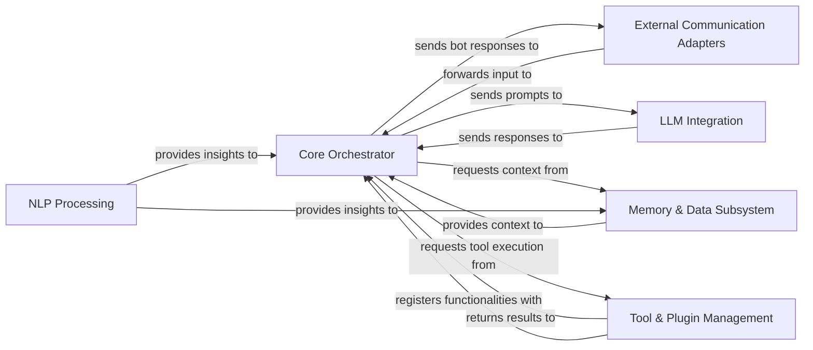

## Details

MaiBot's architecture is designed as a modular AI-powered conversational agent, centered around a Core Orchestrator that manages the overall conversational flow and user intent. User interactions enter via External Communication Adapters, which forward input to the Orchestrator. The Orchestrator leverages NLP Processing for linguistic insights and interacts with the Memory & Data Subsystem to retrieve and store conversational context and long-term knowledge. For generating responses, the Orchestrator sends prompts to the LLM Integration component and requests actions from the Tool & Plugin Management system, which dynamically extends the bot's capabilities. Finally, the Orchestrator sends the bot's responses back through the External Communication Adapters.

### Core Orchestrator [[Expand]](./Core_Orchestrator.md)
The central control unit of MaiBot. It interprets user intent, orchestrates the conversational flow, and coordinates interactions between all other components to generate appropriate bot responses.

**Related Classes/Methods**:

- `maibot.core.orchestrator.Orchestrator` (1:1)
- `maibot.core.event_bus.EventBus` (1:1)

### LLM Integration [[Expand]](./LLM_Integration.md)
Manages all communication with Large Language Models, including prompt construction, sending requests, and parsing LLM-generated outputs.

**Related Classes/Methods**:

- `maibot.core.llm_integration.LLMClient` (1:1)
- `maibot.core.llm_integration.PromptBuilder` (1:1)

### Memory & Data Subsystem [[Expand]](./Memory_Data_Subsystem.md)
Handles all aspects of the bot's memory (short-term conversation context, long-term knowledge, personality traits) and the underlying data persistence mechanisms required to store and retrieve this information.

**Related Classes/Methods**:

- `maibot.memory.short_term_memory.ConversationBuffer` (1:1)
- `maibot.memory.long_term_memory.GraphMemory` (1:1)
- `maibot.memory.long_term_memory.VectorMemory` (1:1)
- `maibot.memory.personality_memory.PersonalityStore` (1:1)
- `maibot.data.database.DatabaseManager` (1:1)
- `maibot.data.models.UserModel` (1:1)
- `maibot.data.repositories.UserRepository` (1:1)

### External Communication Adapters [[Expand]](./External_Communication_Adapters.md)
Provides standardized interfaces for MaiBot to interact with various external platforms, including messaging services (e.g., Discord, Slack) and programmatic APIs, handling input reception and output delivery.

**Related Classes/Methods**:

- `maibot.interfaces.messaging_platform_adapter.DiscordAdapter` (1:1)
- `maibot.interfaces.messaging_platform_adapter.SlackAdapter` (1:1)
- `maibot.interfaces.api_interface.FastAPIApp` (1:1)
- `maibot.interfaces.api_interface.endpoints` (1:1)

### Tool & Plugin Management [[Expand]](./Tool_Plugin_Management.md)
Manages the dynamic extension of MaiBot's capabilities by overseeing the registration, discovery, and execution of both internal and external tools, as well as the loading and management of custom plugins.

**Related Classes/Methods**:

- `maibot.plugins.PluginManager` (1:1)
- `maibot.plugins.base.BasePlugin` (1:1)
- `maibot.tools.tool_registry.ToolRegistry` (1:1)
- `maibot.tools.tool_executor.ToolExecutor` (1:1)

### NLP Processing [[Expand]](./NLP_Processing.md)
Performs natural language processing tasks on user input to extract meaning, sentiment, and other linguistic insights, enhancing the bot's understanding.

**Related Classes/Methods**:

- `maibot.nlp.text_processor.JiebaTokenizer` (1:1)
- `maibot.nlp.sentiment_analysis.SentimentAnalyzer` (1:1)

### [FAQ](https://github.com/CodeBoarding/GeneratedOnBoardings/tree/main?tab=readme-ov-file#faq)