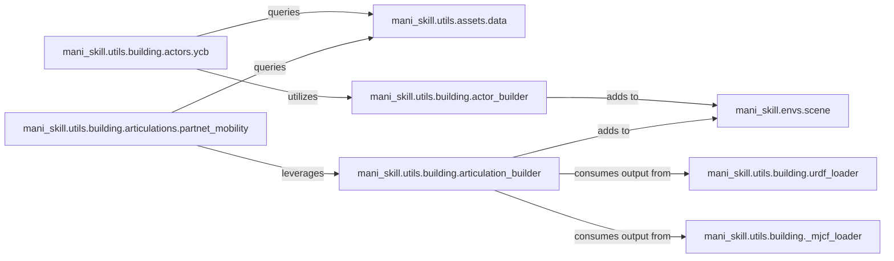

## Details

The `Asset & Scene Management` subsystem is crucial for defining and populating the simulation environment within the `ManiSkill` framework. It encompasses the loading, parsing, and construction of 3D assets, both rigid and articulated, and their integration into the simulation scene.

### mani_skill.utils.assets.data
Acts as a central registry and provider for asset metadata and file paths, abstracting the storage and retrieval of various asset datasets (e.g., YCB, PartNet-Mobility).

**Related Classes/Methods**:

- <a href="https://github.com/haosulab/ManiSkill/blob/main/mani_skill/utils/assets/data.py" target="_blank" rel="noopener noreferrer">`mani_skill.utils.assets.data`</a>

### mani_skill.utils.building.urdf_loader
Parses URDF (Unified Robot Description Format) files, converting robot and object descriptions into a structured, in-memory format usable by the simulation.

**Related Classes/Methods**:

- <a href="https://github.com/haosulab/ManiSkill/blob/main/mani_skill/utils/building/urdf_loader.py" target="_blank" rel="noopener noreferrer">`mani_skill.utils.building.urdf_loader`</a>

### mani_skill.utils.building._mjcf_loader
Parses MJCF (MuJoCo XML Format) files, similar to URDF, for physical model descriptions, providing an alternative format for asset definition.

**Related Classes/Methods**:

- <a href="https://github.com/haosulab/ManiSkill/blob/main/mani_skill/utils/building/_mjcf_loader.py" target="_blank" rel="noopener noreferrer">`mani_skill.utils.building._mjcf_loader`</a>

### mani_skill.utils.building.actor_builder
Constructs individual rigid body actors (non-articulated objects) within the simulation, handling the creation of visual and collision geometries.

**Related Classes/Methods**:

- <a href="https://github.com/haosulab/ManiSkill/blob/main/mani_skill/utils/building/actor_builder.py" target="_blank" rel="noopener noreferrer">`mani_skill.utils.building.actor_builder`</a>

### mani_skill.utils.building.articulation_builder
Constructs complex articulated models, such as robots, by assembling multiple links and joints based on parsed model data (URDF/MJCF).

**Related Classes/Methods**:

- <a href="https://github.com/haosulab/ManiSkill/blob/main/mani_skill/utils/building/articulation_builder.py" target="_blank" rel="noopener noreferrer">`mani_skill.utils.building.articulation_builder`</a>

### mani_skill.utils.building.actors.ycb
Specializes in integrating objects from the YCB Object and Model Set into the simulation, leveraging `actor_builder` for their construction.

**Related Classes/Methods**:

- <a href="https://github.com/haosulab/ManiSkill/blob/main/mani_skill/utils/building/actors/ycb.py" target="_blank" rel="noopener noreferrer">`mani_skill.utils.building.actors.ycb`</a>

### mani_skill.utils.building.articulations.partnet_mobility
Specializes in integrating articulated models from the PartNet-Mobility dataset, leveraging `articulation_builder` for their complex assembly.

**Related Classes/Methods**:

- <a href="https://github.com/haosulab/ManiSkill/blob/main/mani_skill/utils/building/articulations/partnet_mobility.py" target="_blank" rel="noopener noreferrer">`mani_skill.utils.building.articulations.partnet_mobility`</a>

### mani_skill.envs.scene
Manages the fundamental elements of the simulation scene, including the physics engine, cameras, and lighting, providing the environment where built assets reside and interact.

**Related Classes/Methods**:

- <a href="https://github.com/haosulab/ManiSkill/blob/main/mani_skill/envs/scene.py" target="_blank" rel="noopener noreferrer">`mani_skill.envs.scene`</a>

### [FAQ](https://github.com/CodeBoarding/GeneratedOnBoardings/tree/main?tab=readme-ov-file#faq)