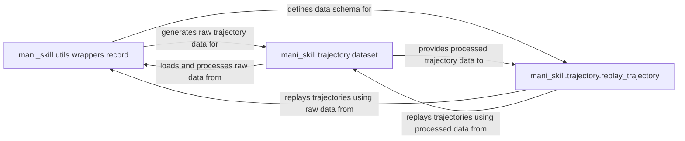

## Details

The trajectory management subsystem in ManiSkill is designed around the lifecycle of simulation data, from collection to replay. The mani_skill.utils.wrappers.record component serves as the primary data capture mechanism, wrapping simulation environments to record detailed trajectories and associated metadata into standardized H5 and JSON formats. This raw data is then consumed by mani_skill.trajectory.dataset, which handles the loading, parsing, and initial preparation of trajectories for broader use. Finally, mani_skill.trajectory.replay_trajectory provides the capability to re-simulate or visualize these collected trajectories, either by directly accessing the raw data from the recording component or by utilizing the processed data provided by the dataset component. This architecture ensures a clear separation of concerns, with explicit data flow and schema dependencies facilitating robust data handling and analysis within the simulation framework. The mani_skill.utils.wrappers.record component, specifically the RecordEpisode wrapper, is central to data collection. It captures simulation states, observations, and actions, then serializes this information into H5 files and associated JSON metadata. This output forms the primary data source for the trajectory subsystem. The mani_skill.trajectory.dataset component is responsible for ingesting these raw H5 and JSON files, loading them into memory, and performing any necessary initial processing or cleaning. It acts as an intermediary, preparing the data for consumption by other modules. The mani_skill.trajectory.replay_trajectory component leverages this collected data for various purposes, including analysis, debugging, and visualization. It can directly consume the raw H5/JSON files generated by record or utilize the pre-processed data provided by dataset, offering flexibility in how trajectories are accessed and replayed. The explicit definition of data structures within record ensures compatibility and interoperability across these components.

### mani_skill.utils.wrappers.record
This component is responsible for the real-time collection, storage, and management of simulation trajectories and video recordings during environment interaction. It acts as a wrapper around the core simulation environment, capturing data as steps are performed and saving it, typically to H5 files. It is crucial for generating the raw data needed for learning and analysis.

**Related Classes/Methods**:

- <a href="https://github.com/haosulab/ManiSkill/blob/main/mani_skill/utils/wrappers/record.py" target="_blank" rel="noopener noreferrer">`mani_skill.utils.wrappers.record`</a>

### mani_skill.trajectory.dataset
This component handles the loading and initial processing of simulation trajectory and demonstration data, primarily from H5 files. It prepares the collected data by loading it into memory and potentially performing minor transformations (e.g., removing specific data types), making it ready for consumption by learning algorithms or for replay.

**Related Classes/Methods**:

- <a href="https://github.com/haosulab/ManiSkill/blob/main/mani_skill/trajectory/dataset.py" target="_blank" rel="noopener noreferrer">`mani_skill.trajectory.dataset`</a>

### mani_skill.trajectory.replay_trajectory
This component facilitates the replaying of collected simulation trajectories within various simulation environments (both CPU and parallelized). This is crucial for analysis, debugging, policy evaluation, and generating visual demonstrations from pre-recorded data, allowing researchers to inspect and understand agent behaviors.

**Related Classes/Methods**:

- <a href="https://github.com/haosulab/ManiSkill/blob/main/mani_skill/trajectory/replay_trajectory.py" target="_blank" rel="noopener noreferrer">`mani_skill.trajectory.replay_trajectory`</a>

### [FAQ](https://github.com/CodeBoarding/GeneratedOnBoardings/tree/main?tab=readme-ov-file#faq)