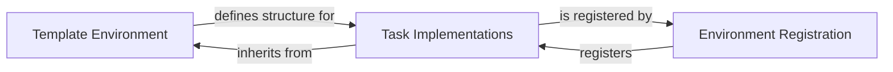

## Details

The ManiSkill environment subsystem is structured around a clear separation of concerns, facilitating the creation and management of diverse simulation tasks. The `Template Environment` serves as the foundational abstract layer, defining the core interface and common functionalities that all environments share. `Task Implementations` are concrete instantiations of specific simulation challenges, inheriting from and extending the `Template Environment` to define unique task-specific logic and configurations. This inheritance mechanism ensures consistency while allowing for specialized behaviors. Finally, the `Environment Registration` component acts as a central registry, enabling the discoverability and instantiation of various `Task Implementations` by providing a standardized mechanism to register and retrieve environments, thereby streamlining their integration into learning algorithms and user workflows.

### Template Environment
This component provides a foundational, abstract interface and default implementations for common environment functionalities. It establishes the basic structure for all ManiSkill environments, including methods for scene setup, observation space definition, action space definition, and a base for reward computation. It acts as a crucial abstraction layer, promoting code reuse and consistency across different tasks.

**Related Classes/Methods**:

- <a href="https://github.com/haosulab/ManiSkill/blob/main/mani_skill/envs/template.py#L1-L9999" target="_blank" rel="noopener noreferrer">`mani_skill.envs.template.TemplateEnv`:1-9999</a>

### Task Implementations
These are concrete implementations of specific simulation tasks. Each class defines the unique characteristics of a particular task, such as initial object configurations, specific goals, detailed reward functions, and success/failure criteria. They extend and override the base functionalities provided by `TemplateEnv` to create distinct learning challenges.

**Related Classes/Methods**:

- <a href="https://github.com/haosulab/ManiSkill/blob/main/mani_skill/envs/tasks/tabletop/pick_cube.py#L1-L9999" target="_blank" rel="noopener noreferrer">`mani_skill.envs.tasks.tabletop.pick_cube.PickCube`:1-9999</a>

### Environment Registration
This component manages a centralized registry of all available ManiSkill environments. It provides a mechanism to register new environments and allows users or learning algorithms to instantiate environments by a simple string identifier, promoting discoverability and ease of use within the framework.

**Related Classes/Methods**:

- <a href="https://github.com/haosulab/ManiSkill/blob/main/mani_skill/envs/__init__.py#L1-L9999" target="_blank" rel="noopener noreferrer">`mani_skill.envs.registration.EnvironmentRegistration`:1-9999</a>

### [FAQ](https://github.com/CodeBoarding/GeneratedOnBoardings/tree/main?tab=readme-ov-file#faq)