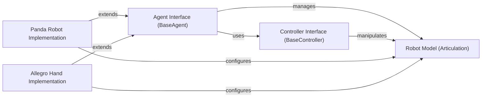

## Details

The `Robot & Agent System` subsystem is central to defining and controlling robotic entities within the simulation. It provides the necessary abstractions and concrete implementations for agents to interact with the environment.

### Agent Interface (BaseAgent)
The foundational abstract class for any controllable entity (robot) within the simulation. It defines the high-level API for agent interaction, including managing its physical model, configuring control modes, defining action spaces, processing actions, and retrieving agent state. This component is crucial for integrating learning algorithms with diverse robot types.

**Related Classes/Methods**:

- <a href="https://github.com/haosulab/ManiSkill/blob/main/mani_skill/agents/base_agent.py" target="_blank" rel="noopener noreferrer">`mani_skill.agents.base_agent`</a>

### Controller Interface (BaseController)
Defines the standardized interface for various robot control mechanisms (e.g., joint position, velocity, torque control). It handles action preprocessing and applying control signals to the robot's joints, abstracting the low-level control logic. This component ensures that different control strategies can be swapped without affecting the core agent logic.

**Related Classes/Methods**:

- <a href="https://github.com/haosulab/ManiSkill/blob/main/mani_skill/agents/controllers/base_controller.py" target="_blank" rel="noopener noreferrer">`mani_skill.agents.controllers.base_controller`</a>

### Robot Model (Articulation)
Represents the physical model of a robot or any articulated body within the simulation environment. It provides methods to access and manipulate the robot's overall state, such as joint positions (`qpos`), joint velocities (`qvel`), and the root pose. This is the simulation's internal representation of the robot's physical state, enabling accurate physics simulation.

**Related Classes/Methods**:

- <a href="https://github.com/haosulab/ManiSkill/blob/main/mani_skill/utils/structs/articulation.py" target="_blank" rel="noopener noreferrer">`mani_skill.utils.structs.articulation`</a>

### Panda Robot Implementation
A concrete implementation of a robotic arm (Panda), extending the `Agent Interface`. It integrates with the `Robot Model` to represent the specific physical properties and kinematics of the Panda robot, enabling its use within the simulation. This component demonstrates how specific robot hardware is integrated into the framework.

**Related Classes/Methods**:

- <a href="https://github.com/haosulab/ManiSkill/blob/main/mani_skill/agents/robots/panda/panda.py" target="_blank" rel="noopener noreferrer">`mani_skill.agents.robots.panda.panda`</a>

### Allegro Hand Implementation
A concrete implementation of a robotic hand (Allegro Hand), also extending the `Agent Interface`. Similar to the Panda, it integrates with the `Robot Model` to define the Allegro Hand's specific physical characteristics and allows for hand-specific proprioception. This component highlights the framework's ability to support diverse end-effectors.

**Related Classes/Methods**:

- <a href="https://github.com/haosulab/ManiSkill/blob/main/mani_skill/agents/robots/allegro_hand/allegro.py" target="_blank" rel="noopener noreferrer">`mani_skill.agents.robots.allegro_hand.allegro`</a>

### [FAQ](https://github.com/CodeBoarding/GeneratedOnBoardings/tree/main?tab=readme-ov-file#faq)