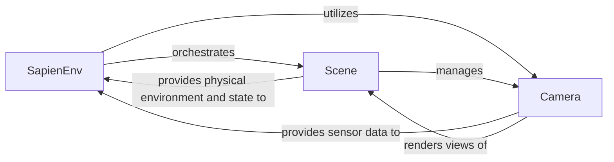

## Details

The Simulation Core subsystem forms the bedrock of the ManiSkill project, embodying the central physics simulation engine, scene management, and rendering interface. It is designed to provide a high-performance, modular, and extensible foundation for embodied AI research, aligning with the project's architectural bias towards simulation-driven development.

### SapienEnv
The SapienEnv component serves as the primary orchestrator of the simulation lifecycle. It is responsible for initializing, resetting, and stepping the simulation forward. It integrates the underlying SAPIEN physics engine and rendering system, manages the generation of observations for agents, and computes rewards based on task progress. This component acts as the main interface for agents to interact with the simulated environment.

**Related Classes/Methods**:

- <a href="https://github.com/haosulab/ManiSkill/blob/main/mani_skill/envs/sapien_env.py" target="_blank" rel="noopener noreferrer">`mani_skill.envs.sapien_env`</a>

### Scene
The Scene component encapsulates the SAPIEN physics scene itself. It is responsible for managing all physical actors (e.g., robots, objects), lights, and cameras within the simulation environment. It handles low-level SAPIEN configurations related to physics properties, collision detection, and rendering settings, effectively defining the physical world where simulations occur.

**Related Classes/Methods**:

- <a href="https://github.com/haosulab/ManiSkill/blob/main/mani_skill/envs/scene.py" target="_blank" rel="noopener noreferrer">`mani_skill.envs.scene`</a>

### Camera
The Camera component manages virtual cameras within the simulated scene. It allows for the configuration of various camera properties such as field of view, resolution, and pose. Its primary responsibility is to capture different types of image data, including RGB, depth, segmentation masks, and point clouds, which are essential for generating observations for learning algorithms. It can also perform post-processing on the captured sensor data.

**Related Classes/Methods**:

- <a href="https://github.com/haosulab/ManiSkill/blob/main/mani_skill/sensors/camera.py" target="_blank" rel="noopener noreferrer">`mani_skill.sensors.camera`</a>

### [FAQ](https://github.com/CodeBoarding/GeneratedOnBoardings/tree/main?tab=readme-ov-file#faq)