```mermaid
graph LR
    Simulation_Core["Simulation Core"]
    Environment_Task_Definition["Environment & Task Definition"]
    Asset_Scene_Management["Asset & Scene Management"]
    Robot_Agent_System["Robot & Agent System"]
    Data_Trajectory_Management["Data & Trajectory Management"]
    Learning_Algorithms_Baselines["Learning Algorithms & Baselines"]
    Environment_Task_Definition -- "configures and initializes" --> Simulation_Core
    Asset_Scene_Management -- "provides elements to" --> Simulation_Core
    Simulation_Core -- "provides observations to" --> Robot_Agent_System
    Robot_Agent_System -- "sends actions to" --> Simulation_Core
    Learning_Algorithms_Baselines -- "collects experience from" --> Simulation_Core
    Simulation_Core -- "provides feedback to" --> Learning_Algorithms_Baselines
    Learning_Algorithms_Baselines -- "stores data in" --> Data_Trajectory_Management
    Data_Trajectory_Management -- "provides data to" --> Learning_Algorithms_Baselines
    Data_Trajectory_Management -- "can replay episodes in" --> Simulation_Core
    click Simulation_Core href "https://github.com/CodeBoarding/GeneratedOnBoardings/blob/main/ManiSkill/Simulation_Core.md" "Details"
    click Environment_Task_Definition href "https://github.com/CodeBoarding/GeneratedOnBoardings/blob/main/ManiSkill/Environment_Task_Definition.md" "Details"
    click Asset_Scene_Management href "https://github.com/CodeBoarding/GeneratedOnBoardings/blob/main/ManiSkill/Asset_Scene_Management.md" "Details"
    click Robot_Agent_System href "https://github.com/CodeBoarding/GeneratedOnBoardings/blob/main/ManiSkill/Robot_Agent_System.md" "Details"
    click Data_Trajectory_Management href "https://github.com/CodeBoarding/GeneratedOnBoardings/blob/main/ManiSkill/Data_Trajectory_Management.md" "Details"
```

## Details

The ManiSkill project is architected around a robust simulation core that interacts with various specialized components to enable complex robotic manipulation tasks. The `Simulation Core` forms the heart of the system, managing physics, scenes, and rendering. `Asset & Scene Management` feeds into this core by providing the necessary 3D models and environmental structures. Robotic agents, defined within the `Robot & Agent System`, interact with the `Simulation Core` by sending actions and receiving observations. The `Environment & Task Definition` component configures the simulation, setting up specific tasks and their parameters, which are then executed within the `Simulation Core`. Finally, `Learning Algorithms & Baselines` leverage the simulation for training, collecting and storing data via `Data & Trajectory Management`, and using this data to refine agent policies. This modular design facilitates clear separation of concerns, allowing for independent development and optimization of each component, which is crucial for both documentation and visual diagram generation.

### Simulation Core [[Expand]](./Simulation_Core.md)
The central physics simulation engine, scene manager, and rendering interface.

**Related Classes/Methods**:

- <a href="https://github.com/haosulab/ManiSkill/blob/main/mani_skill/envs/sapien_env.py" target="_blank" rel="noopener noreferrer">`mani_skill.envs.sapien_env`</a>
- <a href="https://github.com/haosulab/ManiSkill/blob/main/mani_skill/envs/scene.py" target="_blank" rel="noopener noreferrer">`mani_skill.envs.scene`</a>
- <a href="https://github.com/haosulab/ManiSkill/blob/main/mani_skill/sensors/camera.py" target="_blank" rel="noopener noreferrer">`mani_skill.sensors.camera`</a>
- <a href="https://github.com/haosulab/ManiSkill/blob/main/mani_skill/envs/wrappers/__init__.py" target="_blank" rel="noopener noreferrer">`mani_skill.envs.wrappers.gym_wrapper`</a>

### Environment & Task Definition [[Expand]](./Environment_Task_Definition.md)
Defines specific simulation environments and tasks, including goals, reward functions, and initial scene configurations.

**Related Classes/Methods**:

- <a href="https://github.com/haosulab/ManiSkill/blob/main/mani_skill/envs/template.py" target="_blank" rel="noopener noreferrer">`mani_skill.envs.template`</a>
- <a href="https://github.com/haosulab/ManiSkill/blob/main/mani_skill/envs/tasks/tabletop/pick_cube.py" target="_blank" rel="noopener noreferrer">`mani_skill.envs.tasks.tabletop.pick_cube`</a>
- <a href="https://github.com/haosulab/ManiSkill/blob/main/mani_skill/envs/__init__.py" target="_blank" rel="noopener noreferrer">`mani_skill.envs.registration`</a>

### Asset & Scene Management [[Expand]](./Asset_Scene_Management.md)
Manages the loading, creation, and manipulation of 3D assets to construct simulation scenes.

**Related Classes/Methods**:

- <a href="https://github.com/haosulab/ManiSkill/blob/main/mani_skill/utils/building/actor_builder.py" target="_blank" rel="noopener noreferrer">`mani_skill.utils.building.actor_builder`</a>
- <a href="https://github.com/haosulab/ManiSkill/blob/main/mani_skill/utils/building/articulation_builder.py" target="_blank" rel="noopener noreferrer">`mani_skill.utils.building.articulation_builder`</a>
- <a href="https://github.com/haosulab/ManiSkill/blob/main/mani_skill/utils/building/urdf_loader.py" target="_blank" rel="noopener noreferrer">`mani_skill.utils.building.urdf_loader`</a>
- <a href="https://github.com/haosulab/ManiSkill/blob/main/mani_skill/utils/assets/data.py" target="_blank" rel="noopener noreferrer">`mani_skill.utils.assets.data`</a>

### Robot & Agent System [[Expand]](./Robot_Agent_System.md)
Defines robotic agents, their physical models, and control mechanisms for interacting with the environment.

**Related Classes/Methods**:

- <a href="https://github.com/haosulab/ManiSkill/blob/main/mani_skill/agents/base_agent.py" target="_blank" rel="noopener noreferrer">`mani_skill.agents.base_agent`</a>
- <a href="https://github.com/haosulab/ManiSkill/blob/main/mani_skill/agents/controllers/base_controller.py" target="_blank" rel="noopener noreferrer">`mani_skill.agents.controllers.base_controller`</a>
- <a href="https://github.com/haosulab/ManiSkill/blob/main/mani_skill/agents/robots/panda/panda.py" target="_blank" rel="noopener noreferrer">`mani_skill.agents.robots.panda.panda`</a>
- <a href="https://github.com/haosulab/ManiSkill/blob/main/mani_skill/agents/robots/allegro_hand/allegro.py" target="_blank" rel="noopener noreferrer">`mani_skill.agents.robots.allegro_hand.allegro`</a>

### Data & Trajectory Management [[Expand]](./Data_Trajectory_Management.md)
Handles the collection, storage, loading, and replay of simulation trajectories and demonstration data.

**Related Classes/Methods**:

- <a href="https://github.com/haosulab/ManiSkill/blob/main/mani_skill/trajectory/dataset.py" target="_blank" rel="noopener noreferrer">`mani_skill.trajectory.dataset`</a>
- <a href="https://github.com/haosulab/ManiSkill/blob/main/mani_skill/trajectory/replay_trajectory.py" target="_blank" rel="noopener noreferrer">`mani_skill.trajectory.replay_trajectory`</a>
- <a href="https://github.com/haosulab/ManiSkill/blob/main/mani_skill/utils/wrappers/record.py" target="_blank" rel="noopener noreferrer">`mani_skill.utils.wrappers.record`</a>

### Learning Algorithms & Baselines
Contains implementations of various reinforcement learning and imitation learning algorithms for policy training and evaluation.

**Related Classes/Methods**:

- <a href="https://github.com/haosulab/ManiSkill/blob/main/examples/baselines/act/train.py" target="_blank" rel="noopener noreferrer">`examples.baselines.act.train`</a>
- <a href="https://github.com/haosulab/ManiSkill/blob/main/examples/baselines/bc/bc.py" target="_blank" rel="noopener noreferrer">`examples.baselines.bc.bc`</a>
- <a href="https://github.com/haosulab/ManiSkill/blob/main/examples/baselines/diffusion_policy/train.py" target="_blank" rel="noopener noreferrer">`examples.baselines.diffusion_policy.train`</a>
- <a href="https://github.com/haosulab/ManiSkill/blob/main/examples/baselines/ppo/ppo.py" target="_blank" rel="noopener noreferrer">`examples.baselines.ppo.ppo`</a>
- <a href="https://github.com/haosulab/ManiSkill/blob/main/examples/baselines/tdmpc2/trainer/trainer.py" target="_blank" rel="noopener noreferrer">`examples.baselines.tdmpc2.tdmpc2.train`</a>
- <a href="https://github.com/haosulab/ManiSkill/blob/main/examples/baselines/sac/sac.py" target="_blank" rel="noopener noreferrer">`examples.baselines.sac.sac`</a>

### [FAQ](https://github.com/CodeBoarding/GeneratedOnBoardings/tree/main?tab=readme-ov-file#faq)