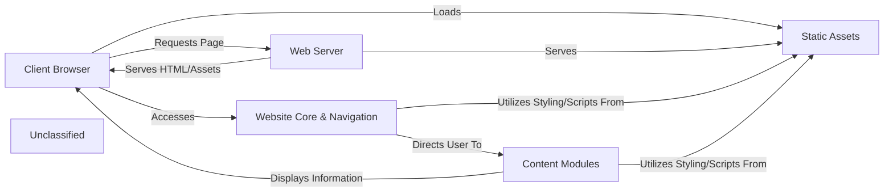

## Details

The Mayar Data Science Lab website operates as a static web application, primarily serving informational content. The Client Browser initiates requests to the Web Server, which is responsible for hosting and delivering all static files. The Website Core & Navigation, centered around `index.html`, acts as the primary entry point and provides the main navigational structure. Users interact with this core to explore various Content Modules, each represented by dedicated HTML files (e.g., `data-analytics.html`, `about.html`), which display specific information about the lab's services, research, and team. The visual presentation and client-side interactivity across all components are managed by Static Assets, including CSS (`style.css`) and JavaScript (`script.js`), which are also served by the Web Server and loaded by the Client Browser. This architecture ensures a clear separation of concerns, with the server handling file delivery and the browser rendering the content and executing client-side logic.

### Client Browser
The end-user's web browser, responsible for requesting, rendering, and interacting with the website content.

**Related Classes/Methods**: _None_

### Web Server
The server infrastructure (e.g., Apache, Nginx) responsible for hosting and serving the static website files to client browsers.

**Related Classes/Methods**: _None_

### Website Core & Navigation
The primary entry point of the website, including the homepage and the integrated navigation system that allows users to traverse different sections.

**Related Classes/Methods**:

- <a href="https://github.com/AhmedAlRadaideh1980/MayarDataScienceLab/blob/mainindex.html" target="_blank" rel="noopener noreferrer">`index.html`</a>

### Content Modules
A collection of pages dedicated to showcasing Mayar Data Science Lab's expertise, company information, career opportunities, and contact details.

**Related Classes/Methods**:

- <a href="https://github.com/AhmedAlRadaideh1980/MayarDataScienceLab/blob/maindata-analytics.html" target="_blank" rel="noopener noreferrer">`data-analytics.html`</a>
- <a href="https://github.com/AhmedAlRadaideh1980/MayarDataScienceLab/blob/mainmachine-learning.html" target="_blank" rel="noopener noreferrer">`machine-learning.html`</a>
- <a href="https://github.com/AhmedAlRadaideh1980/MayarDataScienceLab/blob/mainstatistical-methods.html" target="_blank" rel="noopener noreferrer">`statistical-methods.html`</a>
- <a href="https://github.com/AhmedAlRadaideh1980/MayarDataScienceLab/blob/mainvisualization.html" target="_blank" rel="noopener noreferrer">`visualization.html`</a>
- <a href="https://github.com/AhmedAlRadaideh1980/MayarDataScienceLab/blob/mainresearch.html" target="_blank" rel="noopener noreferrer">`research.html`</a>
- <a href="https://github.com/AhmedAlRadaideh1980/MayarDataScienceLab/blob/mainabout.html" target="_blank" rel="noopener noreferrer">`about.html`</a>
- <a href="https://github.com/AhmedAlRadaideh1980/MayarDataScienceLab/blob/mainteam.html" target="_blank" rel="noopener noreferrer">`team.html`</a>
- <a href="https://github.com/AhmedAlRadaideh1980/MayarDataScienceLab/blob/maincareers.html" target="_blank" rel="noopener noreferrer">`careers.html`</a>
- <a href="https://github.com/AhmedAlRadaideh1980/MayarDataScienceLab/blob/mainapply.html" target="_blank" rel="noopener noreferrer">`apply.html`</a>
- <a href="https://github.com/AhmedAlRadaideh1980/MayarDataScienceLab/blob/maincontact.html" target="_blank" rel="noopener noreferrer">`contact.html`</a>
- <a href="https://github.com/AhmedAlRadaideh1980/MayarDataScienceLab/blob/mainservices.html" target="_blank" rel="noopener noreferrer">`services.html`</a>
- <a href="https://github.com/AhmedAlRadaideh1980/MayarDataScienceLab/blob/mainsurveys.html" target="_blank" rel="noopener noreferrer">`surveys.html`</a>

### Static Assets
Non-HTML files such as CSS stylesheets, JavaScript files, and images that are essential for the website's visual presentation and client-side interactivity.

**Related Classes/Methods**:

- `style.css`
- `script.js`
- `image files`

### Unclassified
Component for all unclassified files and utility functions (Utility functions/External Libraries/Dependencies)

**Related Classes/Methods**: _None_

### [FAQ](https://github.com/CodeBoarding/GeneratedOnBoardings/tree/main?tab=readme-ov-file#faq)