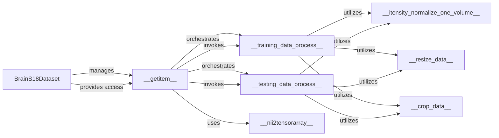

## Details

Analysis of the Data Loading and Preprocessing Module in MedicalNet project.

### BrainS18Dataset
The foundational component, acting as the primary interface for accessing and managing 3D medical image data. It initializes the dataset, handles file path management, and provides the entry point for data retrieval.

**Related Classes/Methods**:

- <a href="https://github.com/Tencent/MedicalNet/blob/master/datasets/brains18.py#L15-L201" target="_blank" rel="noopener noreferrer">`datasets.brains18.BrainS18Dataset`:15-201</a>

### __getitem__
Orchestrates the retrieval and preprocessing of a single data sample. It dynamically selects and applies either the training or testing preprocessing pipeline based on the dataset's current mode.

**Related Classes/Methods**:

- <a href="https://github.com/Tencent/MedicalNet/blob/master/datasets/brains18.py" target="_blank" rel="noopener noreferrer">`datasets.brains18.BrainS18Dataset:__getitem__`</a>

### __training_data_process__
Encapsulates the complete preprocessing pipeline specifically for training data. This includes steps like data cleaning, intensity normalization, resizing, and augmentation (e.g., random cropping).

**Related Classes/Methods**:

- <a href="https://github.com/Tencent/MedicalNet/blob/master/datasets/brains18.py" target="_blank" rel="noopener noreferrer">`datasets.brains18.BrainS18Dataset:__training_data_process__`</a>

### __testing_data_process__
Encapsulates the standardized preprocessing pipeline for testing or validation data. This pipeline typically includes normalization, resizing, and cropping, but generally excludes aggressive augmentation to ensure consistent evaluation.

**Related Classes/Methods**:

- <a href="https://github.com/Tencent/MedicalNet/blob/master/datasets/brains18.py" target="_blank" rel="noopener noreferrer">`datasets.brains18.BrainS18Dataset:__testing_data_process__`</a>

### __nii2tensorarray__
Converts processed NumPy array data (derived from NIfTI files) into the PyTorch tensor format, making it compatible for direct use with PyTorch models.

**Related Classes/Methods**:

- <a href="https://github.com/Tencent/MedicalNet/blob/master/datasets/brains18.py" target="_blank" rel="noopener noreferrer">`datasets.brains18.BrainS18Dataset:__nii2tensorarray__`</a>

### __itensity_normalize_one_volume__
Standardizes the intensity values of a single 3D image volume to a predefined range, crucial for consistent model input and performance.

**Related Classes/Methods**:

- <a href="https://github.com/Tencent/MedicalNet/blob/master/datasets/brains18.py" target="_blank" rel="noopener noreferrer">`datasets.brains18.BrainS18Dataset:__itensity_normalize_one_volume__`</a>

### __resize_data__
Adjusts the spatial dimensions of the 3D medical image data to a uniform size, ensuring consistency across the dataset.

**Related Classes/Methods**:

- <a href="https://github.com/Tencent/MedicalNet/blob/master/datasets/brains18.py" target="_blank" rel="noopener noreferrer">`datasets.brains18.BrainS18Dataset:__resize_data__`</a>

### __crop_data__
Extracts a specific sub-region from the image data. This can be used for focusing on regions of interest or as a data augmentation technique.

**Related Classes/Methods**:

- <a href="https://github.com/Tencent/MedicalNet/blob/master/datasets/brains18.py" target="_blank" rel="noopener noreferrer">`datasets.brains18.BrainS18Dataset:__crop_data__`</a>

### [FAQ](https://github.com/CodeBoarding/GeneratedOnBoardings/tree/main?tab=readme-ov-file#faq)