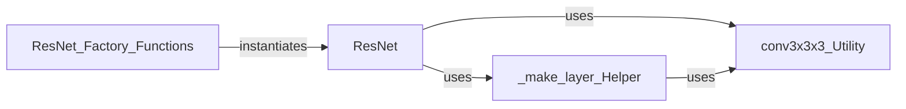

## Details

The Model Definition Module is primarily encapsulated within the models/resnet.py file. This file contains the core ResNet class definition, helper functions for constructing network layers, and factory functions for instantiating specific ResNet variants.

### ResNet
Serves as the foundational blueprint for all 3D ResNet architectures. It defines the network's structure, including the initial convolutional layers, the arrangement of residual blocks, and the final classification layers. It orchestrates the assembly of these components to form a complete deep learning model.

**Related Classes/Methods**:

- <a href="https://github.com/Tencent/MedicalNet/blob/master/models/resnet.py#L112-L215" target="_blank" rel="noopener noreferrer">`ResNet`:112-215</a>

### ResNet_Factory_Functions
These functions (e.g., resnet18, resnet50, resnet101) act as convenient entry points for users to instantiate pre-configured 3D ResNet models. They abstract the complexity of directly configuring the ResNet class, providing a simplified interface for common ResNet variants.

**Related Classes/Methods**:

- <a href="https://github.com/Tencent/MedicalNet/blob/master/models/resnet.py#L224-L228" target="_blank" rel="noopener noreferrer">`resnet18`:224-228</a>
- <a href="https://github.com/Tencent/MedicalNet/blob/master/models/resnet.py#L238-L242" target="_blank" rel="noopener noreferrer">`resnet50`:238-242</a>
- <a href="https://github.com/Tencent/MedicalNet/blob/master/models/resnet.py#L245-L249" target="_blank" rel="noopener noreferrer">`resnet101`:245-249</a>

### conv3x3x3_Utility
A utility function dedicated to creating a standard 3x3x3 convolutional layer, typically including batch normalization and ReLU activation. It ensures consistency and reusability of this common convolutional pattern throughout the ResNet architecture.

**Related Classes/Methods**:

- <a href="https://github.com/Tencent/MedicalNet/blob/master/models/resnet.py" target="_blank" rel="noopener noreferrer">`conv3x3x3_Utility`</a>

### _make_layer_Helper
A private helper function within the ResNet class responsible for constructing a sequence of residual blocks (a "layer group"). It manages the correct stacking and configuration of these blocks, including handling downsampling when transitioning between different stages of the network.

**Related Classes/Methods**:

- <a href="https://github.com/Tencent/MedicalNet/blob/master/models/resnet.py" target="_blank" rel="noopener noreferrer">`ResNet:_make_layer_Helper`</a>

### [FAQ](https://github.com/CodeBoarding/GeneratedOnBoardings/tree/main?tab=readme-ov-file#faq)