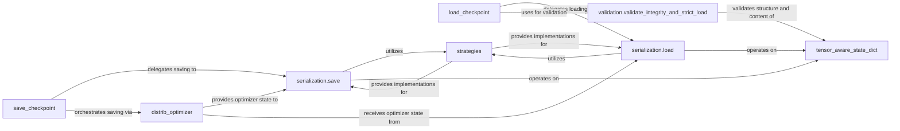

## Details

The Checkpointing & Persistence subsystem in Megatron-LM provides robust mechanisms for saving and loading model and optimizer states, crucial for fault tolerance, resuming training, and transfer learning with very large models.

### save_checkpoint
The primary orchestrator for saving the entire training state, including model, optimizer, and RNG states. It coordinates distributed components and integrates with logging.

**Related Classes/Methods**:

- <a href="https://github.com/NVIDIA/Megatron-LM/blob/main/megatron/training/checkpointing.py#L343-L651" target="_blank" rel="noopener noreferrer">`megatron.training.checkpointing.save_checkpoint`:343-651</a>

### load_checkpoint
The primary orchestrator for loading the training state from a checkpoint. It handles versioning, argument checks, and ensures data integrity before restoring the state.

**Related Classes/Methods**:

- <a href="https://github.com/NVIDIA/Megatron-LM/blob/main/megatron/training/checkpointing.py#L1231-L1610" target="_blank" rel="noopener noreferrer">`megatron.training.checkpointing.load_checkpoint`:1231-1610</a>

### serialization.save
Handles the low-level serialization of distributed checkpoint data to storage. It abstracts the storage mechanism and applies various saving strategies.

**Related Classes/Methods**:

- <a href="https://github.com/NVIDIA/Megatron-LM/blob/main/megatron/core/dist_checkpointing/serialization.py#L310-L435" target="_blank" rel="noopener noreferrer">`megatron.core.dist_checkpointing.serialization.save`:310-435</a>

### serialization.load
Manages the low-level deserialization of distributed checkpoint data from storage, extracting sharded base data and metadata.

**Related Classes/Methods**:

- <a href="https://github.com/NVIDIA/Megatron-LM/blob/main/megatron/core/dist_checkpointing/serialization.py#L60-L170" target="_blank" rel="noopener noreferrer">`megatron.core.dist_checkpointing.serialization.load`:60-170</a>

### tensor_aware_state_dict
Represents and manages sharded tensors and objects across distributed ranks. It facilitates the conversion between regular and sharded state dictionaries, crucial for handling large models and distributed states.

**Related Classes/Methods**:

- <a href="https://github.com/NVIDIA/Megatron-LM/blob/main/megatron/core/dist_checkpointing/tensor_aware_state_dict.py" target="_blank" rel="noopener noreferrer">`megatron.core.dist_checkpointing.tensor_aware_state_dict`</a>

### strategies
Implements various strategies for saving and loading distributed checkpoints, optimizing for different scenarios, storage backends, and parallelism types (e.g., tensor parallelism, pipeline parallelism).

**Related Classes/Methods**:

- <a href="https://github.com/NVIDIA/Megatron-LM/blob/main/megatron/core/dist_checkpointing/strategies" target="_blank" rel="noopener noreferrer">`megatron.core.dist_checkpointing.strategies`</a>

### validation.validate_integrity_and_strict_load
Ensures the integrity of loaded checkpoints and enforces strict loading rules, reporting any mismatches between the loaded state and the expected model/optimizer structure.

**Related Classes/Methods**:

- <a href="https://github.com/NVIDIA/Megatron-LM/blob/main/megatron/core/dist_checkpointing/validation.py#L128-L203" target="_blank" rel="noopener noreferrer">`megatron.core.dist_checkpointing.validation.validate_integrity_and_strict_load`:128-203</a>

### distrib_optimizer
Manages the loading and saving of optimizer states in a distributed setting, including sharding of optimizer parameters and states. This is crucial for large-scale training where optimizer states can be very large.

**Related Classes/Methods**:

- <a href="https://github.com/NVIDIA/Megatron-LM/blob/main/megatron/core/optimizer/distrib_optimizer.py" target="_blank" rel="noopener noreferrer">`megatron.core.optimizer.distrib_optimizer`</a>

### [FAQ](https://github.com/CodeBoarding/GeneratedOnBoardings/tree/main?tab=readme-ov-file#faq)