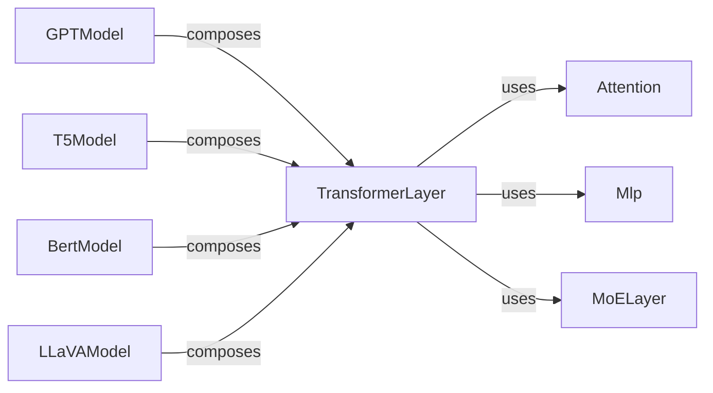

## Details

The Megatron-LM core transformer subsystem is built around the `TransformerLayer`, which serves as the fundamental building block for various large language models. This layer orchestrates the sequential processing of input data by integrating self-attention mechanisms (`Attention`), feed-forward networks (`Mlp`), and optionally, Mixture-of-Experts (`MoELayer`) for enhanced capacity. Higher-level models like `GPTModel`, `T5Model`, `BertModel`, and `LLaVAModel` compose multiple `TransformerLayer` instances to form their respective encoder-decoder or decoder-only architectures, demonstrating a clear hierarchical composition pattern. The interactions within a `TransformerLayer` involve data flow from attention to MLP, while the overall model architecture involves stacking these layers.

### TransformerLayer
Orchestrates the forward and backward passes of a single transformer layer, integrating attention and MLP blocks, and optionally MoE layers. It serves as the core computational unit for sequence processing.

**Related Classes/Methods**:

- <a href="https://github.com/NVIDIA/Megatron-LM/blob/main/megatron/core/transformer/transformer_layer.py#L35-L150" target="_blank" rel="noopener noreferrer">`megatron.core.transformer.TransformerLayer`:35-150</a>

### Attention
Implements the self-attention mechanism, handling query, key, and value projections, and attention score computation. It is a fundamental building block for TransformerLayer.

**Related Classes/Methods**:

- <a href="https://github.com/NVIDIA/Megatron-LM/blob/main/megatron/core/transformer/attention.py#L856-L1056" target="_blank" rel="noopener noreferrer">`megatron.core.transformer.attention.SelfAttention`:856-1056</a>

### Mlp
Implements the Multi-Layer Perceptron (MLP) block (feed-forward network) within a transformer layer. It processes the output of the attention mechanism.

**Related Classes/Methods**:

- <a href="https://github.com/NVIDIA/Megatron-LM/blob/main/megatron/core/transformer/mlp.py#L30-L100" target="_blank" rel="noopener noreferrer">`megatron.core.transformer.Mlp`:30-100</a>

### MoELayer
Implements the Mixture-of-Experts (MoE) layer, enabling conditional activation of different expert networks for scalability and increased model capacity.

**Related Classes/Methods**:

- <a href="https://github.com/NVIDIA/Megatron-LM/blob/main/megatron/core/transformer/moe/moe_layer.py#L92-L303" target="_blank" rel="noopener noreferrer">`megatron.core.transformer.moe.moe_layer.MoELayer`:92-303</a>

### GPTModel
Provides the high-level implementation of a GPT-style decoder-only language model, composing multiple TransformerLayer instances.

**Related Classes/Methods**:

- <a href="https://github.com/NVIDIA/Megatron-LM/blob/main/megatron/core/models/gpt/gpt_model.py#L35-L656" target="_blank" rel="noopener noreferrer">`megatron.core.models.gpt.gpt_model.GPTModel`:35-656</a>

### T5Model
Provides the high-level implementation of a T5-style encoder-decoder language model, composing TransformerLayer instances for both encoder and decoder stacks.

**Related Classes/Methods**:

- <a href="https://github.com/NVIDIA/Megatron-LM/blob/main/megatron/core/models/T5/t5_model.py#L82-L497" target="_blank" rel="noopener noreferrer">`megatron.core.models.T5.t5_model.T5Model`:82-497</a>

### BertModel
Provides the high-level implementation of a BERT-style encoder-only language model, composing multiple TransformerLayer instances.

**Related Classes/Methods**:

- <a href="https://github.com/NVIDIA/Megatron-LM/blob/main/megatron/core/models/bert/bert_model.py#L36-L386" target="_blank" rel="noopener noreferrer">`megatron.core.models.bert.bert_model.BertModel`:36-386</a>

### LLaVAModel
Implements a multimodal large language model, integrating vision and language components, likely by composing TransformerLayer instances and specialized multimodal processing units.

**Related Classes/Methods**:

- <a href="https://github.com/NVIDIA/Megatron-LM/blob/main/megatron/core/models/multimodal/llava_model.py#L49-L943" target="_blank" rel="noopener noreferrer">`megatron.core.models.multimodal.llava_model.LLaVAModel`:49-943</a>

### [FAQ](https://github.com/CodeBoarding/GeneratedOnBoardings/tree/main?tab=readme-ov-file#faq)