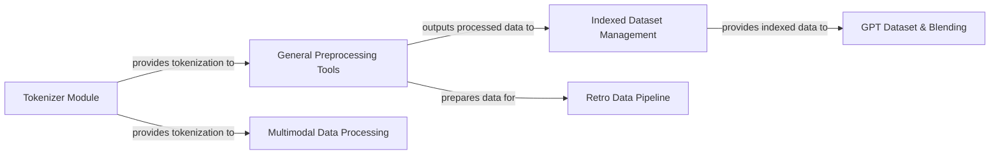

## Details

One paragraph explaining the functionality which is represented by this graph. What the main flow is and what is its purpose.

### Tokenizer Module
Converts raw text into numerical tokens and manages the vocabulary, a fundamental step for all text-based models.

**Related Classes/Methods**:

- <a href="https://github.com/NVIDIA/Megatron-LM/blob/main/megatron/training/tokenizer/__init__.py" target="_blank" rel="noopener noreferrer">`megatron/training/tokenizer/__init__.py`</a>

### General Preprocessing Tools
Performs initial data preparation, cleaning, and encoding, including tokenization, for various data types before they are structured into datasets.

**Related Classes/Methods**:

- <a href="https://github.com/NVIDIA/Megatron-LM/blob/main/tools/preprocess_data.py" target="_blank" rel="noopener noreferrer">`tools/preprocess_data.py`</a>
- <a href="https://github.com/NVIDIA/Megatron-LM/blob/main/tools/preprocess_data_nmt.py" target="_blank" rel="noopener noreferrer">`tools/preprocess_data_nmt.py`</a>
- <a href="https://github.com/NVIDIA/Megatron-LM/blob/main/tools/preprocess_mmdata.py" target="_blank" rel="noopener noreferrer">`tools/preprocess_mmdata.py`</a>

### Indexed Dataset Management
Efficiently stores, accesses, and manages large datasets on disk using indexing, with capabilities to leverage cloud object storage for distributed access. This is crucial for handling datasets that exceed memory capacity.

**Related Classes/Methods**:

- <a href="https://github.com/NVIDIA/Megatron-LM/blob/main/megatron/core/datasets/indexed_dataset.py" target="_blank" rel="noopener noreferrer">`megatron/core/datasets/indexed_dataset.py`</a>
- <a href="https://github.com/NVIDIA/Megatron-LM/blob/main/megatron/core/datasets/object_storage_utils.py" target="_blank" rel="noopener noreferrer">`megatron/core/datasets/object_storage_utils.py`</a>

### GPT Dataset & Blending
Implements data loading and processing specifically for GPT-style models, including shuffling and sample generation. It also orchestrates combining multiple datasets (e.g., Indexed Dataset) for flexible data mixing and curriculum learning, enabling complex training strategies.

**Related Classes/Methods**:

- <a href="https://github.com/NVIDIA/Megatron-LM/blob/main/megatron/core/datasets/gpt_dataset.py" target="_blank" rel="noopener noreferrer">`megatron/core/datasets/gpt_dataset.py`</a>
- <a href="https://github.com/NVIDIA/Megatron-LM/blob/main/megatron/core/datasets/blended_megatron_dataset_builder.py" target="_blank" rel="noopener noreferrer">`megatron/core/datasets/blended_megatron_dataset_builder.py`</a>

### Retro Data Pipeline
Manages the entire pipeline for Retrieval-Augmented Generation (Retro), including the creation and persistence of the knowledge base (database), and efficient querying and indexing (e.g., FAISS) for retrieving relevant passages during training or inference.

**Related Classes/Methods**:

- <a href="https://github.com/NVIDIA/Megatron-LM/blob/main/megatron/core/datasets/retro/db/utils.py" target="_blank" rel="noopener noreferrer">`megatron/core/datasets/retro/db/utils.py`</a>
- <a href="https://github.com/NVIDIA/Megatron-LM/blob/main/megatron/core/datasets/retro/db/build.py" target="_blank" rel="noopener noreferrer">`megatron/core/datasets/retro/db/build.py`</a>
- <a href="https://github.com/NVIDIA/Megatron-LM/blob/main/megatron/core/datasets/retro/query/query.py" target="_blank" rel="noopener noreferrer">`megatron/core/datasets/retro/query/query.py`</a>
- <a href="https://github.com/NVIDIA/Megatron-LM/blob/main/megatron/core/datasets/retro/index/index.py" target="_blank" rel="noopener noreferrer">`megatron/core/datasets/retro/index/index.py`</a>

### Multimodal Data Processing
Provides specialized data encoding, packing, and batching for diverse multimodal data samples (e.g., images, audio, text) specifically adapted for Vision-Language (VLM) and Audio-Vision-Language (AVLM) models.

**Related Classes/Methods**:

- <a href="https://github.com/NVIDIA/Megatron-LM/blob/main/examples/multimodal/dataset_helpers.py" target="_blank" rel="noopener noreferrer">`examples/multimodal/dataset_helpers.py`</a>
- <a href="https://github.com/NVIDIA/Megatron-LM/blob/main/examples/mimo/data/energon_vlm_task_encoder.py" target="_blank" rel="noopener noreferrer">`examples/mimo/data/energon_vlm_task_encoder.py`</a>
- <a href="https://github.com/NVIDIA/Megatron-LM/blob/main/examples/mimo/data/energon_avlm_task_encoder.py" target="_blank" rel="noopener noreferrer">`examples/mimo/data/energon_avlm_task_encoder.py`</a>

### [FAQ](https://github.com/CodeBoarding/GeneratedOnBoardings/tree/main?tab=readme-ov-file#faq)