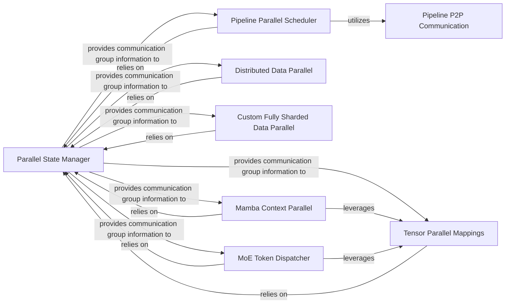

## Details

The Distributed Parallelism Engine subsystem is the core of Megatron-LM's ability to train large-scale models efficiently. It encompasses the mechanisms for orchestrating and executing various distributed training strategies.

### Parallel State Manager
Establishes, manages, and provides access to all distributed communication groups (Tensor Parallel, Pipeline Parallel, Data Parallel, Context Parallel, Expert Parallel). It acts as the central registry for the distributed environment, enabling other components to coordinate.

**Related Classes/Methods**:

- <a href="https://github.com/NVIDIA/Megatron-LM/blob/main/megatron/core/parallel_state.py" target="_blank" rel="noopener noreferrer">`megatron.core.parallel_state`</a>

### Pipeline Parallel Scheduler
Orchestrates the high-level execution flow for pipeline parallelism, managing microbatches, inter-stage communication, and ensuring correct data flow between pipeline stages.

**Related Classes/Methods**:

- <a href="https://github.com/NVIDIA/Megatron-LM/blob/main/megatron/core/pipeline_parallel/schedules.py" target="_blank" rel="noopener noreferrer">`megatron.core.pipeline_parallel.schedules`</a>

### Tensor Parallel Mappings
Implements low-level communication primitives and tensor manipulation for Tensor Parallelism, including splitting tensors, gathering results, and performing all-reduce operations across tensor parallel groups.

**Related Classes/Methods**:

- <a href="https://github.com/NVIDIA/Megatron-LM/blob/main/megatron/core/tensor_parallel/mappings.py" target="_blank" rel="noopener noreferrer">`megatron.core.tensor_parallel.mappings`</a>

### Distributed Data Parallel
Manages traditional Distributed Data Parallelism (DDP), where each GPU holds a full model replica, and gradients are averaged across data parallel groups.

**Related Classes/Methods**:

- <a href="https://github.com/NVIDIA/Megatron-LM/blob/main/megatron/core/distributed/distributed_data_parallel.py" target="_blank" rel="noopener noreferrer">`megatron.core.distributed.distributed_data_parallel`</a>

### Custom Fully Sharded Data Parallel
Implements a custom Fully Sharded Data Parallelism (FSDP) strategy, sharding model parameters and optimizer states across data parallel groups to significantly reduce memory footprint.

**Related Classes/Methods**:

- <a href="https://github.com/NVIDIA/Megatron-LM/blob/main/megatron/core/distributed/custom_fsdp/fully_sharded_data_parallel.py" target="_blank" rel="noopener noreferrer">`megatron.core.distributed.custom_fsdp.fully_sharded_data_parallel`</a>

### Pipeline P2P Communication
Provides fundamental point-to-point communication primitives (send/receive) specifically for data transfer between pipeline stages.

**Related Classes/Methods**:

- <a href="https://github.com/NVIDIA/Megatron-LM/blob/main/megatron/core/pipeline_parallel/p2p_communication.py" target="_blank" rel="noopener noreferrer">`megatron.core.pipeline_parallel.p2p_communication`</a>

### Mamba Context Parallel
Implements specific communication patterns, particularly all-to-all operations, required for Context Parallelism, especially in models like Mamba.

**Related Classes/Methods**:

- <a href="https://github.com/NVIDIA/Megatron-LM/blob/main/megatron/core/ssm/mamba_context_parallel.py" target="_blank" rel="noopener noreferrer">`megatron.core.ssm.mamba_context_parallel`</a>

### MoE Token Dispatcher
Manages routing tokens to experts and combining outputs in Mixture-of-Experts (MoE) models, involving communication across expert parallel groups. This is key for Expert Parallelism.

**Related Classes/Methods**:

- <a href="https://github.com/NVIDIA/Megatron-LM/blob/main/megatron/core/transformer/moe/token_dispatcher.py" target="_blank" rel="noopener noreferrer">`megatron.core.transformer.moe.token_dispatcher`</a>

### [FAQ](https://github.com/CodeBoarding/GeneratedOnBoardings/tree/main?tab=readme-ov-file#faq)