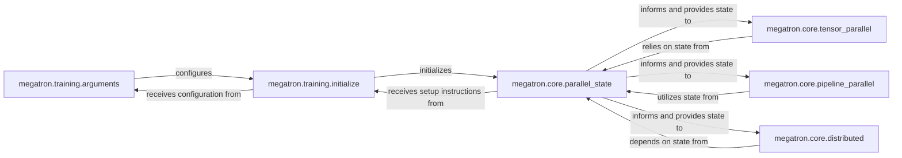

## Details

The `Distributed System Orchestration` subsystem is fundamental to Megatron-LM's ability to scale deep learning models across multiple GPUs. It encompasses the initial setup, configuration, and management of various parallelism strategies.

### megatron.training.arguments
Responsible for parsing and validating command-line arguments that configure the entire distributed training setup, including parallelism strategies, sizes, and other distributed environment settings.

**Related Classes/Methods**:

- <a href="https://github.com/NVIDIA/Megatron-LM/blob/main/megatron/training/arguments.py" target="_blank" rel="noopener noreferrer">`megatron.training.arguments`</a>

### megatron.training.initialize
Acts as the primary orchestrator for the initial setup of the distributed training environment. This includes initializing the communication backend (e.g., NCCL), setting up logging, and configuring features like autoresume, leveraging parsed arguments.

**Related Classes/Methods**:

- <a href="https://github.com/NVIDIA/Megatron-LM/blob/main/megatron/training/initialize.py" target="_blank" rel="noopener noreferrer">`megatron.training.initialize`</a>

### megatron.core.parallel_state
A foundational component that establishes and manages distributed process groups for all parallelism strategies (Tensor, Pipeline, Data, Context, Expert Parallelism). It maintains and provides essential information about the current process's rank, world size, and specific group details for distributed operations.

**Related Classes/Methods**:

- <a href="https://github.com/NVIDIA/Megatron-LM/blob/main/megatron/core/parallel_state.py" target="_blank" rel="noopener noreferrer">`megatron.core.parallel_state`</a>

### megatron.core.tensor_parallel
Implements the core logic for Tensor Parallelism. This involves distributing model weights and activations across devices within a tensor parallel group, managing collective communication operations (e.g., all-reduce, all-gather) for synchronization, and handling distributed random state.

**Related Classes/Methods**:

- <a href="https://github.com/NVIDIA/Megatron-LM/blob/main/megatron/core/tensor_parallel/" target="_blank" rel="noopener noreferrer">`megatron.core.tensor_parallel`</a>

### megatron.core.pipeline_parallel
Implements the mechanisms for Pipeline Parallelism. This component orchestrates the flow of data (activations and gradients) between different pipeline stages, which are distributed across various devices, managing microbatch scheduling and efficient inter-stage communication.

**Related Classes/Methods**:

- <a href="https://github.com/NVIDIA/Megatron-LM/blob/main/megatron/core/pipeline_parallel/" target="_blank" rel="noopener noreferrer">`megatron.core.pipeline_parallel`</a>

### megatron.core.distributed
Provides general distributed utilities, including Distributed Data Parallel (DDP) and potentially custom Fully Sharded Data Parallel (FSDP) implementations. Its primary focus is on efficient gradient synchronization across data parallel groups and managing distributed parameters.

**Related Classes/Methods**:

- <a href="https://github.com/NVIDIA/Megatron-LM/blob/main/megatron/core/distributed/" target="_blank" rel="noopener noreferrer">`megatron.core.distributed`</a>

### [FAQ](https://github.com/CodeBoarding/GeneratedOnBoardings/tree/main?tab=readme-ov-file#faq)