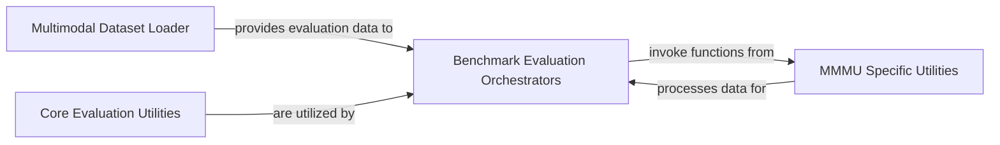

## Details

The multimodal evaluation subsystem is structured around a clear separation of concerns. The `Multimodal Dataset Loader` acts as the data backbone, providing processed benchmark data to the `Benchmark Evaluation Orchestrators`. These orchestrators serve as the primary control flow, initiating specific benchmark evaluations, leveraging the `Core Evaluation Utilities` for common metric calculations, and delegating to specialized components like `MMMU Specific Utilities` for benchmark-specific processing. This design ensures modularity, allowing for easy integration of new benchmarks and maintenance of evaluation logic.

### Core Evaluation Utilities
Provides fundamental, reusable functions for calculating correct answers and general evaluation metrics (e.g., `metrics_func`, `calculate_correct_answers`). This component serves as a low-level, foundational utility layer for all evaluation tasks.

**Related Classes/Methods**:

- <a href="https://github.com/NVIDIA/Megatron-LM/blob/main/tasks/eval_utils.py" target="_blank" rel="noopener noreferrer">`tasks.eval_utils`</a>

### Multimodal Dataset Loader
Acts as the central data interface for all multimodal evaluation tasks. It initializes and provides access to various benchmark datasets (e.g., `VQADataset`, `MMMUDataset`), handling data loading, frame/video reading, and processing of image tags/QA templates.

**Related Classes/Methods**:

- <a href="https://github.com/NVIDIA/Megatron-LM/blob/main/examples/multimodal/evaluation/evaluation_datasets.py" target="_blank" rel="noopener noreferrer">`examples.multimodal.evaluation.evaluation_datasets`</a>

### Benchmark Evaluation Orchestrators
This collection of modules serves as the primary entry points for evaluating specific multimodal benchmarks. They orchestrate the end-to-end evaluation flow, including merging results from distributed runs, invoking task-specific evaluation logic, and delegating to lower-level functions for metric computations. This component represents the application-specific evaluation logic.

**Related Classes/Methods**:

- <a href="https://github.com/NVIDIA/Megatron-LM/blob/main/examples/multimodal/evaluation/evaluate_vqav2.py" target="_blank" rel="noopener noreferrer">`examples.multimodal.evaluation.evaluate_vqav2`</a>
- <a href="https://github.com/NVIDIA/Megatron-LM/blob/main/examples/multimodal/evaluation/evaluate_coco.py" target="_blank" rel="noopener noreferrer">`examples.multimodal.evaluation.evaluate_coco`</a>
- <a href="https://github.com/NVIDIA/Megatron-LM/blob/main/examples/multimodal/evaluation/evaluate_ocrbench.py" target="_blank" rel="noopener noreferrer">`examples.multimodal.evaluation.evaluate_ocrbench`</a>
- <a href="https://github.com/NVIDIA/Megatron-LM/blob/main/examples/multimodal/evaluation/evaluate_mathvista.py" target="_blank" rel="noopener noreferrer">`examples.multimodal.evaluation.evaluate_mathvista`</a>
- <a href="https://github.com/NVIDIA/Megatron-LM/blob/main/examples/multimodal/evaluation/evaluate_rd_tablebench.py" target="_blank" rel="noopener noreferrer">`examples.multimodal.evaluation.evaluate_rd_tablebench`</a>
- <a href="https://github.com/NVIDIA/Megatron-LM/blob/main/examples/multimodal/evaluation/evaluate_mmmu.py" target="_blank" rel="noopener noreferrer">`examples.multimodal.evaluation.evaluate_mmmu`</a>
- <a href="https://github.com/NVIDIA/Megatron-LM/blob/main/examples/multimodal/evaluation/evaluate_spdocvqa.py" target="_blank" rel="noopener noreferrer">`examples.multimodal.evaluation.evaluate_spdocvqa`</a>
- <a href="https://github.com/NVIDIA/Megatron-LM/blob/main/examples/multimodal/evaluation/evaluate_ai2d.py" target="_blank" rel="noopener noreferrer">`examples.multimodal.evaluation.evaluate_ai2d`</a>
- <a href="https://github.com/NVIDIA/Megatron-LM/blob/main/examples/multimodal/evaluation/evaluate_chartqa.py" target="_blank" rel="noopener noreferrer">`examples.multimodal.evaluation.evaluate_chartqa`</a>
- <a href="https://github.com/NVIDIA/Megatron-LM/blob/main/examples/multimodal/evaluation/evaluate_video_motionbench.py" target="_blank" rel="noopener noreferrer">`examples.multimodal.evaluation.evaluate_video_motionbench`</a>
- <a href="https://github.com/NVIDIA/Megatron-LM/blob/main/examples/multimodal/evaluation/evaluate_video_mvbench.py" target="_blank" rel="noopener noreferrer">`examples.multimodal.evaluation.evaluate_video_mvbench`</a>
- <a href="https://github.com/NVIDIA/Megatron-LM/blob/main/examples/multimodal/evaluation/evaluate_video_phys_game_bench.py" target="_blank" rel="noopener noreferrer">`examples.multimodal.evaluation.evaluate_video_phys_game_bench`</a>

### MMMU Specific Utilities
Encapsulates specialized logic for processing and evaluating responses specifically for the MMMU benchmark, including string normalization, number extraction, and multi-choice/open-response evaluation.

**Related Classes/Methods**:

- <a href="https://github.com/NVIDIA/Megatron-LM/blob/main/examples/multimodal/evaluation/mmmu_utils.py" target="_blank" rel="noopener noreferrer">`examples.multimodal.evaluation.mmmu_utils`</a>

### [FAQ](https://github.com/CodeBoarding/GeneratedOnBoardings/tree/main?tab=readme-ov-file#faq)