```mermaid
graph LR
    megatron_inference_text_generation_api["megatron.inference.text_generation.api"]
    megatron_core_inference_text_generation_controllers_text_generation_controller["megatron.core.inference.text_generation_controllers.text_generation_controller"]
    megatron_core_inference_engines_dynamic_engine["megatron.core.inference.engines.dynamic_engine"]
    megatron_core_inference_scheduler["megatron.core.inference.scheduler"]
    megatron_core_inference_model_inference_wrappers_abstract_model_inference_wrapper["megatron.core.inference.model_inference_wrappers.abstract_model_inference_wrapper"]
    megatron_core_inference_communication_utils["megatron.core.inference.communication_utils"]
    megatron_inference_text_generation_api -- "delegates to" --> megatron_core_inference_text_generation_controllers_text_generation_controller
    megatron_core_inference_text_generation_controllers_text_generation_controller -- "interacts with" --> megatron_core_inference_engines_dynamic_engine
    megatron_core_inference_text_generation_controllers_text_generation_controller -- "calls" --> megatron_core_inference_model_inference_wrappers_abstract_model_inference_wrapper
    megatron_core_inference_scheduler -- "supplies requests to" --> megatron_core_inference_engines_dynamic_engine
    megatron_core_inference_engines_dynamic_engine -- "calls" --> megatron_core_inference_model_inference_wrappers_abstract_model_inference_wrapper
    megatron_core_inference_engines_dynamic_engine -- "uses" --> megatron_core_inference_communication_utils
    megatron_core_inference_model_inference_wrappers_abstract_model_inference_wrapper -- "leverages" --> megatron_core_inference_communication_utils
```

## Details

The megatron.core.inference subsystem provides a robust and scalable framework for large-scale language model inference, emphasizing dynamic batching and distributed execution. User requests are initiated through the text_generation.api and managed by the scheduler, which feeds them to the dynamic_engine. This engine orchestrates the core inference loop, leveraging the text_generation_controller for sampling and detokenization, and interacting with the abstract_model_inference_wrapper for model-specific forward passes. Critical to its distributed capabilities, communication_utils facilitates efficient inter-device data exchange, ensuring high-performance inference across multiple GPUs and nodes. This architecture allows for flexible handling of varying request loads and seamless integration of diverse model architectures.

### megatron.inference.text_generation.api
Serves as the primary user interface for initiating text generation and beam search operations, abstracting the underlying inference complexities. It is the entry point for users to interact with the text generation capabilities.

**Related Classes/Methods**:

- <a href="https://github.com/NVIDIA/Megatron-LM/blob/main/megatron/inference/text_generation/api.py" target="_blank" rel="noopener noreferrer">`megatron.inference.text_generation.api`</a>

### megatron.core.inference.text_generation_controllers.text_generation_controller
Manages the detailed process of text generation, including tokenization, sampling from logits (applying top-k/top-p filtering), and detokenization. It orchestrates the generation flow by interacting with the model inference wrapper.

**Related Classes/Methods**:

- <a href="https://github.com/NVIDIA/Megatron-LM/blob/main/megatron/core/inference/text_generation_controllers/text_generation_controller.py" target="_blank" rel="noopener noreferrer">`megatron.core.inference.text_generation_controllers.text_generation_controller`</a>

### megatron.core.inference.engines.dynamic_engine
The core execution engine for inference, specifically designed for dynamic batching to optimize resource utilization and throughput for varying request loads. It manages in-flight requests, interacts with the text generation controller for sampling, and handles distributed communication.

**Related Classes/Methods**:

- <a href="https://github.com/NVIDIA/Megatron-LM/blob/main/megatron/core/inference/engines/dynamic_engine.py" target="_blank" rel="noopener noreferrer">`megatron.core.inference.engines.dynamic_engine`</a>

### megatron.core.inference.scheduler
Manages the queue and state of incoming inference requests, efficiently adding new requests and updating their pools to feed the dynamic engine. It ensures efficient utilization of the inference engine.

**Related Classes/Methods**:

- <a href="https://github.com/NVIDIA/Megatron-LM/blob/main/megatron/core/inference/scheduler.py" target="_blank" rel="noopener noreferrer">`megatron.core.inference.scheduler`</a>

### megatron.core.inference.model_inference_wrappers.abstract_model_inference_wrapper
Provides an abstract, extensible interface for preparing model-specific inputs and executing the forward pass during inference. It handles model preparation, input data formatting, and pipeline parallelism communication, allowing different model architectures to be integrated seamlessly.

**Related Classes/Methods**:

- <a href="https://github.com/NVIDIA/Megatron-LM/blob/main/megatron/core/inference/model_inference_wrappers/abstract_model_inference_wrapper.py" target="_blank" rel="noopener noreferrer">`megatron.core.inference.model_inference_wrappers.abstract_model_inference_wrapper`</a>

### megatron.core.inference.communication_utils
Provides essential utilities for inter-device communication, critical for distributed inference across multiple GPUs or nodes, especially for pipeline parallelism.

**Related Classes/Methods**:

- <a href="https://github.com/NVIDIA/Megatron-LM/blob/main/megatron/core/inference/communication_utils.py" target="_blank" rel="noopener noreferrer">`megatron.core.inference.communication_utils`</a>

### [FAQ](https://github.com/CodeBoarding/GeneratedOnBoardings/tree/main?tab=readme-ov-file#faq)