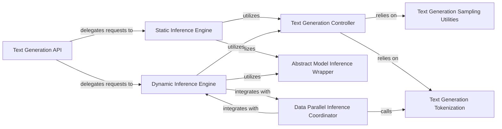

## Details

Analysis of the Inference Engine subsystem in Megatron-LM, detailing its central components, their responsibilities, and their interrelationships.

### Text Generation API
Provides the high-level public interface for initiating text generation and beam search operations, abstracting the underlying inference mechanisms. It acts as the primary entry point for users.

**Related Classes/Methods**:

- <a href="https://github.com/NVIDIA/Megatron-LM/blob/main/megatron/inference/text_generation/api.py" target="_blank" rel="noopener noreferrer">`megatron.inference.text_generation.api`</a>

### Static Inference Engine
Manages inference execution using a static batching strategy, processing requests in fixed-size batches for predictable performance.

**Related Classes/Methods**:

- <a href="https://github.com/NVIDIA/Megatron-LM/blob/main/megatron/core/inference/engines/static_engine.py" target="_blank" rel="noopener noreferrer">`megatron.core.inference.engines.static_engine`</a>

### Dynamic Inference Engine
Manages inference execution using a dynamic batching strategy, allowing flexible batch sizes and asynchronous processing across data parallel ranks for improved throughput with varying workloads.

**Related Classes/Methods**:

- <a href="https://github.com/NVIDIA/Megatron-LM/blob/main/megatron/core/inference/engines/dynamic_engine.py" target="_blank" rel="noopener noreferrer">`megatron.core.inference.engines.dynamic_engine`</a>

### Text Generation Controller
Encapsulates the core text generation logic, including token sampling (e.g., top-k, top-p), detokenization, and managing the iterative generation process for both static and dynamic batching.

**Related Classes/Methods**:

- <a href="https://github.com/NVIDIA/Megatron-LM/blob/main/megatron/core/inference/text_generation_controllers/text_generation_controller.py" target="_blank" rel="noopener noreferrer">`megatron.core.inference.text_generation_controllers.text_generation_controller`</a>

### Abstract Model Inference Wrapper
Provides an abstract interface for executing a single forward pass of the underlying language model during inference, handling different pipeline parallelism configurations. It decouples the engine from the specific model implementation.

**Related Classes/Methods**:

- <a href="https://github.com/NVIDIA/Megatron-LM/blob/main/megatron/core/inference/model_inference_wrappers/abstract_model_inference_wrapper.py" target="_blank" rel="noopener noreferrer">`megatron.core.inference.model_inference_wrappers.abstract_model_inference_wrapper`</a>

### Data Parallel Inference Coordinator
Coordinates inference operations across multiple data parallel ranks, including prompt tokenization and post-processing of generated outputs in a distributed environment.

**Related Classes/Methods**:

- <a href="https://github.com/NVIDIA/Megatron-LM/blob/main/megatron/core/inference/data_parallel_inference_coordinator.py" target="_blank" rel="noopener noreferrer">`megatron.core.inference.data_parallel_inference_coordinator`</a>

### Text Generation Sampling Utilities
Provides utility functions for various token sampling strategies (e.g., `modify_logits_for_top_k_filtering`, `modify_logits_for_top_p_filtering`) used during text generation.

**Related Classes/Methods**:

- <a href="https://github.com/NVIDIA/Megatron-LM/blob/main/megatron/inference/text_generation/sampling.py" target="_blank" rel="noopener noreferrer">`megatron.inference.text_generation.sampling`</a>

### Text Generation Tokenization
Handles the tokenization of input prompts (converting text to token IDs) and detokenization of generated token IDs back into human-readable text.

**Related Classes/Methods**:

- <a href="https://github.com/NVIDIA/Megatron-LM/blob/main/megatron/inference/text_generation/tokenization.py" target="_blank" rel="noopener noreferrer">`megatron.inference.text_generation.tokenization`</a>

### [FAQ](https://github.com/CodeBoarding/GeneratedOnBoardings/tree/main?tab=readme-ov-file#faq)