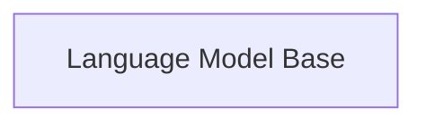

## Details

Corrected source code reference for 'Language Model Base' component.

### Language Model Base
Base class for language models

**Related Classes/Methods**:

### [FAQ](https://github.com/CodeBoarding/GeneratedOnBoardings/tree/main?tab=readme-ov-file#faq)