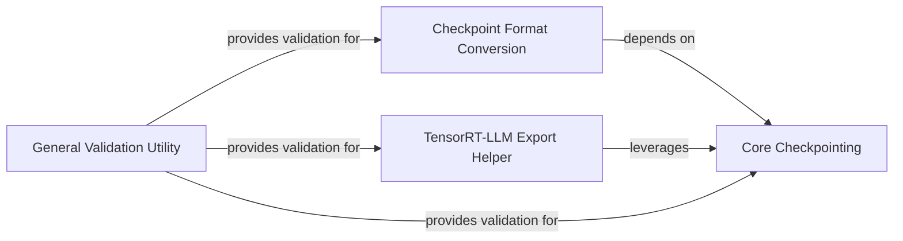

## Details

This subsystem is responsible for the robust handling of model checkpoints, including saving, loading, and converting them for various downstream uses, alongside providing general-purpose validation utilities. It is crucial for enabling fault tolerance in distributed training and facilitating model deployment.

### Core Checkpointing
Manages the saving and loading of model, optimizer, and random number generator (RNG) states, especially in a distributed training environment, ensuring consistency and handling metadata. This is the foundational persistence mechanism.

**Related Classes/Methods**:

- <a href="https://github.com/NVIDIA/Megatron-LM/blob/main/megatron/training/checkpointing.py" target="_blank" rel="noopener noreferrer">`megatron.training.checkpointing`</a>
- <a href="https://github.com/NVIDIA/Megatron-LM/blob/main/megatron/training/checkpointing.py#L343-L651" target="_blank" rel="noopener noreferrer">`megatron.training.checkpointing.save_checkpoint`:343-651</a>
- <a href="https://github.com/NVIDIA/Megatron-LM/blob/main/megatron/training/checkpointing.py#L1231-L1610" target="_blank" rel="noopener noreferrer">`megatron.training.checkpointing.load_checkpoint`:1231-1610</a>
- <a href="https://github.com/NVIDIA/Megatron-LM/blob/main/megatron/training/checkpointing.py#L955-L1086" target="_blank" rel="noopener noreferrer">`megatron.training.checkpointing._load_base_checkpoint`:955-1086</a>
- <a href="https://github.com/NVIDIA/Megatron-LM/blob/main/megatron/training/checkpointing.py#L1477-L1485" target="_blank" rel="noopener noreferrer">`megatron.training.checkpointing.load_model_state_dict`:1477-1485</a>

### Checkpoint Format Conversion
Provides a flexible mechanism for converting Megatron-LM checkpoints to other model formats (e.g., HuggingFace) by dynamically loading specific conversion logic. This is a specialized utility for interoperability.

**Related Classes/Methods**:

- <a href="https://github.com/NVIDIA/Megatron-LM/blob/main/tools/checkpoint/convert.py" target="_blank" rel="noopener noreferrer">`tools.checkpoint.convert`</a>
- <a href="https://github.com/NVIDIA/Megatron-LM/blob/main/tools/checkpoint/convert.py#L109-L166" target="_blank" rel="noopener noreferrer">`tools.checkpoint.convert.main`:109-166</a>
- <a href="https://github.com/NVIDIA/Megatron-LM/blob/main/tools/checkpoint/convert.py#L90-L107" target="_blank" rel="noopener noreferrer">`tools.checkpoint.convert.load_plugin`:90-107</a>
- <a href="https://github.com/NVIDIA/Megatron-LM/blob/main/tools/checkpoint/convert.py#L134-L139" target="_blank" rel="noopener noreferrer">`tools.checkpoint.convert.update_loader_saver`:134-139</a>

### TensorRT-LLM Export Helper
Specializes in preparing Megatron-LM model configurations and weights for export to the TensorRT-LLM inference engine, including handling scaling factors and adapting the model structure. This is another specialized utility for inference optimization.

**Related Classes/Methods**:

- <a href="https://github.com/NVIDIA/Megatron-LM/blob/main/megatron/core/export/trtllm/trtllm_helper.py" target="_blank" rel="noopener noreferrer">`megatron.core.export.trtllm.trtllm_helper`</a>
- <a href="https://github.com/NVIDIA/Megatron-LM/blob/main/megatron/core/export/trtllm/trtllm_helper.py#L264-L350" target="_blank" rel="noopener noreferrer">`megatron.core.export.trtllm.trtllm_helper.get_trtllm_pretrained_config_and_model_weights`:264-350</a>
- <a href="https://github.com/NVIDIA/Megatron-LM/blob/main/megatron/core/export/trtllm/trtllm_helper.py#L210-L261" target="_blank" rel="noopener noreferrer">`megatron.core.export.trtllm.trtllm_helper._load_scaling_factors`:210-261</a>
- <a href="https://github.com/NVIDIA/Megatron-LM/blob/main/megatron/core/export/trtllm/trtllm_helper.py#L377-L449" target="_blank" rel="noopener noreferrer">`megatron.core.export.trtllm.trtllm_helper._get_trtllm_pretrained_config_and_model_weights_in_distributed_setting`:377-449</a>

### General Validation Utility
Offers a decorator-based mechanism to enforce validation rules on function arguments or conditions, ensuring the integrity and correctness of operations across various parts of the system. This is a general-purpose utility, not specific to persistence.

**Related Classes/Methods**:

- <a href="https://github.com/NVIDIA/Megatron-LM/blob/main/megatron/core/utils.py#L164-L261" target="_blank" rel="noopener noreferrer">`megatron.core.utils.validator`:164-261</a>
- <a href="https://github.com/NVIDIA/Megatron-LM/blob/main/megatron/core/utils.py#L164-L261" target="_blank" rel="noopener noreferrer">`megatron.core.utils.validator.validator`:164-261</a>

### [FAQ](https://github.com/CodeBoarding/GeneratedOnBoardings/tree/main?tab=readme-ov-file#faq)