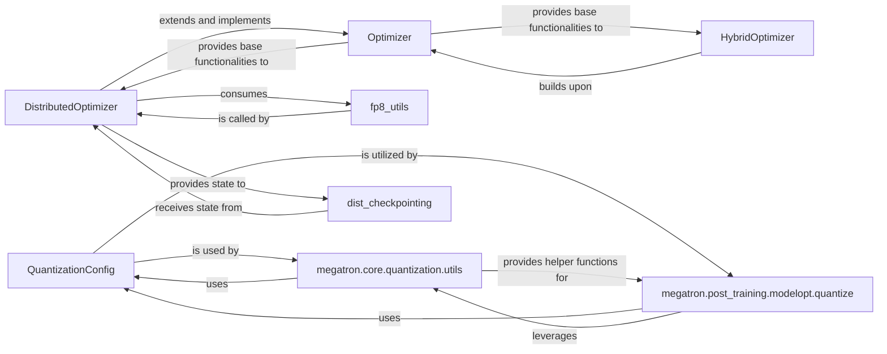

## Details

The `Optimization & Mixed Precision` subsystem in Megatron-LM is crucial for efficient and scalable training of large deep learning models. It encompasses core functionalities for managing model parameter updates, implementing various optimization algorithms, and integrating advanced techniques like mixed-precision training (FP8) and post-training quantization to enhance performance and reduce memory footprint.

### DistributedOptimizer
Orchestrates distributed model parameter updates, including sharding, gradient accumulation, and applying optimization steps across multiple distributed ranks. It ensures synchronized and efficient updates in a distributed training environment, crucial for large-scale models.

**Related Classes/Methods**:

- <a href="https://github.com/NVIDIA/Megatron-LM/blob/main/megatron/core/optimizer/distrib_optimizer.py#L85-L2269" target="_blank" rel="noopener noreferrer">`megatron.core.optimizer.distrib_optimizer.DistributedOptimizer`:85-2269</a>

### Optimizer
Serves as a foundational abstract class for various optimizers, providing common functionalities such as gradient norm calculation, gradient clipping, and general state management.

**Related Classes/Methods**:

- <a href="https://github.com/NVIDIA/Megatron-LM/blob/main/megatron/core/optimizer/optimizer.py" target="_blank" rel="noopener noreferrer">`megatron.core.optimizer.optimizer.Optimizer`</a>

### HybridOptimizer
Implements a specialized optimization strategy that can offload optimizer states to the CPU to significantly reduce GPU memory footprint, which is critical for training very large models.

**Related Classes/Methods**:

- <a href="https://github.com/NVIDIA/Megatron-LM/blob/main/megatron/core/optimizer/cpu_offloading/hybrid_optimizer.py" target="_blank" rel="noopener noreferrer">`megatron.core.optimizer.cpu_offloading.hybrid_optimizer.HybridOptimizer`</a>

### fp8_utils
Provides essential utilities for enabling and managing FP8 (Float8) mixed-precision training. This includes functionalities for dynamic scaling (amax history correction), modifying tensor storage, and preparing models for FP8 inference.

**Related Classes/Methods**:

- <a href="https://github.com/NVIDIA/Megatron-LM/blob/main/megatron/core/fp8_utils.py" target="_blank" rel="noopener noreferrer">`megatron.core.fp8_utils`</a>

### QuantizationConfig
Defines and manages the configuration for quantization, including rules for matching specific layers or modules for quantization and loading these configurations from external sources (e.g., YAML files).

**Related Classes/Methods**:

- <a href="https://github.com/NVIDIA/Megatron-LM/blob/main/megatron/core/quantization/quant_config.py#L71-L89" target="_blank" rel="noopener noreferrer">`megatron.core.quantization.quant_config.QuantizationConfig`:71-89</a>

### megatron.post_training.modelopt.quantize
Responsible for the practical application of post-training quantization, particularly focusing on the calibration process required for certain quantization schemes to determine optimal quantization parameters.

**Related Classes/Methods**:

- <a href="https://github.com/NVIDIA/Megatron-LM/blob/main/examples/post_training/modelopt/quantize.py" target="_blank" rel="noopener noreferrer">`megatron.post_training.modelopt.quantize`</a>

### megatron.core.quantization.utils
Provides utility functions for quantization, such as loading quantization recipes and applying quantization transformations.

**Related Classes/Methods**:

- <a href="https://github.com/NVIDIA/Megatron-LM/blob/main/megatron/core/quantization/utils.py" target="_blank" rel="noopener noreferrer">`megatron.core.quantization.utils`</a>

### dist_checkpointing
This framework is crucial for saving and loading model and optimizer states in a distributed manner. It supports various checkpointing strategies and ensures data integrity and consistency across ranks, vital for resuming large-scale training.

**Related Classes/Methods**:

- <a href="https://github.com/NVIDIA/Megatron-LM/blob/main/megatron/core/dist_checkpointing" target="_blank" rel="noopener noreferrer">`megatron.core.dist_checkpointing`</a>

### [FAQ](https://github.com/CodeBoarding/GeneratedOnBoardings/tree/main?tab=readme-ov-file#faq)