```mermaid
graph LR
    megatron_core_optimizer_optimizer["megatron.core.optimizer.optimizer"]
    megatron_core_optimizer_distrib_optimizer["megatron.core.optimizer.distrib_optimizer"]
    megatron_core_optimizer_cpu_offloading_hybrid_optimizer["megatron.core.optimizer.cpu_offloading.hybrid_optimizer"]
    megatron_core_fusions["megatron.core.fusions"]
    megatron_core_fp8_utils["megatron.core.fp8_utils"]
    megatron_core_transformer_cuda_graphs["megatron.core.transformer.cuda_graphs"]
    megatron_core_optimizer_optimizer -- "delegates to" --> megatron_core_optimizer_distrib_optimizer
    megatron_core_optimizer_optimizer -- "orchestrates use of" --> megatron_core_fusions
    megatron_core_optimizer_distrib_optimizer -- "interacts with" --> megatron_core_fp8_utils
    megatron_core_optimizer_cpu_offloading_hybrid_optimizer -- "initializes and synchronizes with" --> megatron_core_optimizer_optimizer
    megatron_core_fp8_utils -- "ensures correct data handling during graph capture by" --> megatron_core_transformer_cuda_graphs
```

## Details

The Optimization & Performance Engine subsystem is primarily defined by the following core packages and modules within megatron/core/: megatron/core/optimizer/: Handles all aspects of the optimization process, including parameter updates, gradient management, and distributed optimization. megatron/core/fusions/: Contains highly optimized, fused CUDA kernels for performance-critical operations. megatron/core/fp8_utils.py: Provides utilities for FP8 mixed-precision training, including quantization and dynamic scaling. megatron/core/transformer/cuda_graphs.py: Implements CUDA Graph functionalities to reduce CPU overhead and improve GPU utilization. Following the ML Toolkit / Deep Learning Framework Extension patterns, the central components of the Optimization & Performance Engine are focused on efficient model training and inference, leveraging specialized hardware capabilities. These components are fundamental for achieving high throughput and scalability in large language models.

### megatron.core.optimizer.optimizer
Provides the foundational interface for optimizers, handling core tasks such as parameter updates, gradient norm calculation, and gradient clipping. It orchestrates the overall optimization step.

**Related Classes/Methods**:

- <a href="https://github.com/NVIDIA/Megatron-LM/blob/main/megatron/core/optimizer/optimizer.py" target="_blank" rel="noopener noreferrer">`megatron.core.optimizer.optimizer`</a>

### megatron.core.optimizer.distrib_optimizer
Manages distributed aspects of optimization, including sharding of parameters and optimizer states across data parallel ranks, and synchronizing parameters and gradients in a distributed environment.

**Related Classes/Methods**:

- <a href="https://github.com/NVIDIA/Megatron-LM/blob/main/megatron/core/optimizer/distrib_optimizer.py" target="_blank" rel="noopener noreferrer">`megatron.core.optimizer.distrib_optimizer`</a>

### megatron.core.optimizer.cpu_offloading.hybrid_optimizer
Optimizes GPU memory usage by offloading optimizer states and computations to the CPU, particularly relevant for very large models.

**Related Classes/Methods**:

- <a href="https://github.com/NVIDIA/Megatron-LM/blob/main/megatron/core/optimizer/cpu_offloading/hybrid_optimizer.py" target="_blank" rel="noopener noreferrer">`megatron.core.optimizer.cpu_offloading.hybrid_optimizer`</a>

### megatron.core.fusions
Offers highly optimized, fused CUDA kernels for common deep learning operations (e.g., activation functions, softmax, cross-entropy). These fusions reduce memory bandwidth and improve computational efficiency by combining multiple operations into a single kernel.

**Related Classes/Methods**:

- <a href="https://github.com/NVIDIA/Megatron-LM/blob/main/megatron/core/fusions/" target="_blank" rel="noopener noreferrer">`megatron.core.fusions`</a>

### megatron.core.fp8_utils
Handles the complexities of FP8 mixed-precision training. This includes functionalities for quantization, dequantization, and managing amax (absolute maximum) values for dynamic scaling, which are critical for maintaining numerical stability and performance with FP8.

**Related Classes/Methods**:

- <a href="https://github.com/NVIDIA/Megatron-LM/blob/main/megatron/core/fp8_utils.py" target="_blank" rel="noopener noreferrer">`megatron.core.fp8_utils`</a>

### megatron.core.transformer.cuda_graphs
Utilizes NVIDIA CUDA Graphs to capture and replay sequences of GPU operations. This significantly reduces CPU overhead and enhances performance, especially for repetitive computations during training and inference.

**Related Classes/Methods**:

- <a href="https://github.com/NVIDIA/Megatron-LM/blob/main/megatron/core/transformer/cuda_graphs.py" target="_blank" rel="noopener noreferrer">`megatron.core.transformer.cuda_graphs`</a>

### [FAQ](https://github.com/CodeBoarding/GeneratedOnBoardings/tree/main?tab=readme-ov-file#faq)